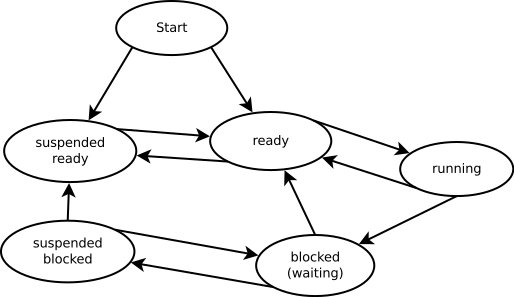

Un sistema con muchos procesos tiene un tiempo de login de un minuto, cuando la expectativa es de
1 ó 2 segundos.  Los procesos ocupan toda la memoria disponible, así que alguien propone aumentar la RAM.
La solución parece obvia: más memoria, mejor rendimiento.

*Diagrama de estados de un proceso*[^process_states]

Resultado: el tiempo de login sube a dos minutos.

¿Qué pasó?  Antes de agregar memoria, muchos procesos que podrían estar listos para ejecutarse
habían sido desalojados (*page-out*) a disco: el sistema operativo los había movido al disco para
liberar RAM.  Un proceso en disco no compite por la CPU; simplemente espera allí, fuera de la cola
de listos.  Con poca memoria, la cantidad de procesos compitiendo activamente por la CPU era baja,
y cada uno recibía su quantum en su turno.

Al aumentar la RAM, esos procesos volvieron a memoria principal y entraron a la cola de listos.
El problema es que la CPU no cambió: el cuello de botella siempre fue la CPU, no la memoria.
Ahora más procesos compiten por el mismo recurso escaso, cada uno espera más tiempo su turno, y
el login tarda el doble.

Agregar memoria no resolvió el problema; lo empeoró, porque nadie analizó *por qué* el login era
lento antes de proponer el cambio.

El mismo error, llevado al extremo, tiene raíces históricas más profundas de lo que parece.

Todo cambio lleva implícito un argumento:

1. No estamos logrando el *objetivo deseado*.
2. El *método actual* produce el *logro actual*.
3. Al cambiar el método por un *método diferente*, vamos a lograr el *objetivo deseado*.

El problema es que en esa lista sólo el *método actual* está definido.  El *objetivo deseado* suele
estar mal especificado, y los resultados del *método diferente* están por verse.

**Para que un cambio sea válido, debe existir una relación lógica entre el problema identificado,
el mecanismo por el cual el nuevo método lo resuelve, y el resultado esperado.**  Esa cadena lógica
es la base racional del plan: por qué cada paso existe, qué problema resuelve.  Sin ella, cambiar
de método es un acto de fe, no de ingeniería.  El consenso no es una demostración.

Esto puede ilustrarse con una técnica médica ya abandonada: el enema de humo de
tabaco[^enema_spanish],[^enema_english].

El tabaco llegó a Europa desde el Nuevo Mundo en el siglo XVII.  Enmarcado en la teoría de los
Humores[^humores], los médicos le encontraron propiedades terapéuticas.  Los indígenas
norteamericanos soplaban humo de tabaco para tratar dolores abdominales y para estimular la
respiración de personas casi ahogadas; los médicos europeos adoptaron la práctica y ampliaron las
indicaciones: dolores de cabeza, hernias, calambres, fiebre tifoidea, cólera.

¿Por qué funcionaba?  No funcionaba.  Pero era práctica ancestral, la aplicaban otros médicos,
había consenso.

Cambiar de método sin entender la base racional del método actual es exactamente eso: soplar humo.
No importa si es práctica ancestral, si hay consenso en el equipo, o si "otros proyectos lo hacen
así".  Sin la cadena lógica —problema real → mecanismo del nuevo método → resultado esperado—
estamos en el terreno de la medicina chamánica.

Identificar la causa raíz es el punto de partida, no el destino.  Lo que necesitamos asegurar es
que el plan esté construido *sobre* esa causa: que cada uno de sus pasos, por su mecanismo y sus
consecuencias, acerque al estado deseado.

Si los pasos del plan no consiguen el objetivo deseado, seguimos soplando humo en el trasero del
problema.

[^process_states]: Diagrama [Process states](https://commons.wikimedia.org/wiki/File:Process_states.en.svg), VolodyA! V Anarhist — dominio público, via Wikimedia Commons.
[^enema_spanish]: [Enema de humo de tabaco](https://es.wikipedia.org/wiki/Enema_de_humo_de_tabaco) en Wikipedia
[^enema_english]: [Tobacco smoke enema](https://en.wikipedia.org/wiki/Tobacco_smoke_enema) en Wikipedia
[^humores]: [Teoría de los cuatro humores](https://es.wikipedia.org/wiki/Teor%C3%ADa_de_los_cuatro_humores)