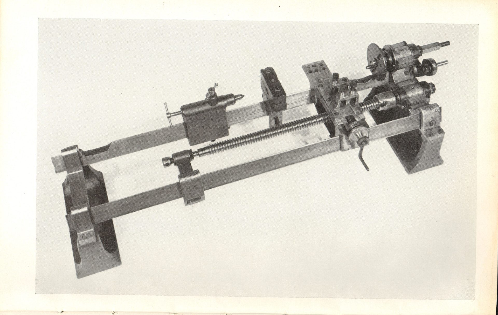

¿Qué tiene en común el torno de precisión y la inteligencia artificial?

A primera vista, nada.  Uno es una máquina de hierro que arranca virutas de metal; la otra es
software que predice la siguiente palabra.  Pero las dos enfrentan el mismo problema fundacional:
para construir una versión mejor de sí mismas, necesitan una versión de sí mismas que ya sea
suficientemente buena.  El torno preciso se fabrica con piezas precisas, pero las piezas precisas
se fabrican en un torno preciso.  La IA capaz de mejorar IA necesita ser lo bastante inteligente
para entender qué mejorar, pero esa inteligencia es justamente lo que estamos tratando de construir.

Es el problema del huevo y la gallina.  Y las dos lo resolvieron de la misma manera: iterando.

## El primer torno

La evidencia más antigua de un torno viene del Egipto antiguo, alrededor del 1300 antes de nuestra
era[^lathe_wiki].  Era un aparato de dos personas: una enrollaba una cuerda alrededor de la pieza y
tiraba para hacerla girar, la otra apoyaba una herramienta afilada contra el material.  Los romanos
le agregaron un arco que permitía girar la pieza con una sola mano.

¿Precisión?  La que daban el ojo y el pulso.  Milímetros, con suerte.  No existía la idea de
"tolerancia" porque no existía la idea de que dos piezas idénticas pudieran ser intercambiables.
Cada objeto era único, ajustado a mano contra su compañero.  Si un eje no entraba en su buje,
lo limabas hasta que entrara.

## Los tornos antes de la Revolución Industrial

Durante la Edad Media apareció el torno de pedal, que liberó las dos manos del operario.  Fue una
mejora enorme en comodidad, pero no en precisión.  El problema seguía siendo el mismo: la
herramienta de corte la sostenía la mano humana, y la mano humana tiembla.

Jesse Ramsden[^ramsden] construyó entre 1767 y 1775 su máquina de dividir circular: una rueda de 45
pulgadas con 2160 dientes de precisión, engranada con un tornillo patrón.  Con ella se podían
graduar las escalas angulares de sextantes y octantes de manera mecánica.  Lo que antes llevaba
horas de trabajo manual de un artesano experto, ahora se hacía en 30 minutos.  Ramsden le dio a
los fabricantes de instrumentos británicos décadas de ventaja sobre el resto de Europa.

Pero aun así, las piezas mecánicas grandes — cilindros, ejes, engranajes — seguían siendo burdas.
Los cilindros se forjaban a martillo, eran irregulares, y perdían presión por todos lados.
James Watt lo sabía mejor que nadie.

## La máquina de vapor

Watt tenía el diseño de una máquina de vapor superior a la de Newcomen, pero no podía construirla.
El problema era el cilindro: necesitaba uno lo bastante redondo para que el pistón sellara sin
perder vapor, y nadie podía fabricar un cilindro así.  Los cilindros de hierro forjado de la época
tenían irregularidades de varios milímetros.

En 1774, John Wilkinson[^wilkinson] — apodado "Iron-Mad Wilkinson" — inventó una máquina de
mandrilar que resolvió el problema.  En vez de forjar un tubo hueco (inherentemente impreciso),
Wilkinson partía de un bloque sólido de hierro y lo perforaba con un eje cortante apoyado en ambos
extremos.  La rigidez del eje era la fuente de la precisión — no necesitó una máquina precisa
previa, solo una barra muy rígida.

La tolerancia que logró: "no yerra más que el espesor de un chelín viejo", unos 2.5 milímetros
en un cilindro de 120 centímetros de diámetro.  Parece burdo hoy, pero fue suficiente para que la
máquina de vapor de Watt funcionara.  Watt le dio a Wilkinson un contrato de exclusividad.

Y acá empieza la cadena de bootstrapping.

La palabra *bootstrapping* viene de una vieja expresión inglesa: "pull yourself up by your
bootstraps" — levantarte tirando de las presillas de tus propias botas.  Se la suele asociar con
el Barón Munchausen[^munchausen], el personaje del libro de Rudolf Erich Raspe (1785) que se salva
de situaciones imposibles con hazañas absurdas.  Aunque en la versión original el Barón se saca
de un pantano tirándose del pelo (de su coleta, para ser exactos), la versión con las botas se
le pegó después.  Lo importante es el sentido original: la frase describía algo *físicamente
imposible*.  No podés levantarte del piso tirando de tus propios zapatos.  Recién en el siglo XX
el significado se invirtió y pasó a significar "salir adelante con tus propios medios."

En ingeniería, el término recuperó el sentido original de paradoja: ¿cómo arrancás un sistema que
se necesita a sí mismo para funcionar?  Una computadora necesita un programa para cargar programas
— el *bootstrap loader*.  Un compilador necesita un compilador para compilarse a sí mismo.  Y un
torno preciso necesita piezas precisas que solo un torno preciso puede fabricar.

## La aceleración en la precisión

### Henry Maudslay y el torno de roscar (~1800)

Henry Maudslay[^maudslay] es el padre fundador de la máquina-herramienta moderna.  Su invención
clave fue el torno con corredera (*slide rest*) y el tornillo patrón (*leadscrew*) con engranajes
intercambiables.  El portaherramientas ya no dependía de la mano humana: estaba fijado a
superficies metálicas cepilladas con precisión, y avanzaba en proporción exacta al giro de la pieza.

El resultado: por primera vez se podían cortar roscas estandarizadas.  Antes de Maudslay, cada
tornillo era ligeramente diferente y ninguna tuerca encajaba en otro bulón.  Después de Maudslay,
las piezas podían ser intercambiables.

Tolerancia de trabajo: centésimas de milímetro, del orden de 0.025 mm.

[^img_maudslay]

Maudslay también construyó el "Lord Chancellor", un micrómetro de banco capaz de medir a
diezmilésimas de pulgada — unos 2.5 micrones.  Lo usaba como árbitro final en su taller.  Y acá
aparece una clave de todo este proceso: la medición siempre fue un paso adelante de la manufactura.
No podés mejorar lo que no podés medir.

### Joseph Whitworth y la planaridad desde la nada (1850s)

Joseph Whitworth[^whitworth] fue aprendiz de Maudslay, y llevó la idea más lejos.  Estandarizó
la rosca británica (el estándar Whitworth, la primera norma nacional de roscas) y perfeccionó
el *método de los tres platos* para crear superficies perfectamente planas.

El método es el ejemplo más puro de bootstrapping de precisión que conozco, y merece que lo
cuente con detalle.  Tomá tres platos de acero — los vamos a llamar Rojo, Verde y Azul.  Untá
uno con azul de Prusia[^weinhoffer] (un pigmento), frotalo contra el segundo: las marcas de
pigmento te muestran dónde están los puntos altos.  Rasqueteá los puntos altos.  Ahora usá
el primero como referencia para rasquetear el tercero.  Después frotá el segundo contra el tercero.
Repetí el ciclo.

Lo extraordinario es que los errores no se acumulan — se cancelan.  Al alternar cuál plato es
referencia y cuál se corrige, el proceso converge a la planaridad geométrica verdadera sin
necesitar una referencia externa que ya sea plana.  Es planaridad surgida de la nada, solo
geometría e iteración.  Es un compilador compilándose a sí mismo, dos siglos antes de que
existieran los compiladores.

Whitworth también construyó la "Máquina del Millonésimo"[^millionth], exhibida en la Gran
Exposición de 1851.  Medía a una millonésima de pulgada, unos 25 nanómetros.  Era tan sensible
que detectaba la dilatación térmica de una barra de hierro de una pulgada por el calor de un
dedo tocándola.

### Carl Edvard Johansson y los bloques patrón (1901)

El sueco Johansson[^johansson] inventó los *gauge blocks* — bloques patrón de longitud que se
combinan por adherencia molecular (*wringing*): los apretás y torcés suavemente uno contra otro,
y se adhieren por fuerzas intermoleculares y presión atmosférica.  Para 1910 había roto la barrera
del milésimo de milímetro: 1 micrón.  Sus bloques eran más precisos que los patrones de las
oficinas nacionales de metrología.

Henry Ford lo contrató en 1923.  Su primer cliente americano fue Henry Leland en Cadillac,
alrededor de 1908 — el hombre que hizo de la intercambiabilidad total de piezas la base de la
industria automotriz.

### La escalera completa

| Época                      | Tolerancia          | Hito                                      |
| -------------------------- | ------------------- | ----------------------------------------- |
| Egipto antiguo (~1300 AEC) | varios mm           | Torno de cuerda, ajuste a ojo             |
| 1774 — Wilkinson           | ~2.5 mm             | Cilindro para la máquina de vapor de Watt |
| ~1800 — Maudslay           | ~0.025 mm           | Torno de roscar con corredera             |
| 1850s — Whitworth          | medición a ~25 nm   | Máquina del Millonésimo                   |
| 1901 — Johansson           | 1 micrón (0.001 mm) | Bloques patrón como estándar físico       |
| CNC moderno                | 2-5 micrones        | Mecanizado industrial estándar            |
| Ultra-precisión            | sub-micrón, ~100 nm | Óptica, aeroespacial, semiconductores     |

Cada generación de máquinas-herramienta fabricó las piezas de la siguiente generación, más
precisa.  Superficies planas mejores produjeron guías mejores; guías mejores produjeron cortes más
rectos; cortes más rectos produjeron tornillos patrón más exactos; tornillos más exactos produjeron
tornos más precisos.  Y en cada escalón, un nuevo instrumento de medición reveló errores que
antes eran invisibles y creó la demanda para el siguiente salto.

El ciclo nunca se detuvo.

## La conexión IA

En Springfield, Missouri, un maquinista llamado Dave Gingery[^kelly] bootstrappeó un taller
mecánico completo a partir de chatarra.  Empezó con un balde de 20 litros convertido en fundición,
coló un torno rudimentario en aluminio, usó ese torno para construir una taladradora, y después
fue reemplazando piezas del propio torno con versiones mejoradas fabricadas en las nuevas máquinas.
Kevin Kelly lo llama un "dispositivo de up-creation": una máquina capaz de generar más precisión
de la que tiene.

La Revolución Industrial entera fue un dispositivo de up-creation a escala civilizatoria.

En 1965, el estadístico y criptógrafo I.J. Good[^good] escribió:

> Sea una máquina ultrainteligente aquella que puede superar ampliamente todas las actividades
> intelectuales de cualquier humano por inteligente que sea.  Dado que el diseño de máquinas es
> una de esas actividades, una máquina ultrainteligente podría diseñar máquinas aún mejores;
> habría entonces, sin duda alguna, una "explosión de inteligencia", y la inteligencia del hombre
> quedaría muy atrás.

Good fue el primero en nombrar el bucle recursivo que el torno venía recorriendo en silencio
desde hacía siglos.  Pero durante doscientos años la analogía no cerró del todo, porque no
existía una herramienta que pudiera mejorarse a sí misma en el plano de la inteligencia.

Hasta ahora.

Hoy los ejemplos son concretos:

- **AlphaChip**[^alphachip] (Google DeepMind) usa aprendizaje por refuerzo para diseñar los
  *floorplans* de los chips TPU — los mismos chips que corren los modelos de DeepMind.  Ya diseñó
  layouts para tres generaciones consecutivas de TPU.  Lo que a un equipo humano le tomaba semanas,
  AlphaChip lo genera en horas.  DeepMind lo dice explícitamente: "los chips han impulsado el
  progreso de la IA, y AlphaChip devuelve el favor."

- **AlphaEvolve**[^alphaevolve] (Google DeepMind, mayo 2025) es un agente evolutivo de código que
  descubre y optimiza algoritmos.  Recuperó 0.7% de los recursos de cómputo globales de Google,
  logró un 32.5% de speedup en kernels FlashAttention, y encontró la primera mejora al algoritmo
  de Strassen para multiplicación de matrices en 56 años.

- **GPT-5.3-Codex**[^codex] (OpenAI, febrero 2026): OpenAI declaró que es "el primer modelo que
  fue instrumental en crearse a sí mismo."  Usaron versiones tempranas del modelo para debuggear
  su propio entrenamiento y administrar clusters de GPU.

- **Claude diseñando Claude**[^claude_axios] (Anthropic, septiembre 2025): Dario Amodei dijo que
  "esencialmente tenemos a Claude diseñando la siguiente versión de Claude... ese bucle empieza
  a cerrarse muy rápido."

La tabla de analogías se arma sola:

[^img_recursion]

| Torno / mecanizado                               | IA                                           |
| ------------------------------------------------ | -------------------------------------------- |
| Torno rudimentario                               | Modelos base tempranos                       |
| Cada generación fabrica la siguiente             | Cada modelo entrena o diseña al siguiente    |
| Método de los tres platos: planaridad de la nada | NAS / AutoML: arquitecturas de la nada       |
| "No podés mejorar lo que no podés medir"         | Benchmarks y evaluaciones como instrumentos  |
| Bloques patrón de Johansson                      | Datasets curados como estándar de referencia |
| CNC: la máquina programa la máquina              | IA escribiendo código para IA                |
| AlphaChip diseña el chip que corre AlphaChip     | El bucle se cierra                           |

## Perspectivas desde la historia reciente

¿Hasta dónde llega la analogía?

François Chollet[^chollet] argumenta que la explosión de inteligencia es improbable.  Su razón:
el progreso exponencial choca con fricción exponencial en otras partes del sistema.  El resultado
es crecimiento lineal o sigmoidal, no exponencial.  Señala que la mejora recursiva de herramientas
viene ocurriendo durante toda la historia humana sin producir una singularidad.

El contra-argumento: el mecanizado nunca produjo una singularidad porque las mejoras eran físicas.
Los átomos tienen fricción, los metales tienen elasticidad, la termodinámica pone límites.  La IA
opera en información, donde copiar es gratis y la iteración es casi instantánea.  ¿Es esa
diferencia suficiente para romper el patrón histórico?

La historia del torno sugiere cautela.  Cada salto de precisión fue real, pero cada salto también
fue más difícil que el anterior.  Pasar de milímetros a décimas de milímetro tomó unas décadas.
Pasar de décimas a micrones tomó un siglo.  Pasar de micrones a nanómetros requirió cambiar de
tecnología por completo — de la mecánica a la óptica y la litografía.  La curva de precisión del
mecanizado[^winchester] no es exponencial: es una escalera donde cada peldaño cuesta más que el
anterior.

Quizás la IA siga el mismo patrón.  Los primeros saltos de capacidad — de GPT-2 a GPT-4, digamos —
fueron dramáticos.  Los siguientes podrían requerir cambios de paradigma equivalentes a pasar del
rasqueteado manual a la interferometría láser.  No está claro que el bucle recursivo, por poderoso
que sea, escape a los rendimientos decrecientes.

Pero hay algo que la historia del torno deja fuera de duda: el ciclo funciona.  Maudslay no
necesitó un torno perfecto para empezar.  Necesitó uno apenas mejor que el anterior, y la paciencia
de iterar.

## Conclusión

El método de los tres platos de Whitworth crea planaridad de la nada — sin una superficie plana
previa, sin un instrumento que diga "esto es plano."  Solo tres platos imperfectos, alternándose
como referencia y como pieza, corrigiéndose mutuamente, convergiendo hacia algo que ninguno de
los tres tenía al principio.

La IA está haciendo lo mismo.  Modelos imperfectos que diseñan chips, que escriben código, que
generan datos de entrenamiento, que descubren algoritmos — cada uno corrigiendo al siguiente, cada
siguiente un poco mejor que el anterior.

La pregunta que nos queda no es si la IA puede mejorar IA.  Ya lo está haciendo.  La pregunta
es si el ciclo converge — como los tres platos de Whitworth, que se estabilizan en una superficie
plana — o si diverge.

Maudslay resolvió su problema del huevo y la gallina hace doscientos años.  Nosotros recién
estamos empezando a resolver el nuestro.

[^lathe_wiki]: [Lathe](https://en.wikipedia.org/wiki/Lathe) — historia del torno desde el Egipto antiguo hasta CNC, en Wikipedia.

[^ramsden]: [Jesse Ramsden](https://en.wikipedia.org/wiki/Jesse_Ramsden) — la máquina de dividir circular y la fabricación de instrumentos de precisión en el siglo XVIII.

[^wilkinson]: [John Wilkinson (industrialist)](https://en.wikipedia.org/wiki/John_Wilkinson_(industrialist)) — la máquina de mandrilar que hizo posible la máquina de vapor de Watt.

[^maudslay]: [Henry Maudslay](https://en.wikipedia.org/wiki/Henry_Maudslay) — torno de roscar, micrómetro Lord Chancellor, y la generación de ingenieros que formó.

[^whitworth]: [Joseph Whitworth](https://en.wikipedia.org/wiki/Joseph_Whitworth) — estandarización de roscas y la Máquina del Millonésimo.

[^weinhoffer]: [The Whitworth Three Plates Method](https://ericweinhoffer.com/blog/2017/7/30/the-whitworth-three-plates-method) — Eric Weinhoffer explica cómo se crea planaridad desde cero con tres platos.

[^millionth]: [The stunning sensitivity of the IMechE Archive's 'Millionth Machine'](https://www.imeche.org/news/news-article/the-stunning-sensitivity-of-the-imeche-archive's-'millionth-machine') — la Máquina del Millonésimo en el Institution of Mechanical Engineers.

[^johansson]: [Carl Edvard Johansson](https://en.wikipedia.org/wiki/Carl_Edvard_Johansson) — inventor de los bloques patrón, barrera del micrón rota en 1910.

[^kelly]: [Bootstrapping the Industrial Age](https://medium.com/@kevin2kelly/bootstrapping-the-industrial-age-dc8a100b351d) — Kevin Kelly sobre Dave Gingery, dispositivos de up-creation y el bootstrapping de la precisión.

[^good]: [Speculations Concerning the First Ultraintelligent Machine](https://languagelog.ldc.upenn.edu/myl/Good1964.pdf) — I.J. Good, en *Advances in Computers*, vol. 6, Academic Press, 1965. El paper original donde Good acuña el concepto de "explosión de inteligencia". El MIRI (Machine Intelligence Research Institute) tomó este concepto como eje de su trabajo, aunque la organización ha sido criticada por su sesgo alarmista: en 2024 abandonó la investigación técnica en alineación para dedicarse al activismo mediático y el lobby político, y su co-fundador Eliezer Yudkowsky ha propuesto medidas tan extremas como atacar datacenters con misiles para frenar el desarrollo de IA.

[^alphachip]: [How AlphaChip transformed computer chip design](https://deepmind.google/blog/how-alphachip-transformed-computer-chip-design/) — Google DeepMind, IA diseñando los chips que corren IA.

[^alphaevolve]: [AlphaEvolve: a Gemini-powered coding agent for designing advanced algorithms](https://deepmind.google/blog/alphaevolve-a-gemini-powered-coding-agent-for-designing-advanced-algorithms/) — Google DeepMind, mayo 2025.

[^codex]: [OpenAI says new Codex coding model helped build itself](https://www.nbcnews.com/tech/innovation/openai-says-new-codex-coding-model-helped-build-rcna257521) — NBC News sobre GPT-5.3-Codex.

[^claude_axios]: [Anthropic's Claude is getting better at building itself](https://www.axios.com/2025/09/17/ai-anthropic-amodei-claude) — Axios, septiembre 2025.

[^chollet]: [The Impossibility of Intelligence Explosion](https://medium.com/@francois.chollet/the-impossibility-of-intelligence-explosion-5be4a9eda6ec) — François Chollet, el contra-argumento escéptico.

[^munchausen]: [Bootstrapping](https://en.wikipedia.org/wiki/Bootstrapping) — Wikipedia sobre el origen del término, su conexión con el Barón Munchausen, y su uso en ingeniería y computación.

[^winchester]: Simon Winchester, *The Perfectionists: How Precision Engineers Created the Modern World* (2018) — el libro definitivo sobre la historia de la precisión, de Wilkinson a la litografía de semiconductores. Disponible para préstamo en [Internet Archive](https://archive.org/details/perfectionistsho0000winc). Charlas del autor en C-SPAN Book TV: [Miami Book Fair, dic. 2018](https://archive.org/details/CSPAN2_20181224_144600_Simon_Winchester_The_Perfectionists) y [nov. 2018](https://archive.org/details/CSPAN2_20181118_030000_Simon_Winchester_The_Perfectionists).

[^img_maudslay]: Imagen de [K.R. Gilbert, *The Machine Tool Collection*, Science Museum London (1966), Plate 10](https://commons.wikimedia.org/wiki/File:Machine_Tool_Collection_Gilbert_1966_Plate_10.jpg) — dominio público.

[^img_recursion]: Imagen de [Rolf h nelson, Wikimedia Commons (2018)](https://commons.wikimedia.org/wiki/File:Recursive_self-improvement.svg) — CC BY-SA 4.0.
