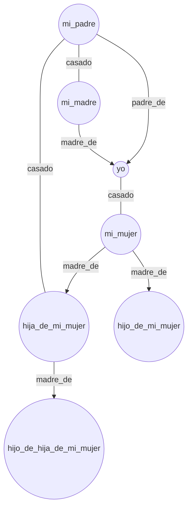
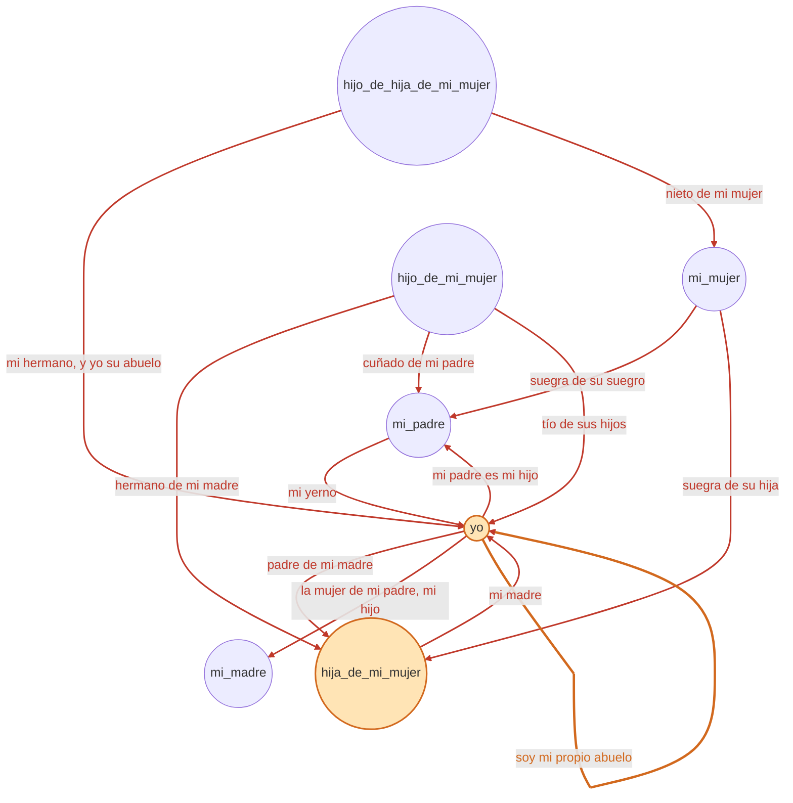

Hay una humorada que circula en castellano desde hace décadas, en versión video, en versión chiste de sobremesa de domingo con demasiada familia alrededor de la mesa[^img_hero], en versión "te lo cuento y no me vas a creer"[^cancion]. La escuché hace años, la conté mal un par de veces, y en algún momento me pareció obvio qué hacer con ella: no volver a contarla de memoria y arriesgarme a perder el hilo, sino escribirla en un lenguaje que no se pierde nunca en un árbol genealógico. Ese lenguaje es Prolog.

## El relato

Va completo, porque la gracia está en la acumulación:

> Tuve la desgracia de casarme con una viuda. Ella tenía una hija. De haberlo sabido nunca me hubiera casado.
>
> Mi padre para mayor desgracia era viudo, se enamoró y se casó con la hija de mi mujer.
>
> De manera que mi mujer era suegra de su suegro. Mi hijastra se convirtió en mi madre, y mi padre al mismo tiempo era mi yerno.
>
> Al poco tiempo mi madrastra trajo al mundo un varón, que era mi hermano, pero era nieto de mi mujer. De manera que yo era abuelo de mi hermano.
>
> Con el correr del tiempo, mi mujer trajo al mundo un varón, y como era hermano de mi madre, era el cuñado de mi padre y tío de sus hijos. Mi mujer era suegra de su hija.
>
> Yo en cambio soy padre de mi madre, y mi padre y su mujer son mis hijos. Además yo soy mi propio abuelo.

Si nunca la escuchaste, es normal que a la tercera frase ya hayas perdido el hilo. Es exactamente lo que le pasa a cualquiera que la sigue de oído. Y es exactamente el tipo de problema para el que Prolog existe.

## Por qué Prolog y no cualquier otra cosa

En un lenguaje imperativo, modelar esto significa escribir una estructura de datos para el árbol genealógico y una función que la recorra buscando el parentesco que te interese. En Prolog no hay que escribir el recorrido: se declaran los hechos (**padre_de/2**, **madre_de/2**, **casado/2**) y las reglas de parentesco derivado (**hijo_de/2**, **hermano_de/2**, **nieto_de/2**, ...), y el motor de resolución hace la búsqueda. La pregunta "¿soy mi propio abuelo?" se convierte en una consulta, no en un algoritmo que hay que diseñar.

Hace unos años armé el POC[^repo] con SWI-Prolog[^swipl]. El archivo `dos-casamientos.pl` tiene unas 260 líneas: no es el `abuelo(X,Y) :- padre(X,Z), padre(Z,Y).` de manual que uno esperaría, sino un vocabulario de parentesco bastante más completo — **madrastra_de/2**, **padrastro_de/2**, **suegra_de/2**, **suegro_de/2**, **hijastra_de/2**, **yerno_de/2**, **hermano_de/2**, **cuñado_de/2**, **nieto_de/2** — más catorce predicados de "conclusión", uno por cada frase-remate del relato, incluida la final.

## Los hechos base

Los personajes son siete, y las relaciones directas se declaran así:

```prolog
persona(mi_madre).
persona(mi_padre).
persona(yo).
persona(mi_mujer).
persona(hija_de_mi_mujer).
persona(hijo_de_hija_de_mi_mujer).
persona(hijo_de_mi_mujer).

hombre(mi_padre).  hombre(yo).
mujer(mi_madre).   mujer(mi_mujer).  mujer(hija_de_mi_mujer).

padre_de(mi_padre, yo).
madre_de(mi_madre, yo).
madre_de(mi_mujer, hija_de_mi_mujer).

/* casado(Esposo, Esposa) */
casado(mi_padre, mi_madre).
casado(yo, mi_mujer).
casado(mi_padre, hija_de_mi_mujer).
```

Con eso alcanza para derivar todo lo demás. La regla **hijo_de/2**, por ejemplo, no distingue si el vínculo viene del padre o de la madre:

```prolog
hijo_de(Hijo, Progenitor) :-
    persona(Hijo), persona(Progenitor),
  ( padre_de(Progenitor, Hijo)
          ;
    madre_de(Progenitor, Hijo)
  ).
```

Y **madrastra_de/2** — la que va a hacer todo el trabajo pesado del final — dice: sos madrastra de alguien si estás casada con quien es su progenitor:

```prolog
madrastra_de(Mujer, Persona) :-
    mujer(Mujer), persona(Mujer),
    casado(Esposo, Mujer), persona(Esposo),
    hijo_de(Persona, Esposo).
```

**padrastro_de/2** es la regla simétrica para el lado masculino.

## Cómo se cierra el lazo

Acá está la parte que no se ve a simple vista leyendo el chiste, y que Prolog deja perfectamente explícita. El predicado final no dice `abuelo(yo, yo)`; dice lo mismo desde el otro extremo del vínculo:

```prolog
yo_soy_mi_propio_abuelo :-
    nieto_de(yo, yo), !.
```

Es decir: se prueba que *yo soy nieto de mí mismo*, que es lógicamente lo mismo que ser mi propio abuelo, pero mirado desde abajo del árbol en vez de desde arriba. Para que eso sea cierto, `nieto_de(yo, yo)` necesita encontrar a alguien que sea al mismo tiempo "progenitor general" de `yo` y "hijo general" de `yo` — un único intermediario que cierre el círculo.

Ese intermediario es `hija_de_mi_mujer`, y el cierre pasa por dos hechos de parentesco político que la humorada ya adelanta:

- `hija_de_mi_mujer` es mi **madrastra**, porque se casó con mi padre (`casado(mi_padre, hija_de_mi_mujer)`) y yo soy hijo de mi padre. Eso hace que `madre_general_de(hija_de_mi_mujer, yo)` sea verdadero.
- Al mismo tiempo, yo soy el **padrastro** de `hija_de_mi_mujer`, porque me casé con su madre, `mi_mujer` (`casado(yo, mi_mujer)`, y `hija_de_mi_mujer` es hija de `mi_mujer`). Eso hace que `padre_general_de(yo, hija_de_mi_mujer)` también sea verdadero.

Una misma persona es, simultáneamente, mi madre política y mi hija política. Ese es el nudo — no una metáfora, un hecho que el motor de resolución encuentra solo, recorriendo **madrastra_de/2** y **padrastro_de/2** sin que nadie le diga dónde mirar. Cuando **nieto_de/2** combina ambas direcciones, `yo` termina siendo su propio abuelo. La consulta `?- yo_soy_mi_propio_abuelo.` responde `true.`, y con eso alcanza — pero lo interesante no es la respuesta, es el camino que el motor recorrió para llegar a ella sin que se lo hayamos indicado paso a paso.

## Los tests

El repo tiene una suite `plunit`[^plunit] con catorce tests — uno por cada conclusión del relato, incluida la final:

```
$ swipl -s tests/test_dos-casamientos.pl -g run_tests,halt -t 'halt(1)'
% PL-Unit: doscasamientos .............. done
% All 14 tests passed
```

No siempre fueron catorce sobre catorce. Tres predicados estuvieron un tiempo marcados `blocked` — **mi_padre_es_mi_yerno/0**, **mi_mujer_es_suegra_de_su_hija/0**, y el caso de "tío de sus hijos" del último hijo, que directamente no estaba implementado. **mi_padre_es_mi_yerno/0** fallaba por algo tan simple como el orden de los argumentos: la versión vieja preguntaba `yerno_de(yo, Padre)` (¿soy yo el yerno de mi padre?) cuando el relato dice lo contrario — mi padre es mi yerno, no al revés. Cambiar a `yerno_de(Padre, yo)` alcanzó. El caso del tío necesitaba un predicado que directamente no existía todavía: **tio_de/2**, que se agregó componiendo **hermano_de/2** con **padre_general_de/2**/**madre_general_de/2**. Con esas correcciones, el modelo termina demostrando el chiste completo, frase por frase, sin excepciones.

## Por qué este es el hello world perfecto

Uno podría escribir esta humorada como un dibujo, un hilo de Twitter, un diagrama. Pero un diagrama no *demuestra* nada — vos lo mirás y le creés, o no. Acá el motor de inferencia de Prolog llega a la misma conclusión que la abuela que te contaba el chiste en la sobremesa, pero llega solo, sin que nadie le diga el camino, componiendo reglas de parentesco genéricas que ni siquiera fueron escritas pensando en este caso particular. Esa es la demostración de que declarar hechos y reglas alcanza — no hace falta programar el árbol genealógico a mano. Si alguna vez quisiste una excusa liviana para probar Prolog por primera vez, esta humorada es una excusa mejor que cualquier ejercicio de manual.

## Apéndice: el árbol completo

Para quien prefiera ver esto de un vistazo, van dos diagramas. El primero son las siete personas y los ocho hechos base — líneas negras, sin interpretación, tal cual están declarados en el código:



El segundo son las trece conclusiones del relato — no hechos declarados, sino lo que el motor de inferencia *deriva* a partir de ellos, una por cada frase-remate del chiste. Por eso van en un color distinto, en rojo, sobre las mismas siete personas. Los dos nodos resaltados en naranja, `yo` e `hija_de_mi_mujer`, son los que se cierran en círculo — sus dos flechas rojas ("mi madre" / "padre de mi madre") son, en conjunto, exactamente lo que hace verdadero `nieto_de(yo, yo)`:



Las trece flechas rojas cubren los catorce predicados de "conclusión" que vimos más arriba (una sola flecha resume dos: **el_hijo_de_mi_madrastra_es_mi_hermano/0** y **yo_soy_abuelo_de_mi_hermano/0** comparten el mismo par de nodos). La última, en naranja y más gruesa, es el auto-lazo sobre `yo`: **yo_soy_mi_propio_abuelo/0**, la combinación de las dos flechas resaltadas — el cierre del chiste, dibujado literalmente como un círculo.

[^cancion]: La misma estructura lógica aparece, de forma independiente, en la canción country estadounidense *I'm My Own Grandpa* (1947), de Lonzo & Oscar — [grabación original en YouTube](https://www.youtube.com/watch?v=x3CvRC4fAmk), [entrada en Wikipedia](https://en.wikipedia.org/wiki/I%27m_My_Own_Grandpa) — prueba de que el chiste de parentescos imposibles no es un invento exclusivamente hispanoamericano, sino un nudo lógico que se redescubre en distintas culturas.

[^repo]: César Ballardini, [*prolog-me-case-con-una-viuda*](https://github.com/CesarBallardini/prolog-me-case-con-una-viuda), repositorio en GitHub. Contiene `dos-casamientos.pl`, la suite de tests `plunit` y el workflow de GitHub Actions que las corre en cada push.

[^swipl]: [SWI-Prolog](https://www.swi-prolog.org/) — implementación de Prolog usada en este proyecto. Para quien quiera profundizar en el lenguaje: Ivan Bratko, *Prolog Programming for Artificial Intelligence*, 4.ª ed., Pearson, 2011 (edición anterior, 3.ª ed. 2001, en [préstamo digital controlado en archive.org](https://archive.org/details/prologprogrammin0000brat_l1m9)); y William F Clocksin & Christopher S Mellish, *[Programming in Prolog](https://link.springer.com/book/10.1007/978-3-642-55481-0)*, 5.ª ed., Springer, 2003 (edición anterior, 2.ª ed. 1985, en [préstamo digital controlado en archive.org](https://archive.org/details/programminginpro00cloc)) — los dos clásicos de referencia.

[^plunit]: [`plunit`](https://www.swi-prolog.org/pldoc/doc_for?object=section%28%27packages/plunit.html%27%29) — el framework de testing unitario incluido en SWI-Prolog.

[^img_hero]: Imagen de portada: [*Italy. (People dining outdoors)*](https://commons.wikimedia.org/wiki/File:Italy._(People_dining_outdoors)_-_NARA_-_541742.tif) — fotografía c. 1948-1955, colección de fotografía del Plan Marshall, vía NARA (National Archives and Records Administration, EE.UU.) — Dominio público (obra de un empleado del gobierno federal de EE.UU.). Recortada a 2.5:1 para hero landscape.
