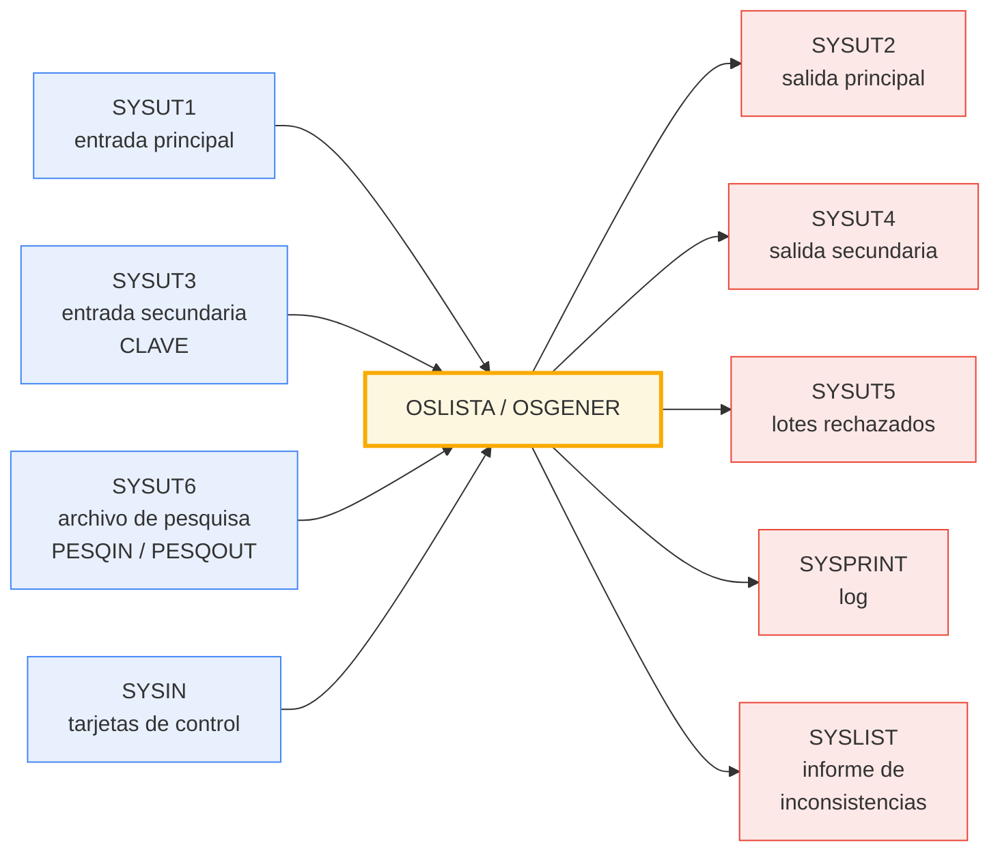

El libro que narra la historia les dedica un párrafo[^img_hero]. Un párrafo, en la página 37, es todo lo que la historia publicada de la informática del Estado argentino tiene para decir sobre dos programas que —según ese mismo párrafo— no hubo implementador, programador ni analista que no haya usado.

Yo tengo el manual. Y tengo la salida de un job de producción que los corrió de verdad. Así que hice lo único razonable: los escribí de nuevo[^repo].

## El párrafo

La fuente es *40 años de informática en el Estado argentino*, de Pablo A Fontdevila, Arturo Laguado Duca y Horacio Cao, publicado por EDUNTREF en noviembre de 2007[^libro]. En la sección «La edad de oro del CUPED», la página 37 dice:

> El desarrollo más reconocido fue el de dos utilitarios modulares desarrollados por Jorge Vattuone en el área de programación del CUPED. Estas dos herramientas – OS GENER y OS LIST - estaban diseñadas para formar parte del sistema operativo y así realizar tareas que, de otra manera, hubieran necesitado programas específicos. Con ellas, entre otras cosas, se podía aparear archivos o listas para reemplazar ó copiar datos de uno en otro, modificar o convertir datos de una tabla o archivo a otro, buscar archivos o tablas para seleccionar ó eliminar registros, etc. No hubo implementador, programador o analista que no haya echado mano a ellos ante cualquier contingencia.  Hasta el día de hoy veo entradas de experimentados (viejos) desarrolladores en Linkedin con referencias a proficiencia en el uso de esos programas.

Había un área de investigación y desarrollo a la que los compañeros llamaban, «con sorna y algo de envidia», *los becados*; y había una política explícita:

> A partir de los '70, se incursionó en el software de base de IBM y en el diseño de utilitarios, tratando de reducir la dependencia con la firma norteamericana.

Eso es todo. Dos párrafos y un cierre —«el OS GENER y el OS LISTA fueron agregados a la rutina de trabajo del CUPED con tanto éxito que se acusa a IBM de incorporarlo a su sistema operativo, usándolos hasta principios del siglo XXI»— y con eso se agota el registro publicado.

Sobre esa última frase conviene ser prolijo: es lo que afirma el libro, y no encontré ninguna corroboración independiente de que IBM haya absorbido las utilerías en su sistema operativo. La repito como cita, no como hecho.

Y una aclaración sobre el título de este post: las fuentes que tengo no fijan una fecha. El libro dice «a partir de los '70» y el manual que sobrevivió es la publicación **1/84**. «Fines de los '70» es mi estimación, no un dato documentado.

## Qué era el CUPED

El **CUPED** —Centro Único de Procesamiento Electrónico de Datos— se creó el 18 de octubre de 1967 bajo la Secretaría de Estado de Seguridad Social, y durante décadas fue el centro de cómputos centralizado del Estado argentino. Antes se llamó **CUSDI**, y acá aparece un detalle que dice bastante sobre el estado del registro histórico: el propio libro expande esa sigla de dos maneras distintas en dos lugares distintos.

Hay una segunda incógnita, y es la tapa del manual. Cada una de sus 37 hojas está encabezada por `SCD - CENTRO DE COMPUTOS - DEPARTAMENTO DE INGENIERIA`. El libro usa esas tres letras una sola vez, para una asesoría en Sistemas de Computación de Datos creada bajo la Presidencia de la Nación. Es una expansión plausible de la sigla, pero no una identificación: la SCD del libro es un organismo de normas y asesoramiento, y la SCD del manual tiene centro de cómputos propio y departamento de ingeniería. Pueden ser la misma cosa, pueden ser sucesivas, pueden no tener nada que ver. El libro nunca vincula ninguna de las dos con la publicación 1/84.

## Un lenguaje de 80 columnas

La idea de diseño es la parte que mejor envejeció.

**OSLISTA** produce listados a partir de archivos. **OSGENER** genera archivos. Ninguno de los dos se programa: se *parametriza*, con tarjetas de control de 80 columnas que se leen en tiempo de ejecución. El código de operación va en la columna 1; los operandos, separados por al menos un blanco. No hay compilación, no hay link-edit, no hay pase por el bibliotecario. Escribís el mazo dentro del JCL y corrés:

```
//SYSIN    DD *
PESQIN 1,5,1
RCIN  1,3,EQ,'ARG'/1,3,EQ,'BRA'
COND1 8,4,GE,'1990'
GENER 1,7/80,1/'0','1','2','3'
CODIG '1',OBL,'2'
INCON '0'/12,6,FD/13,1,ND
FIELD 1,3,MOVE,1
FIELD 18,6,MOVE,10
FIELD 98,6,MOVE,20
FIELD 18,6,zDVy,30
/*
```

Eso es, en términos de hoy, un lenguaje de dominio específico embebido en un mazo de tarjetas. Es exactamente el mismo movimiento conceptual que `awk`, que `sed`, que las utilerías `SORT` de IBM: resolver una familia entera de problemas con un programa parametrizable en vez de con *n* programas a medida. La introducción del manual lo dice sin vueltas —«en ciertas situaciones pueden reemplazar la codificación de programas en COBOL, con el ahorro de recursos que ello implica»— y hay que leer «ahorro de recursos» en el sentido literal de 1984, cuando el recurso escaso era el tiempo de máquina tanto como el del programador.

La contracara también se ve con cuarenta años de perspectiva: el vocabulario creció hasta ser un lenguaje, con la diferencia de que nadie lo diseñó como lenguaje. Se nota en las asimetrías. Dentro de una tarjeta `RCIN` el separador `/` significa **o**; dentro de una tarjeta `INCON`, el mismo `/` significa **y**. Las dos decisiones son razonables en su contexto local, y juntas pueden dar lugar a confusión.

## El vocabulario

Lo interesante de la lista de capacidades que da el libro es que se mapea una a una contra las tarjetas que documenta el manual. Esa correspondencia es, hasta donde sé, la mejor evidencia de que la publicación 1/84 documenta efectivamente las herramientas que el libro describe:

| El libro dice | La tarjeta se llama |
| --- | --- |
| aparear archivos o listas | `CLAVE`, `PESQIN` / `PESQOUT` |
| reemplazar o copiar datos de uno en otro | `COPY`, `FIELD` |
| convertir datos de una tabla o archivo a otro | `CONV` + tablas de conversión |
| buscar para seleccionar o eliminar registros | `RCIN` / `RCOUT` |

Y el manual documenta bastante más de lo que el libro menciona:

- **`GENER`** consolida varias tarjetas que comparten una clave en un área de 800 bytes —diez ranuras de 80— ubicadas según la prioridad del código declarado en cada tarjeta, no según el orden de llegada.
- **`CODIG`** declara qué códigos son obligatorios dentro de un lote.
- **`INCON`** valida consistencia con ocho tipos de regla, y algunas de ellas **corrigen el dato en el lugar** en vez de rechazar el registro.
- **`ACUM`** da nueve acumuladores con las cuatro operaciones.
- **`CORTE`** e **`IMCOR`** dan diez niveles de corte de control con sus totales.
- **`xDVy`** calcula el dígito verificador módulo 10, con pesos 2,1,2,1… de derecha a izquierda y la regla de restar 9 cuando el producto pasa de 9.
- **`TIT`**, **`PRINT`** y **`CARRO`** manejan títulos, formato de línea y control de carro de la impresora.

Todo con límites explícitos y chicos: 150 condiciones, 125 operaciones `FIELD`, 20 tablas de conversión, 10 niveles de corte, 10 códigos por lote. Números que hoy suenan arbitrarios y que en su momento eran, literalmente, cuánta memoria se les podía dar.

## Nueve archivos

Toda la arquitectura entra en un diagrama. Nueve DDNAMEs: cuatro entradas, cinco salidas.



En el port a sistemas abiertos los DDNAMEs se resuelven por variables de entorno, así que el equivalente de todo el JCL es:

```sh
export SYSUT1=./in.dat SYSUT2=./out.dat SYSIN=./cards.txt SYSPRINT=./log.txt
./bin/OSGENER
```

## Un motor, dos personalidades

La reimplementación es un único motor: `src/OSENGINE.CBL`, unas 4800 líneas de COBOL-85 estricto en formato fijo hasta la columna 72, que parsea las tarjetas en tiempo de ejecución y se comporta como una u otra utilería. Los dos ejecutables son stubs mínimos que hacen `CALL "OSENGINE" USING` un campo `PIC X(7)` con el modo.

Podría haber escrito dos programas. No lo hice porque cerca del 90 % del vocabulario es común a ambos, y duplicarlo era garantizar que las dos copias divergieran en el primer arreglo de bugs.

Compila con **GnuCOBOL 3.2** en dos perfiles de dialecto, `-std=mvs` y `-std=rm`, desde una sola fuente. Y los dos builds producen resultados **byte a byte idénticos** — demostrado mediante la integración continua con una matriz sobre ambos dialectos en cada push.

El precio de esa portabilidad es cero funciones intrínsecas, y es un ejercicio instructivo:

- `CURRENT-DATE` → `ACCEPT … FROM DATE` más una ventana de siglo hecha a mano.
- Los dieciséis usos de `NUMVAL` por dígito → una tabla de lookup.
- `UPPER-CASE` → `INSPECT … CONVERTING`.
- `ORD` y `CHAR` → un redefine `BINARY` big-endian, válido en GnuCOBOL, en MVS real y en RM/COBOL porque los tres definen binarios big-endian.
- Las salidas tempranas, que en GnuCOBOL escribirías con `EXIT PARAGRAPH`, van como `GO TO <n>-EXIT` más `PERFORM … THRU <n>-EXIT`, que es el patrón clásico del '85.

La única línea realmente atada al dialecto —cómo se asigna dinámicamente el nombre del archivo de una tabla de conversión— quedó aislada en un copybook por dialecto, que el Makefile elige con `-I src/copy/$(DIALECT)`.

La conclusión que me llevé: escribir COBOL portable en 2026 se parece muchísimo a escribirlo en 1984, porque la restricción es la misma. Cada comodidad que agregó el compilador es una decisión que después no podés deshacer.

## Cinco maneras de estar equivocado

La parte del proyecto de la que estoy más conforme no es el motor: es cómo está medido. Son cinco suites, y cada una prueba algo que la anterior no puede.

| Suite | Qué prueba | Estado |
| --- | --- | --- |
| `OSTESTS.CBL` | 5 asserts en COBOL sobre los algoritmos núcleo: desempaquetado COMP-3 por nibbles, módulo 10, lookup por intervalos | 5/5 |
| `run_tests.sh` | 63 casos de comportamiento, límites de tablas y parseo negativo | 63/63 |
| `manual_examples.sh` | **los 93 ejemplos de tarjetas impresos en el manual**, uno por caso | 93/93 |
| `golden_check.sh` | 4 líneas base end-to-end, diffeadas en cada `make test` | 4/4 |
| `mainframe_check.sh` | **8 pasos de un job de producción de 1984, contra la salida que produjo el mainframe genuino** | 8/8 |

Cuando el criterio de éxito es un documento, lo que estás validando es tu comprensión del documento; cuando el criterio es la salida de la máquina original, no hay dónde esconderse. Mientras iba escribiendo el programa, veintinueve huecos de conformidad quedaron al descubierto sólo por replicar los 93 ejemplos impresos, y **cuatro de ellos aparecieron mientras arreglaba otros**, no en la auditoría inicial. Cada hueco tapaba un defecto silencioso más abajo.

## Dos rarezas del EBCDIC

Hay dos cosas que descubrí replicando el job real y que no son bugs de nadie. Las anoto porque son el tipo de detalle que no aparece en ningún manual de migración.

**La colación cambia el orden del universo.** En EBCDIC las letras ordenan *por debajo* de los dígitos; en ASCII, por encima. Los archivos de pesquisa abren con un registro de texto descriptivo que en el mainframe quedaba correctamente ubicado para el merge ordenado y que, transcodificado a ASCII, se va al principio y bloquea el merge. El dato no cambió ni un bit: cambió el orden del alfabeto debajo de él.

**Un `X'00'` puede ser dato.** Los datasets originales eran `RECFM=FB`, de longitud fija y sin terminadores de registro, así que un byte nulo en medio de un campo era dato perfectamente ordinario. Al replicarlo, el build de GnuCOBOL sobre Linux hace el ida y vuelta sin perder nada, y el de Windows pierde esos registros. Mismo código, mismo dato, dos resultados. En el mainframe el sistema de archivos también es parte del programa.

## Sobre la asistencia de IA

Escribí este proyecto con la asistencia de Claude, de Anthropic. En un trabajo anterior intenté realizar estos programas, solicité que me asignen un programador COBOL experimentado para realizar las tareas de codificación.  Esperé tres meses y no pudieron conseguir ninguno. Cosas que podían suceder en 2017.  Ahora en 2026 esa limitación de personal no existe: querido programador COBOL de 2017, no te necesito, gracias.

Vale la pena separar qué parte no era delegable, porque son justamente las decisiones que definieron el resultado:

- La estrategia de un motor único con dos stubs, en vez de dos programas o de un esquema de compilación condicional.
- La resolución de las contradicciones entre las transcripciones documentales previas: qué va a `SYSUT5`, qué corrige `INCON` en el lugar, qué se hace con los casos inalcanzables.
- El modelo de conectores: leer una tarjeta de condiciones como una **disyunción de corridas**, donde `/` cierra una corrida y abre otra y por eso puede cambiar de familia lógica. Es la única lectura que hace legales a todos los ejemplos impresos.
- La restricción de que sólo las reglas relacionales puedan ser alternativas con `.O.`.
- El tamaño de registro de entrada: 32760 bytes, el registro QSAM no *spanned* más grande que admite un dataset de MVS, para que ningún LRECL legítimo sea rechazado.
- Y la decisión de fondo: que el criterio de éxito fuera la salida del mainframe real y no la lectura del manual.

## Cierre

Dos programas escritos por una persona con nombre y apellido en un organismo público argentino, usados por todo el mundo durante décadas, documentados en un párrafo.

Es el destino habitual del software de infraestructura: se vuelve invisible exactamente en la medida en que funciona bien. Nadie escribe la historia de la herramienta que nunca falló; se escribe la del sistema que se cayó. Jorge Vattuone resolvió, con dos utilerías parametrizables, una clase entera de problemas que de otro modo habrían sido miles de programas COBOL a medida, y el reconocimiento que le quedó es una línea en la página 37.  Gracias Jorge, si sumamos las horas de trabajo que ahorraste seguramente podríamos sumar la duración de varias vidas humanas.

Reimplementarlas fue, más que nada, una forma de leerlas con atención. Y de dejar por escrito que existieron.  Si todavía las estás usando en un mainframe, buscá a Jorge y mandale un mensaje de agradecimiento, invitalo un café.

[^img_hero]: Imagen de [CHM Artifacts — IBM System/360 control panel (model 91)](https://commons.wikimedia.org/wiki/File:CHM_Artifacts_IBM_System_360_control_panel_(model_91)_(2375800585).jpg) — CC BY 2.0 — Marcin Wichary, 2008, Computer History Museum. Los tres diales hexadecimales de la foto son la entrada `CYCLIC PROGRAM COUNTER ENTRY`: el operador componía una dirección a mano, dígito por dígito. Recortada a 2,5:1 para hero landscape.

[^repo]: [`CesarBallardini/osgener-oslista`](https://github.com/CesarBallardini/osgener-oslista) — la reimplementación completa, bajo licencia MIT. El manual original y su traducción íntegra al inglés están en `docs/manual/`; la historia de la implementación, con las diez fases y las decisiones de diseño, en `docs/plan.md`; la referencia de tarjetas de control, en `docs/user-guide.md`.

[^libro]: Pablo A Fontdevila, Arturo Laguado Duca y Horacio Cao, *40 años de informática en el Estado argentino*, Buenos Aires: EDUNTREF — Universidad Nacional de Tres de Febrero, 1.ª edición, noviembre de 2007, 170 pp. Investigación realizada en el Centro de Investigación en Administración Pública de la Facultad de Ciencias Económicas de la UBA. El coautor Horacio Cao publica el PDF para descarga libre [en su propio sitio](https://www.horaciocao.com.ar/wp-content/uploads/2015/05/08_Cuarenta_anos_de_informatica_en_el_Estado.pdf) ([copia archivada en Wayback Machine, 2023-10-12](https://web.archive.org/web/20231012043250/https://www.horaciocao.com.ar/wp-content/uploads/2015/05/08_Cuarenta_anos_de_informatica_en_el_Estado.pdf)), y hay [una copia en el repo del proyecto](https://github.com/CesarBallardini/osgener-oslista/blob/main/docs/Cuarenta_anos_de_informatica_en_el_Estado.pdf) por ser la fuente citada de `docs/a-little-history.md`. Las citas conservan la ortografía del original, incluida su `ó` acentuada donde va la conjunción *o*.
