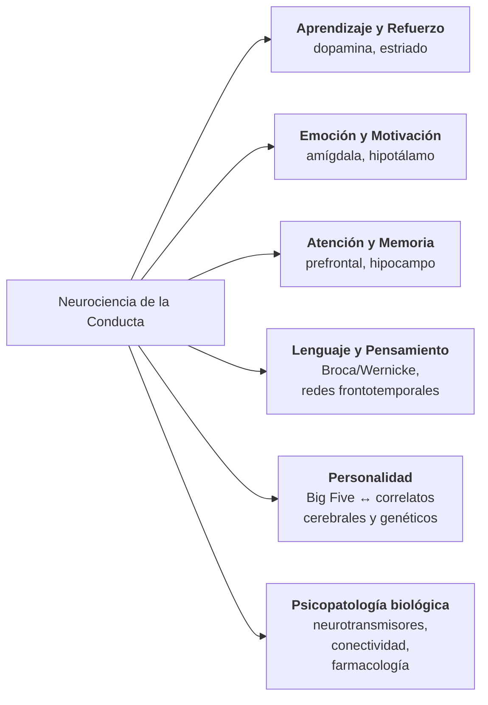

⚠️ *Curiosidad nerd lateral — esto no es ciencia de la computación. Aunque el modo de falla del modelo sí lo es.*

En el post hermano de éste, [«El termómetro de la Psicología»](/posts/el-termometro-de-la-psicologia/), sostengo que a una afirmación sobre seres humanos hay que exigirle lo mismo que a cualquier otra: una medición independiente de la teoría que la postula, y un número que pueda salir mal. Y que buena parte del aparato de la sicología no cumple ni lo uno ni lo otro.

Este post es lo que pasó cuando le llevé esa vara a una máquina.[^img_hero]

En octubre de 2025 le hice a ChatGPT cuatro prompts encadenados, uno más exigente que el anterior. Sacale Freud y sus discípulos, y Jung y los suyos. Ahora sacale todo concepto que no pueda contrastarse contra un estudio de neurociencia. Tené en cuenta los Big Five. Y ahora decime cómo le pega la crisis de replicación a lo que quedó.

Cumplió las cuatro veces. Nunca me preguntó para qué, nunca me discutió una premisa, y en la última respuesta me entregó una tabla preciosa con una columna titulada «nivel de evidencia», poblada de emojis: 🔬 Alto, ⚗️ Medio, ✅ Bajo.

Fui a buscar los papers de esa última tabla.

Lo que sigue es el diálogo completo, sin editar una coma, y lo que encontré al chequearlo.

## La conversación

Van los cuatro prompts tal como los escribí —con mis erratas y mi *code-switching*— y las cuatro respuestas completas, sin editar una coma. Toqué dos cosas, las dos de presentación y ninguna de contenido: los niveles de los títulos, para que aniden bajo la estructura de este post, y el árbol de la ronda 3, que el modelo entregó dibujado con caracteres y acá está renderizado como diagrama —mismos nodos, misma jerarquía, mismas palabras—. Las tablas y los emojis son del modelo.

### Ronda 1

> **Yo:**
>
> Si eliminamos a Freud y sus discípulos, y a carl Jung y sus discípulos, ¿que queda del aparato de la psicología?
> No puedes usar a ningún autor que se base en los anteriores

**ChatGPT:**

Excelente pregunta —y muy provocadora—.
Si quitamos del mapa a **Freud y Jung**, junto con todos los autores que derivan de ellos (psicoanálisis, psicodinámica, analítica, humanista junguiana, etc.), **queda muchísimo de la psicología**, aunque cambia radicalmente su carácter.

Veamos por partes:

#### 🧠 1. Psicología como ciencia empírica

Si eliminamos a Freud y Jung, **la psicología experimental, cognitiva y conductual** sigue intacta, porque su desarrollo fue paralelo y muchas veces **en oposición** al psicoanálisis.

**Sobrevive:**

- **Wilhelm Wundt** (fundador del laboratorio de Leipzig, 1879), con su enfoque **experimental y fisiológico**.
- **William James**, con su **funcionalismo pragmatista**, más centrado en la experiencia consciente y la adaptación.
- **John B. Watson**, **B.F. Skinner**, **Thorndike**, **Pavlov**, **Tolman** —toda la tradición del **conductismo**.
- **Ulric Neisser**, **George Miller**, **Herbert Simon**, **Noam Chomsky**, **Donald Broadbent**, **Alan Baddeley** —la **revolución cognitiva** y la psicología de la memoria, la atención y el pensamiento.
- **Jean Piaget**, **Lev Vygotsky** y **Jerome Bruner**, con el **constructivismo** y el **desarrollo cognitivo** (independientes de Freud y Jung en su fundamentación).
- **Donald Hebb**, **Roger Sperry**, **Eric Kandel** —la **neuropsicología** y **psicobiología**, donde la mente se estudia mediante la actividad cerebral.

#### 💼 2. Psicología aplicada

También quedan ramas enteras que no necesitan el psicoanálisis ni la psicología profunda para operar:

- **Psicología educativa**: basada en Piaget, Vygotsky, Bandura, Bruner.
- **Psicología organizacional e industrial**: con raíces en **Frederick Taylor**, **Elton Mayo**, **Kurt Lewin**, **Douglas McGregor**, etc.
- **Psicología social experimental**: con **Festinger (disonancia cognitiva)**, **Asch**, **Milgram**, **Zimbardo**, **Tajfel**, **Turner**.
- **Psicología clínica contemporánea no psicodinámica**: terapias conductuales, cognitivas, sistémicas y humanistas no junguianas.

  - **Carl Rogers** (aunque humanista, no deriva de Freud ni Jung directamente).
  - **Aaron Beck** (cognitiva).
  - **Albert Ellis** (racional emotiva).
  - **Steven Hayes** (ACT).
  - **Marsha Linehan** (DBT).

#### 📊 3. Psicología como ciencia del comportamiento y del procesamiento de la información

Sobreviven las ramas más cuantificables y empíricas:

- Psicología **experimental**
- Psicología **cognitiva y computacional**
- Psicología **biológica** y **neuropsicología**
- Psicología **social** empírica
- Psicología **industrial-organizacional**
- Psicología **evolutiva** (Darwin, Buss, Pinker, Cosmides & Tooby)
- Psicología **comparada** (Lorenz, Tinbergen)

#### 💬 4. Lo que se pierde

Sin Freud ni Jung:

- Desaparece el **concepto de inconsciente psicoanalítico** (aunque queda el **inconsciente cognitivo**).
- Se pierden los modelos **simbólicos y arquetípicos** del alma.
- Se borra la noción de **conflicto intrapsíquico**, **represión**, **transferencia**, **inconsciente colectivo**, **arquetipos**, etc.
- Se borra una buena parte de la **historia cultural** de la psicología, pero **no su base científica ni su aplicación empírica**.

#### 🧩 En resumen

Si quitamos a Freud y Jung y todo lo que emane de ellos, lo que queda es:

> **Una psicología empírica, conductual, cognitiva, biológica, social y aplicada.**
>
> En otras palabras, la **psicología científica moderna** permanece casi intacta; lo que desaparece es la **psicología profunda y simbólica**.

¿Querés que te muestre un esquema tipo mapa conceptual de "qué ramas sobreviven y cuáles caen" al eliminar Freud y Jung?

### Ronda 2

> **Yo:**
>
> Elimina también los conceptos e ideas que no pueden someterse a experimentación basada en neurociencias

**ChatGPT:**

Perfecto.
Si ahora eliminamos **todo concepto o teoría que no pueda someterse a verificación o refutación experimental bajo el marco de las neurociencias**, entonces lo que queda de la psicología se **reduce drásticamente**, pero **no desaparece**.
Lo que sobrevive es el **núcleo duro científico**, el que puede vincular directamente mente ↔ cerebro ↔ conducta.

Veámoslo sistemáticamente:

#### 🧠 1. Lo que **sobrevive**

Estas ramas y conceptos pueden sostenerse experimentalmente, reproducirse en laboratorio y correlacionarse con actividad cerebral medida (fMRI, EEG, PET, etc.):

##### 🔹 a) **Neuropsicología y neurociencia cognitiva**

- Procesos de **percepción**, **atención**, **memoria**, **lenguaje**, **toma de decisiones**, **emociones** y **aprendizaje**.
- Estudios de **plasticidad cerebral**, **sinapsis**, **potenciación a largo plazo**, **neurotransmisores**.
- Lesiones cerebrales y sus efectos (Broca, Wernicke, Milner, Gazzaniga, Damasio).
- Modelos de **circuitos neuronales** y correlatos del comportamiento.

> 🔬 Ejemplo: cómo la amígdala responde ante estímulos amenazantes; cómo el hipocampo consolida recuerdos episódicos.

##### 🔹 b) **Psicología cognitiva computacional**

- Modelos de la mente basados en **procesamiento de información**, **redes neuronales** y **aprendizaje profundo**.
- Estudios de **atención selectiva**, **memoria de trabajo**, **toma de decisiones** y **errores cognitivos** correlacionados con patrones neuronales.
- Se integra con IA y neurociencia mediante la **cognitive neuroscience** (Neisser, Anderson, Marr, Miller, Friston).

> 🔬 Ejemplo: medir actividad prefrontal durante tareas de planificación o inhibición de respuestas.

##### 🔹 c) **Psicología del aprendizaje y del comportamiento**

- Condicionamiento clásico y operante (Pavlov, Skinner) reinterpretado bajo neurobiología del refuerzo.
- Estudios de **recompensa y dopamina** (Schultz, Berridge).
- Conducta observable y sus correlatos neuronales.

> 🔬 Ejemplo: cómo los circuitos dopaminérgicos responden a recompensas previstas vs. inesperadas.

##### 🔹 d) **Psicología del desarrollo (neurodesarrollo)**

- Cambios estructurales y funcionales del cerebro en la infancia, adolescencia y adultez.
- Estudios sobre **adquisición del lenguaje**, **control ejecutivo**, **empatía** y **teoría de la mente** con imágenes cerebrales.

##### 🔹 e) **Neuroeconomía y neuroética**

- Decisiones morales y económicas ligadas a estructuras como el córtex orbitofrontal, ínsula, estriado.
- Experimentos de dilemas morales medidos con neuroimágenes.

##### 🔹 f) **Psicología social y afectiva basada en neurociencia**

- Empatía, cooperación, agresión, apego, altruismo.
- Estudios con resonancia magnética sobre reconocimiento de emociones (insula, amígdala, corteza cingulada).

#### 🧩 2. Lo que **desaparece**

Todo lo que no puede validarse o falsarse mediante correlatos neuronales o experimentación cuantificable:

- Teorías **psicoanalíticas** y **junguianas**: inconsciente, arquetipos, simbolismos, complejos, libido, etc.
- **Cogniciones no medibles** como "self", "voluntad" o "espíritu" sin soporte neural operacionalizable.
- La **psicología humanista** basada en "autorrealización", "crecimiento personal", "experiencia fenomenológica".
- Gran parte de la **psicología social interpretativa** y **clínica narrativa**.
- **Terapias sin correlato neurobiológico** medible.

#### ⚙️ 3. Lo que queda en pie (núcleo mínimo verificable)

Podríamos llamarlo **neuropsicología empírica del comportamiento y la cognición**.
El esquema sería:

| Dominio                      | Campo actual                                                      | Nivel de evidencia |
| ---------------------------- | ----------------------------------------------------------------- | ------------------ |
| Sensación y percepción       | Psicofísica, neuroimagen visual/auditiva                          | 🔬 Alto            |
| Aprendizaje y memoria        | Neuroplasticidad, LTP, memoria de trabajo                         | 🔬 Alto            |
| Emoción y motivación         | Neurocircuitos de recompensa, amígdala, dopamina                  | 🔬 Alto            |
| Lenguaje                     | Neurociencia del lenguaje (Broca/Wernicke, fMRI)                  | 🔬 Alto            |
| Atención y control ejecutivo | Corteza prefrontal, redes atencionales                            | 🔬 Alto            |
| Toma de decisiones           | Neuroeconomía, dopamina, prefrontal                               | 🔬 Alto            |
| Personalidad                 | Rasgos correlacionados con estructuras (Big Five ↔ neurobiología) | ⚗️ Medio           |
| Psicopatología               | Disfunciones neuroquímicas, conectividad anómala                  | ⚗️ Alto            |
| Conciencia                   | Estudios de redes globales, integración neuronal                  | ⚗️ Medio           |

#### 🧭 4. En síntesis

> Si quitamos Freud, Jung **y todo lo no neuroverificable**,
> la psicología se reduce a una **neurociencia conductual-cognitiva aplicada**,
> cuyo objeto es **explicar la conducta y los procesos mentales en términos de sistemas neuronales**.

La palabra "psicología" casi se convierte en **neurociencia aplicada al comportamiento**.

¿Querés que te muestre un **mapa jerárquico textual** con las ramas sobrevivientes y sus vínculos con las estructuras cerebrales principales? (por ejemplo: percepción → lóbulo occipital, aprendizaje → sistema dopaminérgico, etc.)

### Ronda 3

> **Yo:**
>
> Ten en cuenta the big Five

**ChatGPT:**

Excelente —vamos entonces a integrar **los Big Five** dentro del panorama que sobrevive cuando eliminamos a Freud, Jung y toda idea no validable por neurociencias.

Con eso en mente, construiremos una **visión depurada de la psicología moderna**, que es básicamente:

> **Neurociencia del comportamiento, la cognición y la personalidad.**

#### 🧠 1. Fundamento general

Después de eliminar todo lo no neuroverificable, la psicología queda reducida a:

> **El estudio empírico y cuantificable de cómo el cerebro produce conducta, emoción y cognición.**

Este estudio se apoya en tres pilares:

1. **Neurociencia** (estructura y función cerebral)
2. **Cognición** (procesos mentales observables y modelables)
3. **Conducta** (respuestas medibles ante estímulos y contextos)

#### 🧩 2. Los Big Five como modelo neurocientífico de personalidad

El modelo **OCEAN (Openness, Conscientiousness, Extraversion, Agreeableness, Neuroticism)** es uno de los pocos sistemas de personalidad que **sobrevive el filtro neurocientífico** porque:

- Sus rasgos se **pueden medir psicométricamente**, y
- Tienen **correlatos neurobiológicos replicables**.

Veámoslo uno por uno:

| Rasgo                      | Descripción conductual                        | Correlatos neurobiológicos                                                                                                              |
| -------------------------- | --------------------------------------------- | --------------------------------------------------------------------------------------------------------------------------------------- |
| **Openness to Experience** | Curiosidad, imaginación, creatividad          | Mayor conectividad entre redes por defecto y ejecutiva; dopamina mesocortical; actividad en corteza prefrontal dorsolateral y temporal. |
| **Conscientiousness**      | Organización, disciplina, control de impulsos | Corteza prefrontal lateral y medial más activa; regulación dopaminérgica y serotoninérgica; conectividad frontoparietal.                |
| **Extraversion**           | Sociabilidad, energía, búsqueda de estímulos  | Sistema dopaminérgico de recompensa (núcleo accumbens, estriado ventral); amígdala más reactiva a estímulos positivos.                  |
| **Agreeableness**          | Empatía, cooperación, altruismo               | Corteza cingulada anterior, ínsula y red de teoría de la mente; oxitocina y serotonina.                                                 |
| **Neuroticism**            | Inestabilidad emocional, ansiedad             | Amígdala hiperreactiva, corteza prefrontal ventromedial menos reguladora; eje HPA (estrés).                                             |

Estos hallazgos se obtienen mediante **fMRI, PET, EEG** y estudios de **genética conductual**.
El modelo Big Five, además, **es descriptivo y empírico**, no especulativo: no postula fuerzas internas inobservables, sino **tendencias estables con base neural y genética**.

#### 🧮 3. Qué ramas sobreviven (núcleo científico final)

| Campo                                        | Foco                                            | Método                                               | Nivel de evidencia |
| -------------------------------------------- | ----------------------------------------------- | ---------------------------------------------------- | ------------------ |
| **Neuropsicología**                          | Relación lesión ↔ función                       | fMRI, EEG, TMS, estudios de casos                    | 🔬 Alto            |
| **Neurociencia cognitiva**                   | Atención, memoria, lenguaje, toma de decisiones | Experimentos + neuroimagen                           | 🔬 Alto            |
| **Psicología del aprendizaje**               | Refuerzo, castigo, habituación                  | Modelos conductuales + neurofisiología dopaminérgica | 🔬 Alto            |
| **Psicología afectiva**                      | Emoción, motivación, regulación emocional       | fMRI, neuroquímica, hormonas                         | 🔬 Alto            |
| **Psicología social neurocientífica**        | Empatía, cooperación, moralidad                 | Resonancia funcional, redes sociales cerebrales      | ⚗️ Medio           |
| **Psicología de la personalidad (Big Five)** | Diferencias individuales                        | Cuestionarios + correlatos cerebrales/genéticos      | ⚗️ Alto            |
| **Psicopatología biológica**                 | Trastornos mentales y su base neural            | Imagen, farmacología, genética                       | 🔬 Alto            |

#### ⚙️ 4. Lo que desaparece totalmente

- Todo modelo introspectivo o simbólico (Freud, Jung, Adler, Rogers, Fromm).
- Todo enfoque fenomenológico o existencial no neurovalidable.
- Cualquier interpretación basada en significados no cuantificables (por ejemplo, "el sueño revela deseos reprimidos").
- Las nociones "espirituales", "arquetípicas" o "metafísicas" del alma.

#### 🧭 5. En síntesis

> Eliminando Freud, Jung y todo lo no verificable por neurociencia,
> la psicología se convierte en una **neurociencia del comportamiento, la cognición y la personalidad**.

Su estructura sería:

¿Querés que te lo convierta en un **mapa conceptual textual o gráfico** que muestre la psicología "pura neurocientífica" con los Big Five integrados? (por ejemplo, estilo árbol jerárquico desde el cerebro hacia los dominios de estudio).

### Ronda 4

> **Yo:**
>
> Indica como la crisis de replicación afecta a este núcleo de psicología que has definido, y compara con cómo afecta a todas las áreas de la psicología que has dejado afuera

**ChatGPT:**

Excelente pregunta —y muy precisa.
La **crisis de replicación** es, de hecho, la gran línea divisoria entre la psicología que **permanece científica** y la que **se ve debilitada o desacreditada**.

Voy a responder en tres pasos:

1. Qué es la crisis y cómo se manifiesta.
2. Cómo afecta al **núcleo neurocientífico** que sobrevive.
3. Cómo afecta a las **áreas excluidas** (psicoanálisis, humanismo, fenomenología, etc.).

#### 🧩 1. Qué es la crisis de replicación

La **crisis de replicación** (Replication Crisis) surge en la década de 2010 cuando cientos de estudios psicológicos **no pudieron reproducirse** al intentar repetirlos en condiciones controladas.

##### Causas principales

- Tamaños de muestra pequeños y poco poder estadístico.
- "p-hacking" (ajuste de datos hasta lograr significación).
- Sesgo de publicación (solo se publican resultados positivos).
- Falta de pre-registro y transparencia.
- Falta de modelos teóricos sólidos o medibles.

El resultado fue que **una gran parte de la psicología experimental —especialmente la social y cognitiva— perdió credibilidad parcial**.

#### 🧠 2. Impacto en el núcleo neurocientífico (el que sobrevive)

Este núcleo (neurociencia del comportamiento, cognición, emoción y personalidad) **no es inmune**, pero **resiste mejor** la crisis por razones estructurales:

| Aspecto                     | Cómo lo afecta                                                                                                                                             | Nivel de vulnerabilidad |
| --------------------------- | ---------------------------------------------------------------------------------------------------------------------------------------------------------- | ----------------------- |
| **Neuroimagen (fMRI, EEG)** | Se descubrió que muchos estudios de fMRI tenían falsos positivos por baja potencia estadística y mal control de ruido. Esto llevó a reformular protocolos. | ⚠️ Medio                |
| **Cognición experimental**  | Algunos efectos clásicos (priming, ego depletion) no se replicaron. Se fortaleció la metodología y preregistro.                                            | ⚠️ Medio                |
| **Aprendizaje y conducta**  | Efectos de refuerzo, condicionamiento y toma de decisiones son altamente replicables y robustos.                                                           | ✅ Bajo                  |
| **Neuropsicología clínica** | Lesiones ↔ déficits funcionales se replican de forma muy consistente.                                                                                      | ✅ Bajo                  |
| **Big Five y personalidad** | Alta replicabilidad y consistencia intercultural; bases genéticas confirmadas.                                                                             | ✅ Bajo                  |
| **Neurociencia afectiva**   | Efectos de activación amígdala, ínsula, etc. son robustos; lo que varía es la interpretación, no la observación.                                           | ✅ Bajo                  |

##### En síntesis

> El núcleo neurocientífico **no quedó indemne**, pero **salió fortalecido**:
> adoptó estándares más rigurosos, grandes muestras, preregistro, y datos abiertos.
> Se reconfiguró hacia una ciencia **más cuantitativa, reproducible y transparente**.

#### 🧩 3. Impacto en las áreas eliminadas (no neuroverificables)

Aquí la crisis no solo revela fallas experimentales, sino **una imposibilidad estructural de replicación**.

| Área                                                                         | Capacidad de replicación                                       | Naturaleza del daño                                                                                                                               |
| ---------------------------------------------------------------------------- | -------------------------------------------------------------- | ------------------------------------------------------------------------------------------------------------------------------------------------- |
| **Psicoanálisis (Freud, Jung, etc.)**                                        | ❌ Nula — las hipótesis no son operacionalizables ni falsables. | No puede haber crisis de replicación porque nunca hubo experimentos replicables. La crisis simplemente confirma su **estatuto no científico**.    |
| **Humanismo y existencialismo (Rogers, Maslow, Frankl)**                     | ❌ Muy baja — dependen de introspección y narrativa.            | La crisis de replicación no los afecta directamente, pero los **expulsa del marco científico**, quedando como corrientes filosófico-terapéuticas. |
| **Fenomenología, terapia Gestalt, análisis transaccional, etc.**             | ❌ Inaplicable                                                  | No pueden verificarse ni reproducirse bajo condiciones controladas; quedan fuera del dominio empírico.                                            |
| **Psicología social "blanda" (priming, actitudes automáticas, poder, etc.)** | ⚠️ Afectada fuertemente                                        | Muchos hallazgos no se replicaron; la crisis golpeó más aquí que en cualquier otra área experimental.                                             |

En resumen:

- En las áreas no neurocientíficas, la crisis **desnuda la ausencia de base empírica**.
- En las neurocientíficas, **purifica y fortalece la metodología**.

#### 🧭 4. Comparación global

| Dimensión                   | Núcleo neurocientífico                                                    | Psicologías excluidas                                                   |
| --------------------------- | ------------------------------------------------------------------------- | ----------------------------------------------------------------------- |
| **Replicabilidad empírica** | Alta a media                                                              | Muy baja o nula                                                         |
| **Capacidad de falsación**  | Elevada (hipótesis neurofuncionales medibles)                             | Prácticamente nula (conceptos metafóricos o introspectivos)             |
| **Respuesta a la crisis**   | Reformas metodológicas, Big Data, preregistro, neuroestadística           | Inmune por irrelevancia: no generan experimentos                        |
| **Resultado final**         | Reforzamiento de su estatus científico                                    | Relegación a marcos filosófico-terapéuticos o culturales                |
| **Analogía**                | Física después de la crisis de reproducibilidad en psicología → se ajusta | Astrología: no sufre la crisis, pero porque no pertenece al mismo campo |

#### 🧩 5. Conclusión

> La crisis de replicación **depuró** la psicología:
> lo que quedó dentro del dominio de las neurociencias se volvió **más científico y transparente**,
> mientras que lo que dependía de interpretación, introspección o simbolismo quedó **fuera del campo empírico**.

En otras palabras:

> **La crisis no destruyó el núcleo neurocientífico: lo definió.**

¿Querés que te prepare un **cuadro visual o mapa lógico** mostrando cómo la crisis de replicación "filtra" las ramas de la psicología, dejando solo el bloque empírico (neurociencia + Big Five + aprendizaje + cognición) al final?

## Lo que hizo bien

La ronda 1 es un mapa correcto, y conviene decirlo antes de las críticas. La sicología experimental, conductual, cognitiva y biológica no salió del psicoanálisis: creció en paralelo y a menudo en contra. Wundt monta el laboratorio de Leipzig en 1879, antes de que Freud publicara nada relevante. Eliminar a Freud y a Jung no deja un cráter; deja el campo casi intacto y bastante más ordenado.

Nada de eso está en discusión, y el modelo lo resumió bien.

## Lo que se le escapó

Cuatro cosas, ninguna de las cuales yo le señalé.

**Carl Rogers no pasa el filtro que el propio modelo enunció.** La ronda 1 dice, textual, «Carl Rogers (aunque humanista, no deriva de Freud ni Jung directamente)». Rogers reconocía a Otto Rank —discípulo directo de Freud— como su influencia temprana decisiva, por vía de Jessie Taft y el círculo rankiano de Filadelfia.[^rank] Mi regla era «ningún autor que se base en los anteriores»: Rogers tendría que haber caído en la primera pasada. Detalle sabroso: en la ronda 3 el modelo *sí* lo elimina, sin avisar que se está corrigiendo.

**Y hay una baja más grave, que el modelo no mencionó nunca.** John Bowlby era psicoanalista, formado en la Sociedad Psicoanalítica Británica, y construyó la teoría del apego desde adentro de esa tradición. Con mi regla, Bowlby cae. Y el apego, con Ainsworth y la Situación Extraña, es de las áreas mejor replicadas de la sicología del desarrollo. Es decir: mi filtro elimina un cuerpo empírico sólido **por genealogía y no por mérito**. Eso ya dice algo sobre el filtro, y me lo tendría que haber dicho el modelo, no yo un año después.

**Dos nombres que no son sicólogos.** Frederick Taylor era ingeniero mecánico; Darwin, naturalista. Aparecen listados como raíces de ramas sicológicas sin aclaración. No es grave, pero delata que la lista es asociativa y no curada.

**«El psicoanálisis no es falsable» se presenta como hecho, y es una posición.** Es la tesis de Popper.[^popper] La crítica filosófica más dura al psicoanálisis, la de Adolf Grünbaum, sostiene lo contrario: que Freud sí hace afirmaciones contrastables y que el problema es que fallan.[^grunbaum] Ojo con la ironía: la segunda posición es *más* dura con Freud, no más blanda. El modelo eligió una de las dos y la enunció sin nombrarla.

## La inversión

Y ahora la ronda 4, que es donde el asunto se pone interesante.

El modelo arma una tabla de vulnerabilidad a la crisis de replicación y concluye que el núcleo neurocientífico «salió fortalecido». Fui a buscar los papers. Esto es lo que dicen.

**Neuroimagen: el modelo le pone ⚠️ Medio, con la fórmula tranquilizadora de que «esto llevó a reformular protocolos».** Eklund, Nichols y Knutsson mostraron en PNAS que la corrección de errores para inferencia por *clusters* en fMRI, tal como venía implementada en los paquetes de software habituales, inflaba los falsos positivos.[^eklund] Botvinik-Nezer y colegas le dieron **el mismo dataset a setenta equipos independientes** con nueve hipótesis idénticas: no hubo dos equipos que eligieran el mismo *pipeline*, y las conclusiones variaron sustancialmente.[^botvinik] Marek y colegas calcularon que los estudios de asociación cerebro-conducta necesitan **miles** de sujetos para ser reproducibles, cuando el estudio típico usaba unas pocas decenas; la mediana del tamaño de efecto reproducible que encontraron fue de **0,01**, contra el 0,2 o más que reportaban rutinariamente los papers publicados del área.[^marek] La potencia estadística mediana en neurociencia se ha estimado en torno al **21%**, contra el estándar de 80%.[^wiki]

**Psicopatología biológica: el modelo le pone ✅ Bajo, o sea poco vulnerable, y la califica de evidencia ⚗️ Alto.** Border y colegas revisaron los dieciocho genes candidatos más estudiados para depresión en muestras grandes y no encontraron soporte para ninguno; la conclusión es que la literatura previa era, con altísima probabilidad, falsos positivos.[^border] La revisión paraguas de Moncrieff y colegas sobre la teoría serotoninérgica de la depresión no halló evidencia consistente de la asociación — y hay que decir también que ese trabajo recibió críticas metodológicas serias en la misma revista, así que no es un veredicto cerrado.[^moncrieff]

**Big Five: el modelo le pone ✅ Bajo por «alta replicabilidad y consistencia intercultural».** En poblaciones WEIRD aguanta bien — WEIRD por *Western, Educated, Industrialized, Rich, Democratic*, el acrónimo con el que Henrich, Heine y Norenzayan señalaron en 2010 que el 96% de los sujetos de la investigación psicológica salía de países occidentales industrializados, y el 68% sólo de Estados Unidos: el 96% de la evidencia extraída del 12% de la humanidad, y en buena medida de estudiantes universitarios. El chiste del acrónimo es la tesis: en muchas medidas esas poblaciones están en el extremo de la distribución, así que el sujeto más estudiado es también el más atípico.[^weird] Laajaj y colegas analizaron 29 encuestas cara a cara con 94.751 respondentes en 23 países de ingresos bajos y medios y encontraron que los ítems habituales **no miden lo que dicen medir** fuera de ese mundo — mientras que las mismas preguntas por internet, con respondentes autoseleccionados de los mismos países, sí funcionaban.[^laajaj] «Consistencia intercultural» necesita un asterisco grande.

**Lo que sí acertó:** *ego depletion*. La replicación multi-laboratorio preregistrada de Hagger y colegas, con 23 laboratorios y 2.141 participantes, no encontró el efecto.[^hagger] Y el marco general que describe es real: el *Reproducibility Project* de la Open Science Collaboration replicó 100 estudios de tres revistas de primera línea y obtuvo resultado significativo en el **36%** de las réplicas contra el 97% de los originales, con tamaños de efecto a la mitad.[^osc]

Hay algo más, y es lo que me hizo escribir todo esto. Los Big Five **sí** sobreviven, pero no por donde el modelo dice. Sobreviven por razones psicométricas y de genética conductual: la estructura de cinco factores reaparece en muestras grandes, los rasgos predicen resultados de vida con validez modesta pero estable, los estudios de gemelos dan heredabilidades sustanciales. Nada de eso necesita un scanner. La parte *neuro* de los Big Five —«extraversión ↔ estriado ventral», «neuroticismo ↔ amígdala hiperreactiva»— es justamente la más floja del paquete: estudios de muestra chica, del tipo que peor sobrevivió a la última década.

Aplicado con rigor, mi criterio me dejaba con lo peor del constructo y me hacía tirar lo mejor.

## Humo nuevo, mismo trasero

Acá es donde el título se explica solo.

El enema de humo de tabaco tenía práctica ancestral, consenso profesional, un mecanismo narrado —la teoría de los humores— y ningún resultado. Un estudio de neuroimagen con n=25 tiene prestigio institucional, consenso metodológico, un mecanismo narrado y, demasiadas veces, ningún resultado que sobreviva a la réplica.

La diferencia entre los dos es el precio del equipo.

Yo pedí **contrastabilidad contra estudios de neurociencia**. El modelo lo comprimió a «lo neuroverificable» —palabra suya, no mía— y de ahí en adelante trató a la neuroimagen como sinónimo de dato duro. No lo es. Contrastar contra una literatura de baja potencia no selecciona por replicabilidad: selecciona por **apariencia de mensurabilidad**. Es la ley de Goodhart aplicada a la epistemología: cuando la métrica se vuelve el objetivo, la métrica deja de medir, y después el instrumento se vuelve incuestionable porque produce números.

Un fMRI produce números. Los números producen tablas. Las tablas producen convicción. Y un estudio con veinticinco sujetos y veinte grados de libertad en el *pipeline* de análisis es menos reproducible que un cuestionario de personalidad bien validado, por más caro que haya sido el imán.

Mi criterio no estaba mal en la forma —pedir contrastabilidad es lo correcto—. Estaba **estrecho**, y me quedé corto en el alcance: contrastable contra la neurociencia de baja potencia es una garantía mucho más débil de lo que parece.

## Los prompts no eran una travesura. Y aun así

Quiero ser preciso acá, porque es fácil confundir dos cosas.

Mis cuatro prompts no eran premisas cargadas por descuido. Eran la posición que enuncié al principio, apoyada en el criterio de la temperatura. Pedir que se elimine lo que no tiene medición ni número que pueda salir mal no es un sesgo del que pregunta: es el estándar mínimo, el mismo que le aplicamos a cualquier otra cosa.

Y sin embargo hay algo que no funcionó, y es independiente de si yo tenía razón.

**El modelo nunca se enfrentó con la premisa.** No la examinó, no la matizó, no me dijo que Bowlby y el apego caían con ella, no distinguió mecanismo de evidencia, no me señaló que mi criterio de la ronda 2 era más estrecho de lo que me convenía. Ejecutó. Cuatro veces, con entusiasmo creciente, y las cuatro veces ofreció al final dibujar un diagrama más lindo del mismo mapa. Nunca ofreció revisar la premisa. Un asistente entrenado con retroalimentación humana tiende a coincidir con las creencias del usuario por encima de decir lo cierto: Sharma y colegas lo midieron en cinco asistentes de este tipo y rastrearon la conducta hasta los propios datos de preferencia humana.[^sharma]

Y ahí está el punto más incómodo de todo esto: **un modelo que te da la razón no es evidencia de que la tengas.**

Yo tenía razón en lo principal. Los conceptos son vaporware; la lista de daños existe y está documentada. Y el asentimiento del modelo no aportó **nada** a esa conclusión. Habría asentido igual si me hubiera equivocado. De hecho asintió también cuando me equivoqué, en la ronda 2, con un criterio demasiado estrecho que él amplificó todavía más.

La sicofancia es invisible justo cuando uno está en lo cierto. Por eso es peligrosa: no se siente como un error, se siente como confirmación.

La pregunta que no hice, y que era la única que servía: *¿qué es lo mejor que se puede decir en contra de lo que acabo de afirmar?*

## El modo de falla que importa

No es la alucinación de una URL o de un DOI. Eso se detecta con un clic y ya aprendimos todos a desconfiar.

Es la **alucinación de confianza calibrada**.

Las columnas «Nivel de evidencia: 🔬 Alto / ⚗️ Medio» de esas tablas no salen de ninguna fuente. No hay un paper detrás de cada emoji. Son un juicio del modelo, con formato de dato. El emoji hace el trabajo retórico que en un paper haría un intervalo de confianza, y no hay nada abajo.

Eso es más peligroso que una cita inventada, porque no hay nada que chequear. No hay referente. Una cita falsa se cae sola cuando la buscás; un 🔬 no se cae nunca, porque no afirma nada verificable y sin embargo te convence.

Dicho todo eso, no quiero terminar dejando la impresión de que el ejercicio no sirvió, porque no sería cierto.

Las respuestas no son perfectas —le marqué cuatro errores concretos y una tabla dada vuelta—, y sin embargo **el cuadro general al que se llega es sustancialmente verdadero**. Cuando a la sicología se le quitan las partes endebles, los conceptos sin instrumento y las teorías que no pueden perder contra nada, queda algo. Queda menos de lo que la disciplina exhibe en sus programas de estudio, y bastante más que nada: la psicofísica, el estudio del aprendizaje y la memoria, la neuropsicología de lesiones, la psicometría bien hecha, buena parte de la sicología cognitiva experimental. Es un edificio más chico, más lento y mucho menos elocuente. Pero es un edificio, y se apoya en mediciones que pueden salir mal.

Ésa es la conclusión que me llevo, y es del ejercicio, no del modelo. Que la máquina haya coincidido no la hace más verdadera; pero que la máquina sea complaciente tampoco la hace falsa. Las dos cosas hay que sostenerlas a la vez, y cuesta.

## Cierre

Hice este trabajo acompañado. El criterio y las preguntas los puse yo; ChatGPT trabajó adentro de ese criterio y lo aplicó con bastante rigor: ordenó el mapa, separó lo que sobrevive de lo que se cae, y en lo principal acertó.

Lo que no hizo fue discutirme. En la ronda 4 eso salió caro, y por eso el post muestra la tabla dada vuelta: donde yo esperaba una advertencia, recibí una confirmación con emojis. Es una limitación real y conviene tenerla presente, pero no es una estafa. La dirección la puse yo y el resultado se sostiene.

Después fui a los papers. Eso no desmintió la conversación: la completó. Corrigió la tabla de la ronda 4, puso números donde había adjetivos, y de paso me hizo tirar un argumento propio que estaba mal armado —el del tratamiento que fracasa—. Ese trabajo hay que hacerlo siempre, con máquina o sin máquina.

Queda un apéndice: le hice los mismos cuatro prompts, en el mismo orden, a otro modelo. Está en [«Sicología sin humo de tabaco en el trasero, según Claude»](/posts/sicologia-sin-humo-de-tabaco-segun-claude/), con la advertencia que hace falta para que sirva de evidencia y no de publicidad.

Y el argumento de fondo —qué habría que exigirle a cualquier cosa que se use para trabajar con personas— está en [«El termómetro de la Psicología»](/posts/el-termometro-de-la-psicologia/).

[^rank]: Roy José deCarvalho, [«Otto Rank, the Rankian circle in Philadelphia, and the origins of Carl Rogers' person-centered psychotherapy»](https://pubmed.ncbi.nlm.nih.gov/11623737/), *History of Psychology* 2(2):132-148, 1999. DOI [10.1037/1093-4510.2.2.132](https://doi.org/10.1037/1093-4510.2.2.132).
[^popper]: Karl Popper, *Conjectures and Refutations: The Growth of Scientific Knowledge*, Routledge & Kegan Paul, Londres, 1963. El psicoanálisis aparece como ejemplo en el capítulo 1.
[^grunbaum]: Adolf Grünbaum, *The Foundations of Psychoanalysis: A Philosophical Critique*, University of California Press, Berkeley, 1984 (Pittsburgh Series in Philosophy and History of Science), xiv + 310 pp. [Ejemplar en archive.org](https://archive.org/details/foundationsofpsy00grun).
[^eklund]: Anders Eklund, Thomas E. Nichols y Hans Knutsson, [«Cluster failure: Why fMRI inferences for spatial extent have inflated false-positive rates»](https://www.pnas.org/doi/10.1073/pnas.1602413113), *PNAS* 113(28):7900-7905, 2016. Corresponde leerlo junto con [la corrección publicada](https://www.pnas.org/doi/10.1073/pnas.1612033113) y [la re-evaluación posterior](https://www.pnas.org/doi/10.1073/pnas.1614502114).
[^botvinik]: Rotem Botvinik-Nezer et al., [«Variability in the analysis of a single neuroimaging dataset by many teams»](https://www.nature.com/articles/s41586-020-2314-9), *Nature* 582(7810):84-88, 2020.
[^marek]: Scott Marek et al., «Reproducible brain-wide association studies require thousands of individuals», *Nature* 603(7902):654-660, 24 de marzo de 2022, DOI [10.1038/s41586-022-04492-9](https://doi.org/10.1038/s41586-022-04492-9). Ver la [corrección del editor](https://www.nature.com/articles/s41586-022-04692-3). El dato que más impresiona del trabajo: la mediana del tamaño de efecto reproducible fue de **0,01**, mientras que los papers publicados del área reportaban rutinariamente 0,2 o más.
[^wiki]: [«Replication crisis»](https://en.wikipedia.org/wiki/Replication_crisis), Wikipedia, como panorama general y para los números agregados de potencia estadística en neurociencia.
[^border]: Richard Border et al., [«No Support for Historical Candidate Gene or Candidate Gene-by-Interaction Hypotheses for Major Depression Across Multiple Large Samples»](https://doi.org/10.1176/appi.ajp.2018.18070881), *American Journal of Psychiatry* 176(5):376-387, 2019.
[^moncrieff]: Joanna Moncrieff et al., [«The serotonin theory of depression: a systematic umbrella review of the evidence»](https://pubmed.ncbi.nlm.nih.gov/35854107/), *Molecular Psychiatry*, 2022. Las críticas: [réplica en la misma revista](https://www.nature.com/articles/s41380-023-02093-0) y [respuesta del King's College London](https://www.kcl.ac.uk/news/a-response-to-the-serotonin-theory-of-depression-a-systematic-umbrella-review-of-the-evidence).
[^weird]: Joseph Henrich, Steven J. Heine y Ara Norenzayan, [«The weirdest people in the world?»](https://henrich.fas.harvard.edu/publications/weirdest-people-world), *Behavioral and Brain Sciences* 33(2-3):61-83, 2010 — página del autor en Harvard; [ficha en PubMed](https://pubmed.ncbi.nlm.nih.gov/20550733/). La cifra del 96% / 68% que ellos citan viene del relevamiento de Arnett (2008). Buena síntesis divulgativa en [«Are your findings WEIRD?»](https://www.apa.org/monitor/2010/05/weird), *APA Monitor*, 2010.
[^laajaj]: Rachid Laajaj et al., [«Challenges to capture the big five personality traits in non-WEIRD populations»](https://doi.org/10.1126/sciadv.aaw5226), *Science Advances* 5(7):eaaw5226, 2019. [Texto libre en PMC](https://pmc.ncbi.nlm.nih.gov/articles/PMC6620089/).
[^hagger]: Martin S. Hagger et al., [«A Multilab Preregistered Replication of the Ego-Depletion Effect»](https://journals.sagepub.com/doi/10.1177/1745691616652873), *Perspectives on Psychological Science* 11(4):546-573, 2016.
[^osc]: Open Science Collaboration, [«Estimating the reproducibility of psychological science»](https://doi.org/10.1126/science.aac4716), *Science* 349(6251):aac4716, 2015.
[^sharma]: Mrinank Sharma et al., [«Towards Understanding Sycophancy in Language Models»](https://arxiv.org/abs/2310.13548), arXiv:2310.13548, 2023 (ICLR 2024).
[^img_hero]: Logotipo de ChatGPT, [`ChatGPT-Logo.svg`](https://commons.wikimedia.org/wiki/File:ChatGPT-Logo.svg) — obra de OpenAI, en dominio público por tratarse de una figura geométrica simple no elegible para copyright (PD-shape), vía Wikimedia Commons. Es una marca registrada; acá se usa en su sentido nominativo, para identificar al producto del que trata el post. Compuesto sobre fondo liso en formato 2.5:1 para el hero.
