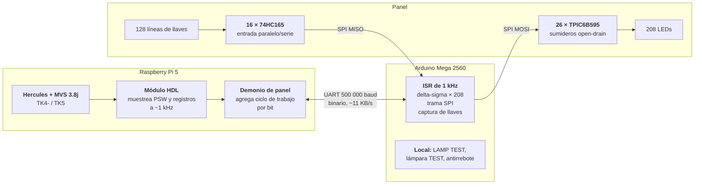

⚠️ *Curiosidad nerd lateral — esto no es ciencia de la computación. Es un fierro con luces.*

Hay una forma de que una computadora te mire de vuelta, y es el panel de control. No la pantalla: el panel. La fila de lámparas que parpadea con el contenido de un registro, la llave que detiene el procesador a mitad de una instrucción, el disco hexadecimal donde marcás la dirección del dispositivo desde el que querés arrancar. La imagen que encabeza este post es exactamente eso: la consola de un IBM System/370 Modelo 145, la máquina de la que trata todo lo que sigue.[^img_hero]

Eso desapareció alrededor de 1975. La consola dejó de ser un tablero y pasó a ser una terminal de video: en el IBM 3033, el sucesor directo de la máquina de la que trata este post, la «consola» ya era un escritorio en L con dos pantallas verdes.

Este post es sobre reconstruir uno. No una foto ni un video de fondo: un panel físico, con lámparas que se encienden porque un emulador ejecutando MVS 3.8j decidió encenderlas, y con llaves que cuando las movés cambian lo que la máquina hace.

## El concepto: un simulador con panel réplica

La idea tiene tres piezas y una regla.

Las piezas: un **panel de acrílico cortado a láser** que imita la consola original; un **Arduino** que enciende las lámparas y lee botones, llaves y discos rotativos; y una **Raspberry Pi 5** que corre el emulador **Hercules** con **MVS Turnkey** adentro. El Arduino se conecta a la Pi por **UART**, directo entre puertos serie — más abajo está por qué no por USB.

La regla: **máxima fidelidad**. Todas las lámparas, todos los botones, todas las llaves.

Y de esa regla sale inmediatamente el problema central del proyecto, que conviene enunciar antes que cualquier otra cosa:

> **Hercules es un emulador de arquitectura, no de microarquitectura.**

Hercules te da la PSW, la dirección de instrucción, el estado del procesador —corriendo, detenido, en espera—, el estado de IPL, los registros, el almacenamiento, la actividad de dispositivos y los MIPS. No te da la ALU, ni el microcódigo, ni las líneas de bus y de almacenamiento local que las posiciones de los *rollers* mostraban en la máquina real.

Eso significa que **algunas lámparas del panel no se pueden encender honestamente**. La decisión del proyecto es decirlo en voz alta en la documentación en vez de insinuar fidelidad completa — y más abajo hay una sección entera dedicada a qué hacer con ellas.

## Hercules sobre GNU/Linux y sobre Raspberry Pi 5

Lo único que los documentos del proyecto fijan sobre la configuración es este par de líneas, y es más importante de lo que parece:

```
ARCHLVL   S/370        # REQUERIDO para MVS 3.8j — funcional, no cosmético
CPUMODEL  0145         # cosmético: sólo cambia lo que reporta STIDP
```

`ARCHLVL` cambia de verdad la máquina emulada: el conjunto de instrucciones y el modo de direccionamiento. `CPUMODEL` **no cambia nada**. La documentación de IBM dice que define «un valor puramente cosmético»: fija el tipo de máquina que devuelve la instrucción `STIDP` y nada más.

Eso tiene una consecuencia liberadora para este proyecto. MVS Turnkey viene configurado como `CPUMODEL 3033`; cambiarlo a `0145` hace que MVS reporte un 370/145 con **cero diferencia de comportamiento**. Es decir: **la elección del panel es completamente independiente de lo que Hercules reporta**. Se puede construir el panel de la máquina que uno quiera.

## MVS 3.8j turnkey sobre la Raspberry Pi 5

MVS 3.8j es la última versión de OS/VS2 MVS que quedó en dominio público, y por eso es la que corre todo el mundo en emuladores.

### Por qué se puede usar

Conviene desarmar esto, porque circula una versión equivocada: **nadie obligó a IBM a entregar el código fuente.** No hubo orden judicial. Lo que hubo fueron dos cosas distintas que se suelen mezclar.

**La primera es antimonopolio, y es indirecta.** El Departamento de Justicia de los Estados Unidos demandó a IBM el **17 de enero de 1969** ante el tribunal del Distrito Sur de Nueva York, por monopolizar el mercado de computadoras de propósito general — sección 2 de la Sherman Act.[^antitrust] Bajo esa presión, en el verano de 1969 IBM **desagregó** («unbundling») lo que hasta entonces vendía junto con el hardware, y partió su software en dos categorías: **System Control Programming**, que siguió sin cargo, y **Program Products**, que pasaron a cobrarse.[^unbundling] El sistema operativo quedó del lado gratuito. El juicio, dicho sea de paso, duró trece años y terminó en 1982 con el propio Departamento de Justicia declarándolo «sin mérito» y abandonándolo.

**La segunda es la que realmente importa, y es un accidente del régimen de copyright de la época.** Hasta la ley de 1978, en Estados Unidos una obra publicada **sin aviso de copyright** caía automáticamente en el dominio público. IBM distribuyó estas versiones sin ese aviso — y su política corporativa es no reclamar derechos sobre el software que distribuyó de ese modo.[^dominio-publico]

O sea: MVS 3.8j no se liberó, se **escapó**. La combinación de un producto sin cargo, distribuido sin la formalidad que la ley exigía, en el último momento en que esa formalidad era obligatoria. La versión 3.8 fue la última bajo ese régimen; lo que vino después ya estuvo protegido y licenciado, y por eso la emulación doméstica de mainframes se quedó congelada en 1981. Un sistema **turnkey** —TK4- o TK5— es una distribución preempaquetada: MVS 3.8j ya generado, con los volúmenes armados y la configuración de Hercules lista, para arrancar sin pasar por una instalación desde cero que en su momento llevaba días.

Un detalle de mantenimiento que ya cuesta encontrar: el sitio original de TK4- en `wotho.ethz.ch` está **caído** —no resuelve, así que no tiene sentido enlazarlo—. El mirror vivo, verificado el 2026-08-02, es **[wotho.pebble-beach.ch/tk4-](https://wotho.pebble-beach.ch/tk4-/)**.

## Discos en RAM para los volúmenes

Los volúmenes de MVS son archivos, y una Pi 5 de 8 GB tiene bastante más RAM que la que necesitan. La tentación es obvia: montarlos en `tmpfs` y sacarse de encima la latencia de la tarjeta SD, que en un emulador de mainframe es la fuente de lentitud más visible.

Es una decisión de diseño que el proyecto **todavía no tiene tomada**, y no por falta de ganas sino porque depende de un número que no está medido: cuánta RAM ocupan realmente los volúmenes de TK4- o TK5. De ese número sale todo lo demás — si entran o no en una Pi de 4 GB, si conviene poner todo en RAM o sólo los volúmenes de lectura y dejar los de escritura en almacenamiento persistente.

Lo que sí se puede decir sin medir nada es cuál es el riesgo, y no es el que uno esperaría. MVS no usa los volúmenes como un caché: escribe en ellos continuamente — el spool, los catálogos, los datasets temporales. Con los volúmenes en RAM, cada corte de energía no cuesta rendimiento sino **el trabajo entero**.

Y ahí engancha con una restricción que el inventario del panel ya fija por otras razones: la tecla **POWER OFF** debe disparar un apagado limpio de la Raspberry Pi, **nunca un corte abrupto**. Lo mismo vale para el interruptor de emergencia. Sin discos en RAM eso es una buena práctica; con discos en RAM pasa a ser lo único que separa al sistema de perderlo todo. La conclusión práctica es que las dos decisiones no son independientes: quien elija `tmpfs` está eligiendo también que el botón de apagado del panel sea software y no un contacto que corte la alimentación.

## Por qué un 370/145 y no un 360

Ésta es la decisión mejor documentada del proyecto, y está tomada leyendo los manuales originales de IBM. La máquina objetivo es el **IBM System/370 Modelo 145**, por tres razones en orden de peso.

**Primera: la elección es libre.** Como vimos, `CPUMODEL` es cosmético. El panel no está atado a lo que el emulador reporta, así que se puede elegir por criterios de panel y no de compatibilidad.

**Segunda, y es la decisiva: el /145 tiene la mejor proporción de lámparas realmente excitables.** Tiene sólo dos *roller switches*, y el manual `GA24-3554-0` marca al pie que las posiciones 2 a 8 del A-REGISTER DISPLAY y las 3 a 8 del DISPLAY ASSEMBLER OUT son «para uso de servicio» — microarquitectura del 3145, sin equivalente en Hercules. Los modelos /155, /165 y /168 tienen muchas más lámparas, y casi todas son de las que no se pueden encender.

El número que resume todo: **de 16 posiciones de roller, 2 llevan contenido arquitectónico útil al operador — y esas 2 sí se pueden manejar.**

**Tercera: es el que mejor está documentado en Bitsavers.** Hay manual de procedimientos de operación, un manual de teoría y mantenimiento de 57 MB, y catálogo de partes. El 3033, en comparación, tiene tres archivos y ningún manual de campo.

Y una advertencia que ahorra un error caro: **no hay que replicar la consola del 3033.** Ese modelo usaba el 3036, un escritorio en L con dos estaciones de trabajo 3277 y procesadores de servicio. Replicarlo fielmente da pantallas verdes, no luces.

## El panel: qué significan las filas de lámparas y las llaves

El panel está construido sobre un **módulo de 18 posiciones** — un hallazgo del relevamiento visual que ordena todo el diseño de la gráfica, porque da un paso de grilla único y repetido.

Otro hallazgo que cambia la construcción: **las posiciones sin etiqueta son posiciones de lámpara reales, no panel ciego.** Están dibujadas del mismo tamaño que las etiquetadas: son portalámparas físicamente presentes para funciones no instaladas. Hay que construir las 18 de cada fila e iluminar sólo las etiquetadas.

### Las cinco lámparas que importan

La fila `SYS  MAN  WAIT  TEST  LOAD` es la que un visitante mira primero, y **las cinco se pueden manejar**:

| Lámpara | Qué indica | De dónde sale |
| --- | --- | --- |
| **SYSTEM** | Operaciones de CPU en curso | Hercules ejecutando |
| **MANUAL** | Reloj de CPU detenido o *soft stop*. Sólo con MANUAL encendida se pueden hacer store/display manuales | Hercules detenido |
| **WAIT** | Estado de espera: reloj corriendo, sin procesar instrucciones | **Bit de wait de la PSW** |
| **TEST** | Alguna llave fuera de su posición normal | **OR de cuatro llaves propias — no necesita datos del emulador** |
| **LOAD** | IPL en curso | Se enciende con la tecla LOAD, se apaga al cargar la PSW inicial |

La lámpara **TEST** merece un párrafo aparte porque es un regalo del diseño original. IBM la define como encendida cuando cualquiera de las llaves RATE, CHECK CONTROL, DIAGNOSTIC/CONSOLE FILE CONTROL o ADDRESS COMPARE CONTROL no está en posición normal. Es un OR puro de posiciones del propio panel: **se calcula en el Arduino y no requiere un solo byte del emulador.**

### Los bancos de lámparas

| Banco | Posiciones | Etiquetadas | Color |
| --- | --- | --- | --- |
| System Checks — fila 1 | 18 | 12 | todas rojas |
| System Checks — fila 2 | 18 | 7 | todas rojas |
| CPU Status | 18 | 16 | 2 ámbar, resto blancas |
| Console File | 18 | 16 | 6 rojas, 1 ámbar, resto blancas |
| System Indicators | 5 | 5 | 1 ámbar, resto blancas |
| Display Assembler Out (roller) | 36 | 36 | 4 ámbar, 32 blancas |
| A-Register Display (roller) | 36 | 36 | 4 ámbar, 32 blancas |
| **Subtotal** | **149** | **128** | |

IBM **codifica por color las lentes**: rojo para todo lo que es falla, ámbar para TEST, TOD CLOCK INVLD, IMPL REQD y **todas las lámparas de paridad**, blanco para el resto. Es directamente accionable: **hay que comprar tres colores de LED, no uno.**

Los bancos de rollers **llevan lámpara de paridad**: cada byte se muestra como `P 0 1 2 3 │ 4 5 6 7`, o sea **nueve lámparas por byte y 36 por banco**, no 32.

Conviene saberlo si vas a leer el manual, porque ahí las dos fuentes no coinciden: las tablas de contenido listan sólo `Byte 0…Byte 3`, mientras que la gráfica del panel muestra la paridad. **Manda la gráfica.** Y en un PDF escaneado eso significa mirarlo, no extraerle el texto — la capa de texto de estos manuales reproduce las tablas, no los dibujos.

### La línea más valiosa del manual

De las dos posiciones de roller que sirven, la del A-Register Display trae esto:

> Cuando la CPU está en *soft stop* (indicador MANUAL encendido), los indicadores muestran la dirección de la instrucción siguiente.

Es la frase más útil de todo el manual para este proyecto: significa que el banco principal de lámparas muestra **la dirección de instrucción de la PSW** cada vez que la máquina se detiene — que es exactamente lo que Hercules regala en cada breakpoint y en cada paso simple.

### Las llaves

Hay cuatro familias de entradas, y **dos de ellas se codifican de manera distinta**, que es lo que decide el presupuesto de líneas.

**Las cinco rotativas de modo**, con sus 33 detentes. Marco cuáles IBM documenta para el cliente y cuáles reserva al personal de servicio, porque esa distinción decide qué se puede manejar de verdad desde Hercules:

**ADDRESS COMPARE — 9 detentes.** Cuándo se dispara la comparación con la dirección marcada en las ruedas CDEFGH. La llave tiene dos grupos, `LOGIC ADR` y `REAL ADR`, y por eso `ANY` e `I COUNTER` aparecen dos veces: una por cada tipo de dirección.

| Detente | Qué hace | Uso |
| --- | --- | --- |
| `ANY` *(real)* | Cualquier acceso a almacenamiento | Cliente |
| `DATA STORE` | Sólo cuando se escribe un dato | Cliente |
| `I/O` | Sólo en accesos de entrada/salida | Cliente |
| `I COUNTER` *(real)* | Sólo en búsqueda de instrucción | Cliente |
| `DATA COMP TRAP` | Para averiguar qué instrucción modifica una posición | Cliente |
| `ANY` *(lógica)* | Cualquier acceso, con dirección lógica | Cliente |
| `I COUNTER` *(lógica)* | Búsqueda de instrucción, dirección lógica | Cliente |
| `CTRL WORD ADR TRAP` | — | Servicio |
| `CTRL WORD ADR` | — | Servicio |

**STORAGE SELECT — 9 detentes.** Qué memoria se lee o escribe en las operaciones manuales. El grupo `OR EXT REG` abarca desde `MPX CHAN` hasta `CHAN 4`.

| Detente | Qué hace | Uso |
| --- | --- | --- |
| `MAIN STORAGE` | Almacenamiento principal | Cliente |
| `LOCAL STORAGE` | Registros de propósito general y de punto flotante | Cliente |
| `CONTROL STORAGE` | Almacenamiento de control — microcódigo | Servicio |
| `EXP LOCAL STOR REGS` | — | Servicio |
| `CHAN 1` · `CHAN 2` · `CHAN 3` · `CHAN 4` | Registros externos de cada canal selector | Servicio |
| `MPX CHAN` | Canal multiplexor | Servicio |

**RATE — 3 detentes.** El mejor mapeo funcional de todo el panel.

| Detente | Qué hace | Uso |
| --- | --- | --- |
| `PROCESS` | Procesamiento normal — Hercules corriendo libre | Cliente |
| `INSTRUCTION STEP` | Una instrucción completa por cada pulsación de START | Cliente |
| `SINGLE CYCLE / HARD STOP` | Paso por microciclo | Servicio |

⚠️ Son **tres** detentes, no cuatro: `SINGLE CYCLE` y `HARD STOP` comparten posición, con la leyenda en dos renglones.

**CHECK CONTROL — 5 detentes.** Qué hace la máquina cuando detecta un error de hardware.

| Detente | Qué hace | Uso |
| --- | --- | --- |
| `PROCESS` | Normal, con un sistema operativo que registra el volcado automáticamente | Cliente |
| `STOP AFTER LOG` | Detiene tras volcar el diagnóstico y enciende `LOG PRES` | Cliente |
| `NO RETRY` | Sin reintento | Servicio |
| `HARD STOP` | Detención inmediata | Servicio |
| `DISABLE` | Deshabilitado | Servicio |

**DIAGNOSTIC / CONSOLE FILE CONTROL — 7 detentes.** Diagnóstico y carga desde el disquete de microcódigo. Dos grupos: `STORAGE` y `CNSL FILE`.

| Detente | Qué hace | Uso |
| --- | --- | --- |
| `PROCESS / IMPL` | Normal, y carga desde el console file | Cliente |
| `SCAN` · `READ` | Lectura de almacenamiento | Servicio |
| `RECYCLE` · `CE MODE` | Modos de mantenimiento | Servicio |
| `EXE CTRL WORD SWS A-H` | Ejecuta la palabra de control marcada en las ruedas | Servicio |
| `LOAD SWS A-H` | Carga desde las ruedas | Servicio |

De las 33 detentes, **12 son de cliente**. Las otras 21 son de servicio y no tienen contraparte en Hercules — pero no son inertes: **cuatro de estas cinco llaves encienden la lámpara TEST cuando salen de su posición normal**, y eso se calcula en el Arduino sin pedirle nada al emulador.

Se leen **1 de N: una línea por detente**, 33 líneas en total. No se codifican en binario, y por dos razones. La primera es que una llave de obleas ya entrega naturalmente un contacto por posición, así que codificar exigiría agregar un diodo por detente sin ganar casi nada. La segunda es que 33 líneas entran holgadas en el presupuesto de 128 entradas.

**Las ocho ruedas hexadecimales A–H** van al revés, y ahí sí hay que codificar:

| | Sin codificar (1 de N) | Codificadas en hexadecimal |
| --- | --- | --- |
| Líneas por rueda | 16 | **4** |
| Líneas para las ocho | **128** | **32** |

Ocho ruedas de 16 posiciones leídas 1 de N costarían **128 líneas — el presupuesto de entradas completo, sólo para las ruedas**. Por eso se usan llaves con salida hexadecimal: cuatro bits por rueda, 32 líneas para las ocho. Si sólo se consiguen llaves de obleas comunes, se llega al mismo resultado con una **matriz de diodos** que baja los dieciséis detentes a cuatro líneas binarias más una de validez: **33 diodos por rueda**, 264 para las ocho. El esquemático y el porqué de esa quinta línea están en el [apéndice](#apéndice-la-matriz-de-diodos-de-una-rueda).

**Y las dos familias restantes**, que no necesitan codificación porque son de a una línea:

| Grupo | Cantidad | Líneas | Detalle |
| --- | --- | --- | --- |
| Teclas | **18 posiciones**, 15 etiquetadas | 15 | Las 3 restantes son tapas ciegas: se montan igual, pero no se conectan a nada |
| Palanquitas | ~7 | ~7 | LAMP TEST, INTERVAL TIMER, TOD CLOCK, ADDRESS COMPARE CONTROL (ésta de 3 posiciones, o sea 2 líneas) |
| Llave de contadores y EPO | 2 | ~2 | La llave que elige qué contador corre, y el corte de emergencia |

Sumando todo: **unas 89 líneas de entrada** —33 + 32 + 15 + 7 + 2— contra las 128 que dan los dieciséis 74HC165. Quedan 39 de sobra.

La llave **RATE** es el mejor mapeo funcional del panel: `PROCESS` es Hercules corriendo libre e `INSTRUCTION STEP` es una instrucción por cada pulsación de START.

Y las ruedas **F, G, H** son las de arrancar: dial de tres dígitos hexadecimales que forman la dirección del dispositivo de IPL. Bajo MVS Turnkey el volumen SYSRES está convencionalmente en `148`, así que las ruedas marcan **1 4 8**. Arquitectónicamente no seleccionan «un disco» sino una dirección de canal y unidad — el mismo dial sirve para arrancar de cinta, que era la forma normal de instalar el sistema.

## LEDs en vez de lámparas incandescentes

Acá hay que corregir una intuición razonable pero equivocada, y es la parte más interesante del diseño eléctrico.

El 3145 usaba **lámparas incandescentes**. Un filamento tiene masa térmica: cuando el bit que muestra conmuta millones de veces por segundo, la lámpara no parpadea — **brilla con un brillo proporcional a la fracción del tiempo que ese bit valió 1**. Ese promediado es lo que producía el titileo característico de las *blinkenlights*.

Entonces modular un LED con el ciclo de trabajo igual a la proporción de unos medida **no es una aproximación al efecto: es reproducir la física que lo causaba.**

Pero la técnica **no es PWM de ventana fija**. Es **delta-sigma de primer orden**, y la diferencia importa:

```c
acc[i] += target[i];            // target 0..255
bool on = (acc[i] >= 256);
if (on) acc[i] -= 256;
```

Delta-sigma **distribuye los encendidos de manera pareja**. Una lámpara al 50 % alterna en cada cuadro: una onda cuadrada de 500 Hz, invisible. El PWM ingenuo con el mismo ciclo de trabajo la encendería 128 cuadros seguidos y la apagaría otros 128 — un parpadeo visible de 3,9 Hz.

El límite inferior es real y hay que respetarlo. Con objetivo `T`, el acumulador desborda cada `256/T` cuadros, así que la frecuencia de pulso es `1000 × T / 256` Hz:

| Objetivo `T` | Ciclo | Pulso | Veredicto |
| --- | --- | --- | --- |
| 128 | 50 % | 500 Hz | ✅ |
| 32 | 12,5 % | 125 Hz | ✅ |
| **16** | **6,3 %** | **62,5 Hz** | ✅ **piso — usar éste** |
| 8 | 3,1 % | 31 Hz | ❌ parpadeo visible |

**Regla: cualquier objetivo por debajo de 16 se lleva a 0.** Y es físicamente correcto, además: un filamento al 6 % de ciclo se ve apagado, así que la máquina real tenía el mismo piso.

Dos consecuencias de diseño: no hace falta hardware de PWM por canal —simples registros de desplazamiento alcanzan, porque la modulación es temporal y vive en el firmware—, y **el cuadro tiene que ser isócrono**, disparado por un temporizador y nunca desde `loop()`, porque el *jitter* de atender el USB modularía el brillo.

Un detalle práctico: **LEDs difusos, nunca transparentes.** Los transparentes tienen un haz angosto y ponen un punto caliente detrás de la tapa en vez de iluminarla pareja. Y **un solo número de parte, un solo rollo**: los lotes mezclados dan brillos visiblemente desparejos en un panel de 200 lámparas, y delta-sigma no lo disimula.

## La arquitectura completa



**La división de responsabilidades es la clave.** El Arduino es dueño de la modulación de 1 kHz, del barrido de llaves, del antirrebote y de todo lo que tiene que seguir funcionando con el enlace muerto. *Toda* la semántica —qué significa una combinación de llaves, qué comando de Hercules emitir, cómo se calcula un ciclo de trabajo— vive en la Pi.

No es una preferencia estética: es la división a la que llegó el proyecto Operation Blinkenlights después de abandonar su primera arquitectura, donde una placa de E/S por USB resultó **mil veces demasiado lenta** — del orden de 1 segundo de latencia contra ~1 ms con un Arduino.

## Los integrados: excitar LEDs y leer llaves

### Salida — TPIC6B595

Registro de desplazamiento de 8 bits con **salidas DMOS de potencia open-drain**. Reemplaza al par 74HC595 + ULN2803 con un solo integrado.

Soporta 150 mA por canal y necesitamos 10–15 mA: margen enorme. Se encadenan `SER OUT` → `SER IN` del siguiente, así que los 26 van en un solo bus SPI. `G` se ata a masa —salidas siempre habilitadas, el brillo es temporal— y `SRCLR` a +5 V.

Como son sumideros, **los ánodos van a +5 V a través de la resistencia y los cátodos al integrado**:

```
        +5V  (riel dedicado del panel — NO el riel USB de la Pi)
          │
         ┌┴┐
         │ │  R      ámbar ~2,0 V → 330 Ω
         └┬┘         blanco cálido ~3,0 V → 220 Ω
          │
         ─┴─   LED difuso
          ▽
          │
     ┌────┴──────────────┐
     │ TPIC6B595  DRAINn │
     └────┬──────────────┘
         GND
```

Se descartaron tres alternativas por razones concretas: el MAX7219 multiplexa internamente y late contra el cuadro de 1 kHz; el TLC5940 trae PWM por canal que es redundante con delta-sigma en firmware; y los WS2812 dan mal color detrás de las tapas de época y su protocolo de un hilo con tiempos duros pelea con el servicio de USB.

### Entrada — 74HC165

Entrada paralelo / salida serie, encadenado sobre el mismo reloj SPI. **No tiene pull-ups internos**: cada entrada necesita uno externo.

```
        +5V
         │
        ┌┴┐
        │ │ 10 kΩ pull-up
        └┬┘
         │
         ├────[ 1 kΩ ]────► entrada 74HC165
         │
         ○  contacto de la llave
         │
        GND
```

La de 10 kΩ fija el estado en reposo; la de 1 kΩ en serie protege contra una falla de cableado o una descarga electrostática en un mazo largo — el mismo criterio que usa el PiDP-11.

### Las ruedas hexadecimales

Ya vimos por qué van codificadas en hexadecimal y no leídas 1 de 16. Falta descartar la tercera opción, que es la que primero se le ocurre a cualquiera que haya hecho un proyecto con Arduino: **encoders de cuadratura, no.** No tienen posición absoluta, así que el panel perdería su ajuste cada vez que se apaga — y la máquina real nunca hacía eso: las ruedas quedaban donde el operador las había dejado.

⚠️ Estas llaves suelen entregar el código **complementado**. Hay que verificarlo contra la hoja de datos e invertir en firmware: al revés, la rueda lee `F` cuando muestra `0`.

## Sobre el esquemático completo en mermaid

**Mermaid no sirve para esto, y conviene decirlo antes de que alguien pierda una tarde.** Es una herramienta de diagramas de bloques y de flujo: no tiene símbolos de componentes, ni nodos eléctricos, ni forma de expresar que tres cosas se conectan al mismo punto. Un esquemático con 26 integrados encadenados, 208 LEDs con sus resistencias y 128 líneas con divisores no se puede expresar ahí.

Las alternativas que sí funcionan embebidas en markdown, en orden de esfuerzo:

| Opción | Qué da | Costo |
| --- | --- | --- |
| **Arte ASCII en bloque de código** | Lo que usan los documentos del proyecto y lo que usé arriba. Excelente para *una* etapa: una cadena de un integrado, un divisor, un LED con su resistencia | Cero herramientas |
| **SVG embebido** | Esquemático real, con símbolos. Se exporta de KiCad y se pega como archivo en el bundle del post | Hay que dibujarlo en KiCad |
| **Mermaid para el diagrama de bloques** | Lo que hice más arriba: señales y responsabilidades entre Pi, Arduino y panel. Ahí sí es la herramienta correcta | Ya está hecho |

**Mi recomendación:** mermaid para la arquitectura, ASCII para cada etapa típica, y un esquemático real de KiCad para lo demás. Un esquemático de esa densidad además no se lee en una página web: se lee en un PDF que se pueda ampliar.

### El esquemático de la unidad repetida

Eso último ya está hecho. **[Esquemático en PDF](kicad/unidad-repetida.pdf)** — hoja A3, generado con [KiCad](https://www.kicad.org/) **10.0.5**, instalado en esta máquina con [Chocolatey](https://community.chocolatey.org/packages/kicad).

No dibujé las 26 etapas: un esquemático de 26 integrados, 208 LEDs y 128 líneas no se lee, y además sería la misma etapa copiada. Lo que hay es **la unidad que se repite**, que es de donde se deduce el resto:

- **Etapa de salida** — un TPIC6B595 con sus ocho LEDs y las resistencias a +5 V, con `SER OUT` etiquetado hacia el `SER IN` del siguiente.
- **Etapa de entrada** — un 74HC165 con ocho llaves, cada una con su pull-up de 10 kΩ y su resistencia serie de 1 kΩ, y `Q7` etiquetado hacia MISO.
- **Las notas de conexión** al Arduino Mega y el divisor hacia el UART de la Pi 5, en la columna derecha de la hoja.

Los fuentes están en [`kicad/`](https://github.com/CesarBallardini/CesarBallardini.github.io/tree/master/content/es/posts/2026-08-03-panel-replica-ibm-370-145/kicad): el esquemático, la biblioteca de símbolos y el script de Python que los genera.

**Dos cosas que conviene decir sobre cómo se hizo.**

El símbolo del **TPIC6B595 no viene con KiCad** y hubo que crearlo. Su pinout salió de la hoja de datos de TI —SLIS032A, paquete de 20 pines, vista superior— y no de la memoria de nadie. El del 74HC165 se verificó contra la biblioteca `74xx` que KiCad distribuye. Aun así: **revisá el pinout contra la hoja de datos antes de fabricar**, porque un pin mal transcrito en un esquemático que después se convierte en PCB es caro.

Y el esquemático **pasa el chequeo eléctrico de KiCad sin errores de cableado**, que es la parte que conviene no saltear: **un esquemático puede verse impecable y estar mal**. Los dos modos de falla típicos son invisibles a simple vista — un extremo que cae fuera de la grilla de 1,27 mm, y un cable que termina una fracción de milímetro antes del pin. En pantalla las dos cosas se ven como una conexión. El ERC las encuentra en un segundo; el multímetro, después de soldar.

Los 83 avisos que quedan son esperables en un extracto: la biblioteca propia no está registrada en la configuración global, las etiquetas de encadenado salen de la hoja, y los rieles no tienen *power flag* porque la alimentación entra desde fuera de este recorte.

## Conexiones entre Arduino, placa de excitación y Raspberry Pi 5

Del Mega 2560 se usan **6 pines de 54**. El resto queda para contadores horarios, un relé de EPO, un display de estado o un segundo panel.

| Señal | Pin | Dir | Notas |
| --- | --- | --- | --- |
| `SPI_MOSI` | D51 | sal | → `SER IN` del primer TPIC6B595 |
| `SPI_MISO` | D50 | ent | ← `QH` del primer 74HC165 |
| `SPI_SCK` | D52 | sal | → todos los `SRCK` **y** todos los `CLK`: bus compartido |
| `SPI_SS` | D53 | **sal** | ⚠️ ver abajo |
| `LED_LATCH` | D8 | sal | Flanco de subida transfiere a las salidas |
| `SW_LOAD` | D9 | sal | Pulso bajo captura las llaves |

> ⚠️ **`SS` (D53) tiene que estar configurado como salida**, aunque no haya nada conectado. En AVR, si queda como entrada y algo lo lleva a nivel bajo, el hardware SPI **pasa silenciosamente a modo esclavo** a mitad de transferencia y el panel se ensucia. `pinMode(53, OUTPUT);` antes de `SPI.begin();`, y no sacarlo nunca.

**El orden dentro del cuadro importa**: `SW_LOAD` se pulsa *antes* de la transferencia y `LED_LATCH` *después*. Al revés, se lee el estado de las llaves con un cuadro de atraso.

### El enlace con la Pi

Acá hay que separar dos cosas que se confunden fácil, porque **la respuesta depende de qué placa uses**.

**Si la placa es una Arduino UNO R4 Minima, se conecta a la Pi con un cable USB-C y listo.** El R4 trae USB nativo —y conector USB-C, a diferencia del USB-B del viejo R3—, así que entrega del orden de 1 MB/s: nuestros 11 KB/s usan el **1 %** del enlace, el baud rate pasa a ser un parámetro cosmético, y no hace falta ni divisor de tensión ni tocar el GPIO de la Pi. Un cable y nada más.

Esa es, de lejos, la opción más simple, y si conseguís la placa es la que yo elegiría.

El proyecto no la eligió por una razón que no tiene nada que ver con la técnica: **al día de hoy no hay UNO R4 disponibles acá.** El relevamiento de proveedores argentinos no encontró stock —habría que importarla— mientras que el Mega 2560 está en góndola y con precio. Es una foto del momento y no una propiedad del mundo: **verificá disponibilidad antes de decidir**, porque si aparece la R4 se ahorran el divisor de tensión, el cableado al GPIO y la mitad de las precauciones de la sección anterior.

Vale aclarar que el Mega no es un premio consuelo. Es la placa a la que llegó Operation Blinkenlights, tiene 5 V de lógica —así que maneja las cadenas 74HC y TPIC sin adaptadores de nivel, que es exactamente lo que una Teensy de 3,3 V sí necesita— y le sobra el 75 % de CPU con todo andando. Lo único que se pierde con el Mega es la comodidad del enlace.

**Pero el objetivo de este proyecto es un Mega 2560, y ahí no.** El ATmega2560 **no tiene periférico USB en absoluto**: un segundo microcontrolador, el ATmega16U2, traduce USB a una línea serie común. El camino real es `Pi ↔ USB ↔ 16U2 ↔ UART ↔ ATmega2560`, con un techo práctico cerca de 50 kB/s. Así que **el baud rate acá es un cuello de botella de hardware real**, no un parámetro cosmético.

| Baud | Bytes/s | Nuestra carga (~11,2 kB/s) | Veredicto |
| --- | --- | --- | --- |
| 115 200 *(default de Arduino)* | 11 520 | **97 %** | ❌ **inservible** |
| 460 800 | 46 080 | 24 % | ✅ |
| **500 000** | 50 000 | **22 %** | ✅ **recomendado** |

**Hay que fijar 500 000 baud; el default fallaría.** Una rareza útil de AVR: con `U2X=1` a 16 MHz, 250 000, 500 000 y 1 000 000 son divisores *exactos*, mientras que el familiar 115 200 cae en 117 647 — 2,1 % de error. Las velocidades altas son más precisas que la baja.

**Y por eso la opción elegida es otra: saltear el USB por completo.** El Mega tiene 4 UARTs por hardware. Conectando `Serial1` (D18/D19) directo al UART del GPIO de la Pi se sacan del camino el 16U2, la pila USB y la enumeración — latencia mucho más baja y predecible, y una pieza menos que pueda fallar. Como el Mega es de 5 V y la Pi de 3,3 V, la línea del Mega hacia la Pi necesita divisor; la de la Pi hacia el Mega va directa, porque 3,3 V supera el umbral de nivel alto del AVR:

```
   Mega D18 (TX, 5 V) ──[ 1k8 ]──┬── Pi GPIO15 (RXD, 3,3 V)
                                 │
                               [ 3k3 ]      ← divisor: 5 V → ~3,2 V
                                 │
                                GND
```

## Cómo la Pi obtiene los datos de Hercules

Acá está el límite duro del proyecto, y conviene enunciarlo con el número en la mano:

> **No se puede transmitir estado por instrucción. Ni cerca.**
>
> Hercules corriendo S/370 en una Pi da del orden de decenas de MIPS. Mandar 3 bytes de dirección de instrucción por instrucción a 30 MIPS son **90 MB/s ≈ 720 Mbit/s**, contra un techo práctico de USB CDC cercano a 1 MB/s. Es **unas 90 veces por encima del presupuesto**, en el mejor caso.

De ahí sale toda la arquitectura de datos: **la agregación ocurre dentro de la Pi, y el enlace transporta ciclos de trabajo, nunca tráfico crudo.**

El mecanismo tiene tres pasos:

1. Un **módulo HDL dentro de Hercules** toma una muestra de la PSW, los registros y la palabra de almacenamiento seleccionada, y la deja en memoria compartida, con un temporizador de **~1 kHz**. Es barato: una muestra cada ~30 000 instrucciones.
2. El **demonio de panel** acumula, por bit, cuántas veces valió 1 en una ventana de 20 a 50 ms.
3. `target = 255 × unos / muestras`, con el piso en 16.

Y acá está lo bonito: **esto es muestreo estadístico, no integración exacta — y cae justo donde caía la máquina real.** Los bits altos de dirección cambian despacio y van a mostrar estructura real; los bits bajos cambian en cada instrucción y promedian cerca del 50 %, difuminándose a medio brillo. **Eso es exactamente lo que se veía en un banco de lámparas de un 3145.**

### El protocolo

Binario, largo fijo, con CRC-16/CCITT.

| Sentido | Contenido | Tamaño | Frecuencia |
| --- | --- | --- | --- |
| Pi → Arduino | Magic, tipo, largo, **208 bytes de brillo**, CRC | 214 B | 50 Hz |
| Arduino → Pi | Magic, tipo, largo, 16 B de mapa de llaves, secuencia, CRC | 23 B | 20 Hz |

Nótese que **la carga útil es brillo, no bits**: el ancho de banda sobra y el ciclo de trabajo por lámpara es todo el punto del diseño. Hay además un ping/pong que lleva la versión de firmware y los tamaños de banco compilados, para que un desajuste entre firmware y host se detecte en vez de manejar el panel mal en silencio.

> ⚠️ **El error clásico.** Las cadenas de registros de desplazamiento se llenan **de atrás para adelante**: el primer byte transmitido termina en el *último* integrado. Para cargar U1…U26 hay que mandar **U26 primero**. Definirlo en un solo lugar y verificarlo con la prueba del bit que camina. Al revés, el panel se mezcla de una forma que parece falla de cableado y cuesta un día entero.

## Programas para el Arduino

El firmware todavía no existe. Lo que sí está especificado —y alcanza para escribirlo— es la estructura del cuadro de 1 kHz:

```
ISR(TIMER1_COMPA_vect, ISR_NOBLOCK):
  1. SW_LOAD bajo → 1 µs → alto        // el 74HC165 captura las llaves
  2. for i in 0..25:
        in[i] = SPI.transfer(frontBuffer[i])   // full duplex: lámparas afuera, llaves adentro
  3. LED_LATCH alto → 1 µs → bajo      // las salidas se actualizan atómicamente
  4. intercambiar buffers si el loop marcó uno listo
  5. cada 5 cuadros, marcar datos de llaves para el loop principal  // antirrebote a 200 Hz
```

Con dos requisitos que no son opcionales en un AVR de 16 MHz, y que explican por qué el delta-sigma **no** va adentro de la ISR:

El USART del ATmega2560 tiene una FIFO de recepción de **dos niveles**. A 500 000 baud llega un byte cada 20 µs, así que hay unos 40 µs de margen antes de perder bytes. Pero la pasada de delta-sigma sobre 208 lámparas cuesta ≈ 130 µs — **más del triple de la tolerancia**. Una ISR normal bloquea interrupciones todo ese tiempo y perdería bytes recibidos, en silencio.

Los dos arreglos, que se aplican juntos: declarar la ISR `ISR_NOBLOCK` para que la recepción del USART pueda interrumpirla, y **doble buffer**, calculando delta-sigma en el loop principal contra un buffer inactivo mientras la ISR sólo desplaza y engancha.

El presupuesto queda en ≈ 25 % de CPU: 3,5 % en la ISR y el resto en el loop. Unos 75 % de margen.

## Programas en la Raspberry Pi 5

Tampoco existen todavía. Son dos piezas: el **módulo HDL** dentro de Hercules, que muestrea a 1 kHz hacia memoria compartida, y el **demonio de panel**, que agrega los ciclos de trabajo y habla el protocolo con el Arduino.

De las dos, la del módulo HDL es la de mayor riesgo del proyecto, porque implica tocar el código de Hercules. Yo empezaría por ahí y no por el firmware: si esa pieza no sale, el panel queda decorativo por más impecable que esté la electrónica.

## Alimentación

**La fuente más probable de problemas. Leer antes de cablear.**

| Carga | Corriente |
| --- | --- |
| 208 LEDs × 10 mA, todos encendidos (**LAMP TEST**) | **2,08 A** |
| 26 × TPIC6B595 en reposo | ~30 mA |
| 16 × 74HC165 en reposo | ~10 mA |
| Arduino Mega 2560 | ~50 mA |
| **Peor caso** | **≈ 2,15 A** |
| Típico (~30 % de ciclo en el panel) | ≈ 0,7 A |

Cinco reglas, y la primera es la que salva el proyecto:

1. **Fuente de 5 V dedicada, de 4 A o más, para el panel.** Nunca sacar la corriente de los LEDs del regulador del Arduino ni de un puerto USB de la Pi: LAMP TEST haría caer la tensión de la Pi, que es la que está corriendo el emulador y su sistema de archivos.
2. **Masa común, unida en un solo punto** — en estrella, o el SPI se queda sin referencia.
3. **Desacople: 100 nF en los pines de alimentación de cada integrado, más 1000 µF de bulk por banco de LEDs.** Delta-sigma a 1 kHz significa que la corriente del panel conmuta continuamente: es un ambiente más hostil que el encendido estático, y con poco bulk los registros de desplazamiento tienen fallas.
4. **No realimentar el Arduino.** Alimentarlo por USB *o* desde la fuente del panel con la línea de 5 V del USB cortada — nunca las dos. Placa por USB, cadenas por fuente propia y masa común es la respuesta simple y correcta.
5. **EPO como entrada**, para que la Pi se apague limpia. Nunca cableado a algo que pueda cortar la alimentación a mitad de una escritura.

## Foto del panel real

Falta, y no es un descuido: **es uno de los ítems abiertos del proyecto**. El inventario necesita una fotografía frontal de una consola 3145 completa para fijar la ubicación de las secciones entre sí y la proporción general del panel — dato que ninguno de los manuales da directamente.

Dos museos tienen paneles /370 físicos y son el camino más corto: el Rhode Island Computer Museum y el Computing History de Cambridge. A cualquiera de los dos se le puede pedir una foto frontal, o medidas si acceden a tomarlas. Una foto tomada en ángulo sirve igual: se corrige la perspectiva sin necesidad de conocer ninguna dimensión absoluta.

## Conclusión: por qué no lo voy a construir

El proyecto es interesante y atractivo, y el diseño está cerrado hasta un nivel de detalle que permitiría empezar a comprar mañana. Pero los costos rondan **los USD 1000 al día de hoy**, y no me puedo permitir ese gasto en un juguete.

Conviene saber dónde se va la plata, porque no es donde uno espera. Los LEDs, las resistencias, los capacitores y los pulsadores son commodity y se compran en una tarde. Los 42 integrados de la cadena —26 TPIC6B595 y 16 74HC165— son baratos por unidad, aunque en Argentina las casas de electrónica venden módulos y kits, no lógica suelta en cantidad, así que hay que importarlos.

El costo real está en **las llaves rotativas**. Ocho ruedas hexadecimales más cinco rotativas de modo con cuentas de posiciones específicas —9, 9, 3, 5 y 7—, que son partes especializadas, difíciles de conseguir en cualquier parte y caras en versión industrial. Ahí, y en el corte láser del acrílico, se concentra el presupuesto. La electrónica es la parte barata.

### Lo que sí se puede hacer sin gastar nada

La Raspberry Pi 5 se conecta a la wifi. Con eso alcanza para tener **la consola del sistema y una terminal TSO desde cualquier máquina de la casa**, con un emulador de terminal: se entra a la Pi por red, y ahí están tanto la consola de Hercules como el TSO de MVS. Sin panel, sin acrílico, sin llaves rotativas, sin fuente de 4 A.

Es decir: **todo lo que la máquina hace está disponible por USD 0.** Lo que cuesta mil dólares es exclusivamente que te mire de vuelta.

### Y una ironía histórica que cierra el asunto

Vale la pena notar dónde termina esta historia. **Desde el IBM 3033, los mainframes de IBM ya no tuvieron consola de control con luces y botones.** El 3033 se anunció el 25 de marzo de 1977 y se entregó por primera vez el 17 de marzo de 1978, y su consola era el 3036: un escritorio con estaciones de trabajo 3277 — pantallas verdes.

Y acá está el detalle que a mí me cierra el círculo. Ordenemos las fechas:

| Hito | Fecha |
| --- | --- |
| S/370 Modelos 158 y 168 anunciados | 2 de agosto de 1972 |
| OS/VS2 Release 1 (SVS) | 1972 |
| **OS/VS2 Release 2 — es decir, MVS** | **1974** |
| IBM 3033 anunciado | 25 de marzo de 1977 |
| IBM 3033 primera entrega | 17 de marzo de 1978 |
| **MVS 3.8j — el que corre todo el mundo** | **1981** |

MVS nació en 1974, para las máquinas de su momento. Pero **la versión que uno emula, el 3.8j, es de 1981**: software de la era del 3033, tres años *posterior* al momento en que IBM ya había reemplazado el tablero por la pantalla verde.

O sea que el panel que estoy reconstruyendo y el sistema operativo que va a correr detrás **nunca convivieron en una sala de máquinas**. Estoy poniendo un MVS de 1981 detrás de una consola que IBM había dejado de fabricar. No es un anacronismo grave —MVS 3.8j corre perfecto bajo `ARCHLVL S/370`, que es de lo que se trata—, pero conviene saberlo, y explica de paso por qué TK4- y TK5 vienen configurados como `CPUMODEL 3033`: reportan la máquina de su época, no la mía.

Así que reconstruir el panel del /145 y conectarse por red a la misma máquina no son dos alternativas caprichosas. Son las dos épocas, una al lado de la otra: el tablero que se mira, y la terminal que lo reemplazó. IBM ya había elegido, y eligió la terminal.

Lo cual, si uno quiere ser honesto, es también la razón por la que el panel es un juguete y no una herramienta. La terminal ganó porque era mejor para trabajar. El panel se extraña porque era mejor para mirar.

[^antitrust]: *U.S. v. IBM*, presentada el 17 de enero de 1969 ante el United States District Court for the Southern District of New York, por monopolización del mercado de computadoras digitales de propósito general bajo la sección 2 de la Sherman Act. Retirada en 1982 por el propio Departamento de Justicia. Contexto en [«The Justice Department: IBM and AT&T»](https://historyofcomputercommunications.info/section/7.2/The-Justice-Department-IBM-and-AT&T/), *History of Computer Communications*.
[^unbundling]: La desagregación de 1969 y la partición del software en *System Control Programming* (sin cargo) y *Program Products* (con cargo): [«1969: Antitrust, The Unbundling of Software and Services»](http://www.liquisearch.com/history_of_ibm/chronology/1969_-_antitrust_the_unbundling_of_software_and_services), cronología de la historia de IBM.
[^dominio-publico]: Sobre la política de IBM de no reclamar derechos sobre el software que distribuyó sin aviso de copyright, y sobre el efecto de la ley estadounidense anterior a 1978: [IBM Public Domain Software Collection](https://www.ibiblio.org/jmaynard/), de Jay Maynard — mantenedor de Hercules. Ver también las notas de instalación de [Jay Moseley](https://www.jaymoseley.com/hercules/installMVS/iMVSintroV8.htm), que documentan que varios integrantes de la comunidad de Hercules pidieron el software directamente a IBM como producto sin cargo. ⚠️ **No es una opinión legal.** Es la práctica establecida y la política declarada de IBM; si el uso fuera comercial, corresponde asesoramiento propio.
[^img_hero]: Imagen de [Panel 370-145](https://commons.wikimedia.org/wiki/File:Panel_370-145.png) — **CC BY-SA 3.0** — Oliver.obi, vía Wikimedia Commons. **Es un render 3D, no una fotografía**: se nota en los reflejos de las perillas y en la nitidez de las leyendas. La geometría y los rótulos coinciden con lo que documenta el manual `GA24-3554-0`, así que sirve como referencia visual — pero no es una consola real fotografiada, y el proyecto sigue necesitando una foto frontal de una máquina física para fijar las proporciones entre secciones. Original de 2560 × 1600 px; acá va recortada a 2,5:1 y con corrección de gamma (0,25) más contraste y saturación leves, porque el original está expuesto para que sólo se vean las lámparas encendidas contra el negro y a tamaño de hero se leía como una banda oscura. ⚠️ **Ojo con la licencia**: BY-SA obliga a compartir las obras derivadas bajo la misma licencia, así que este recorte también es CC BY-SA 3.0 — a diferencia de las demás imágenes del blog, que son CC BY o dominio público y sólo piden atribución.

## Apéndice: la matriz de diodos de una rueda

**[Esquemático en PDF](kicad/matriz-diodos.pdf)** — hoja A3, con los 33 diodos dibujados. Los fuentes y el generador están en [`kicad/`](https://github.com/CesarBallardini/CesarBallardini.github.io/tree/master/content/es/posts/2026-08-03-panel-replica-ibm-370-145/kicad).

Esto resuelve el caso en que no se consiguen llaves con salida hexadecimal y hay que usar rotativas de obleas comunes, que entregan un contacto por detente.

### Cómo funciona

El polo común de la llave va a masa. Cada terminal de posición sube por su propia línea. Cinco rieles horizontales —`b3 b2 b1 b0` y `POS0`— cruzan por arriba, cada uno con **pull-up de 10 kΩ a +5 V** y **1 kΩ en serie** hacia el 74HC165.

Donde el bit vale 1 se monta un diodo, con el **ánodo al riel y el cátodo al terminal de posición**. Al elegir una posición, su terminal queda a masa y todos los diodos que cuelgan de él conducen, bajando sus rieles a unos 0,7 V — cómodamente por debajo del umbral de 1,5 V que el 74HC toma como nivel bajo a 5 V. Los terminales no elegidos flotan, así que sus diodos quedan polarizados en inversa y no cargan nada.

**El diodo baja la línea, así que el código leído es el complemento del valor.** En firmware: `val = (~leido) & 0x0F`.

### Qué posiciones llevan diodo

| Pos | Hex | `b3` | `b2` | `b1` | `b0` | `POS0` | Diodos |
| --- | --- | :-: | :-: | :-: | :-: | :-: | :-: |
| 0 | `0` | · | · | · | · | **▼** | 1 |
| 1 | `1` | · | · | · | ▼ | · | 1 |
| 2 | `2` | · | · | ▼ | · | · | 1 |
| 3 | `3` | · | · | ▼ | ▼ | · | 2 |
| 4 | `4` | · | ▼ | · | · | · | 1 |
| 5 | `5` | · | ▼ | · | ▼ | · | 2 |
| 6 | `6` | · | ▼ | ▼ | · | · | 2 |
| 7 | `7` | · | ▼ | ▼ | ▼ | · | 3 |
| 8 | `8` | ▼ | · | · | · | · | 1 |
| 9 | `9` | ▼ | · | · | ▼ | · | 2 |
| 10 | `A` | ▼ | · | ▼ | · | · | 2 |
| 11 | `B` | ▼ | · | ▼ | ▼ | · | 3 |
| 12 | `C` | ▼ | ▼ | · | · | · | 2 |
| 13 | `D` | ▼ | ▼ | · | ▼ | · | 3 |
| 14 | `E` | ▼ | ▼ | ▼ | · | · | 3 |
| 15 | `F` | ▼ | ▼ | ▼ | ▼ | · | 4 |
| | **Total** | 8 | 8 | 8 | 8 | 1 | **33** |

Cada línea binaria lleva 8 diodos, uno por cada posición en que ese bit vale 1. Más el de `POS0`: **33 por rueda, 264 para las ocho.**

### Por qué la quinta línea no es opcional

Ésta es la parte que se pasa por alto y la que justifica el apéndice entero.

Las rotativas son **break-before-make**: mientras se gira, entre un detente y el siguiente **ningún terminal está conectado**, y las cuatro líneas binarias flotan altas. Eso se lee exactamente igual que una posición 0 legítima.

| Líneas binarias | `POS0` | Significado |
| --- | --- | --- |
| algún bit bajo | alto | Posiciones 1 a F — leer el código |
| todas altas | **bajo** | **Posición 0 legítima** |
| todas altas | alto | **Entre detentes** — descartar, conservar el último valor válido |

Un diodo desde la posición 0 a una línea dedicada lo resuelve por completo. Sin él, **una rueda a medio girar informaría cero en silencio** — y en las ruedas F, G y H, que son las de `LOAD UNIT ADDRESS`, eso significa arrancar del dispositivo equivocado.

Cuesta un diodo y una línea de entrada por rueda. Con las ocho ruedas son 8 líneas de las 39 que sobraban en el presupuesto.

> Una línea `VALID` completa —un diodo desde *cada* posición— también funcionaría, pero cuesta 16 diodos por rueda y no aporta más información: la posición 0 es el único código ambiguo.

## Hojas de datos

Las hojas de datos de los componentes principales están descargadas en el directorio de este post, bajo `datasheets/`, y se pueden abrir desde acá. La columna de la derecha lleva a la fuente original de cada una: **conviene ir siempre al fabricante antes de fabricar nada**, porque las revisiones cambian y la copia local queda congelada en la fecha en que se bajó.

| Componente | Función en el panel | Copia local | Fuente original |
| --- | --- | --- | --- |
| **TPIC6B595** | Registro de desplazamiento con salidas DMOS open-drain — excita 8 LEDs por integrado, 26 en total | [`TPIC6B595-TI-SLIS032A.pdf`](datasheets/TPIC6B595-TI-SLIS032A.pdf) | [Texas Instruments](https://www.ti.com/lit/ds/symlink/tpic6b595.pdf) — SLIS032A, julio 1995, revisada mayo 2005 |
| **74HC165** | Entrada paralelo / salida serie — lee 8 líneas de llaves por integrado, 16 en total | [`74HC165-Nexperia.pdf`](datasheets/74HC165-Nexperia.pdf) | [Nexperia](https://assets.nexperia.com/documents/data-sheet/74HC_HCT165.pdf) — 74HC/HCT165 |
| **ATmega2560** | El microcontrolador del Arduino Mega 2560 | [`ATmega2560-Microchip.pdf`](datasheets/ATmega2560-Microchip.pdf) | [Microchip](https://ww1.microchip.com/downloads/en/devicedoc/atmel-2549-8-bit-avr-microcontroller-atmega640-1280-1281-2560-2561_datasheet.pdf) — doc. 2549 |
| **1N4148** | Matriz de diodos que codifica cada rueda rotativa de 16 posiciones a 4 líneas binarias (opción B) | [`1N4148.pdf`](datasheets/1N4148.pdf) | [Vishay](https://www.vishay.com/docs/81857/1n4148.pdf) |

**LEDs y resistencias no llevan hoja de datos acá, y es a propósito.** Los LEDs se compran por lote y **la hoja de datos que importa es la del lote que compraste**: la tensión directa determina el valor de la resistencia, y varía entre fabricantes y entre bines del mismo fabricante. Los valores del post —330 Ω para ámbar de ~2,0 V y 220 Ω para blanco cálido de ~3,0 V, a 10 mA— son el punto de partida, no la respuesta: hay que medir el LED que se compró. Y el criterio del plan de cableado es comprar **un solo número de parte, un solo rollo**, porque los lotes mezclados dan brillos desparejos que delta-sigma no disimula.

> ⚠️ **Nota sobre redistribución.** Estos cuatro PDF son de sus fabricantes y suman **unos 11 MB** — el del ATmega2560 solo pesa 8,5 MB. Guardarlos acá los publica en el sitio y los versiona en el repositorio público, lo que en la práctica los redistribuye. Los fabricantes de semiconductores suelen tolerarlo sin problema, pero es una decisión, no un descuido. Si preferís no cargar el repo, alcanza con dejar la columna de fuentes originales y borrar `datasheets/`.

## Referencias del proyecto

Todo lo que está arriba sale de cuatro documentos de diseño, que viven en el directorio de este post bajo `referencias/` y se pueden leer completos:

| Documento | Qué contiene |
| --- | --- |
| **[Inventario del panel](https://github.com/CesarBallardini/CesarBallardini.github.io/blob/master/content/es/posts/2026-08-03-panel-replica-ibm-370-145/referencias/2026-08-01-370-145-panel-inventory.md)** | Cada lámpara, llave y tecla de la consola del /145, transcritas del manual `GA24-3554-0`, con su mapeo a Hercules y la auditoría de qué se puede manejar honestamente y qué no. Incluye el censo visual que corrigió los bancos de rollers de 32 a 36 lámparas |
| **[Plan de cableado y firmware](https://github.com/CesarBallardini/CesarBallardini.github.io/blob/master/content/es/posts/2026-08-03-panel-replica-ibm-370-145/referencias/2026-08-02-arduino-wiring-plan.md)** | Delta-sigma a 1 kHz, cadenas TPIC6B595 y 74HC165, codificación de las ruedas hexadecimales, presupuestos de tiempo y de corriente, protocolo con el host, plan de puesta en marcha y lista de materiales con precios locales |
| **[Referencias](https://github.com/CesarBallardini/CesarBallardini.github.io/blob/master/content/es/posts/2026-08-03-panel-replica-ibm-370-145/referencias/2026-08-01-references.md)** | Unas 320 fuentes verificadas en 21 secciones: manuales de IBM en Bitsavers, arte vectorial para el corte láser, interfaces de control de Hercules, MVS Turnkey, electrónica, trabajos previos —Operation Blinkenlights, PiDP, BlinkenBone— y qué enlaces están muertos y por cuáles se reemplazan |
| **[Decisiones cerradas](https://github.com/CesarBallardini/CesarBallardini.github.io/blob/master/content/es/posts/2026-08-03-panel-replica-ibm-370-145/referencias/CLAUDE.md)** | Las decisiones de diseño que ya no se rediscuten, con su fundamento, y las notas de entorno del proyecto |

> **Nota técnica.** Los enlaces van a GitHub y no a este sitio a propósito: Hugo trata a los `.md` que están dentro de un *page bundle* como recursos de tipo página y **no los copia a la salida**, así que existen en el repositorio pero no en el sitio publicado. Si alguna vez conviene que sean descargables desde acá, la solución es renombrarlos a `.txt` — Hugo sí publica los recursos que no son páginas.
