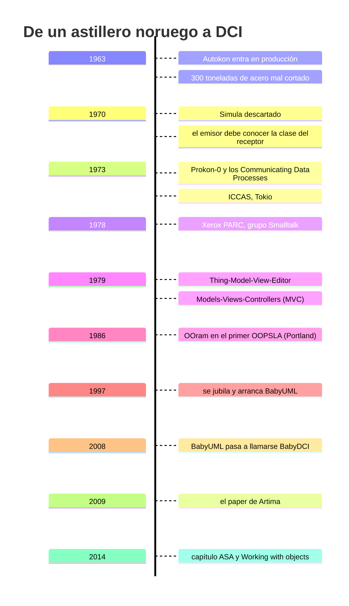
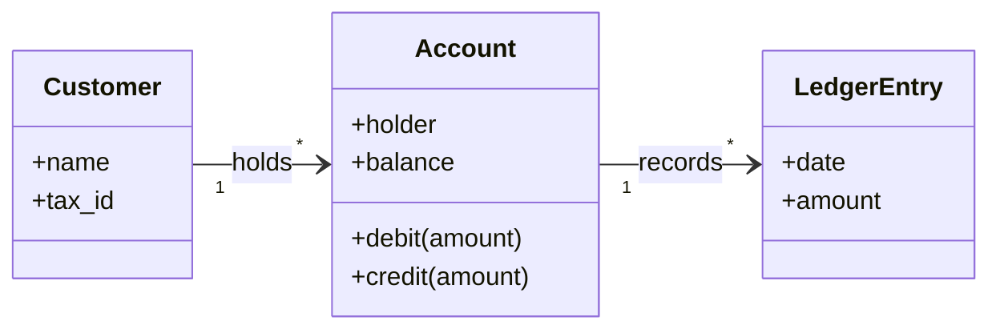
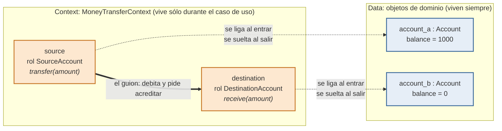

Me pasa cada vez que abro un sistema orientado a objetos que no escribí yo. Miro las clases, entiendo perfectamente qué es cada una —`Account`, `Customer`, `LedgerEntry`, `Branch`—, y no tengo la menor idea de qué hace el sistema. El dominio está modelado con prolijidad de manual. El caso de uso, el que el usuario tenía en la cabeza cuando pidió el software, no está en ninguna parte. Está repartido en pedacitos de dos líneas dentro de once métodos de siete clases, y para reconstruirlo tengo que hacer el trabajo del compilador a mano.

Resulta que el tipo que inventó MVC pensaba lo mismo, y propuso una solución. Se llama DCI —*Data, Context, Interaction*— y casi nadie la conoce. Este post cuenta de dónde salió y qué dice. En [la segunda parte](/posts/dci-en-python-roles-en-runtime/) lo escribimos en Python, y analizamos la conveniencia y limitaciones del lenguaje.

### El currículum obliga a escuchar

Trygve Reenskaug —suerte para mí que no me toca pronunciarlo— fue el autor del patrón Model-View-Controller. Los dos documentos fundacionales siguen publicados en [su propia página](https://folk.universitetetioslo.no/trygver/): «[Thing-Model-View-Editor](https://folk.universitetetioslo.no/trygver/1979/mvc-1/1979-05-MVC.pdf)», del 12 de mayo de 1979, y «[Models-Views-Controllers](https://folk.universitetetioslo.no/trygver/1979/mvc-2/1979-12-MVC.pdf)», del 10 de diciembre de 1979. El primer nombre que le puso fue *Thing-Model-View-Editor*; el que quedó salió recién después de discutirlo largo con Adele Goldberg[^mvc]. Eso solo ya es raro de asimilar: MVC es probablemente la sigla más repetida de la historia del software de aplicación, la que aparece en el primer capítulo de todo tutorial de framework web desde hace veinte años, y tiene un autor con nombre, apellido y página personal todavía en línea en un servidor universitario noruego[^trygver]. Reenskaug fue profesor emérito de informática en la Universidad de Oslo —así firmaba él mismo sus papers de DCI[^asa]— y se había retirado en 1997, lo que hace que todo lo que sigue sea, literalmente, su proyecto de jubilación[^roots]. Lamentablemente falleció en 2024, a los 93 años.

Pero MVC ni siquiera es el principio de la historia; empezaremos por el principio porque explica todo lo demás.

En los años sesenta Reenskaug trabajaba en Autokon[^autokon], un sistema CAD/CAM para diseño de barcos que entró en producción en 1963 y que terminaron usando la mayoría de los astilleros importantes del mundo[^autokon_sintef]. Y ahí pasó algo que él contaba, cuarenta años después, como el origen de todo. El sistema guardaba el modelo del producto en una base de datos central[^autokon_rs]. Alguien despierto en el departamento de trazado se dio cuenta de que, si el modelo ya estaba en la base, se podían sacar directamente de ahí las cintas de control para las máquinas de oxicorte. Cortaron más de trescientas toneladas de acero antes de descubrir la diferencia entre *precisión* y *exactitud*: los datos tenían cuarenta bits de precisión, sí, pero las dimensiones seguían siendo tan aproximadas como en los planos 1:50 de los que habían salido[^roots_autokon].

Trescientas toneladas de chatarra y muchos dedos acusadores. Reenskaug concluyó que la culpa era del sistema, no del muchacho: antes, cada departamento era dueño de sus datos, y la transferencia entre departamentos estaba controlada, firmada por quien la mandaba y chequeada por quien la recibía. La base de datos común había roto ese patrón. No había dueño y no había control.

De ahí salió su obsesión: los sistemas de computación tienen que reflejar la estructura de responsabilidad de la organización real. Intentó construirlo con Simula —que Nygaard y Dahl acababan de inventar en el Norsk Regnesentral[^patio_nr], del otro lado del patio de su oficina[^patio]— y se dio contra dos paredes. Una: un programa Simula corría segundos o minutos, y sus objetos nacían y morían dentro de esa corrida; él necesitaba que la ejecución durara un año o más. Es el problema de la persistencia[^persistencia_survey], y en 1970 no tenía solución — «los objetos persistentes todavía estaban esperando ser inventados», anotó él mismo entre paréntesis[^roots_persistencia]; el término *persistent programming* aparece recién en 1983, con PS-algol[^persistencia]. La otra fue el verdadero problema: **Simula exigía que el emisor de un mensaje conociera la clase del receptor**. Eso rompía la idea entera de componentes que se comunican por un protocolo estándar y son opacos por dentro. Chau Simula.

Sin lenguaje que le sirviera, se construyó las dos cosas a mano. En el paper que llevó a la conferencia ICCAS de Tokio, en agosto de 1973, describe el lenguaje Prokon-0 y su principio de *Communicating Data Processes*: los procesos viven guardados en la base de datos, pasivos la mayor parte del tiempo, y se cargan a memoria recién cuando les llega un mensaje; cuál procedimiento se ejecuta lo decide una tabla que cada proceso tiene para sí, de modo que el mismo mensaje puede ser atendido de manera diferente en procesos distintos[^iccas]. Persistencia y despacho dinámico, escritos a mano en un astillero noruego.

El proyecto se cayó cuando se derrumbó el mercado de barcos nuevos, y con el tiempo libre que le quedó escribió los papers que después lo llevaron a Xerox PARC como científico visitante en 1978/79, al grupo de Smalltalk. Ahí las ideas encajaron. En el grupo, contaba él, decían que había dos escuelas de orientación a objetos: la de la Costa Este, la de C++, «un artefacto de programación donde un objeto es una instancia de una clase y también una estructura de datos con métodos incorporados»; y la de la Costa Oeste, la de ellos, donde «la esencia de la orientación a objetos es que los objetos interactúan para realizar una tarea»[^roots_parc]. Toda la historia posterior de DCI es un intento de escribir código de acuerdo con esa segunda definición.

Si bien coincidía con la definición de orientación a objetos de Alan Kay, sus reparos apuntaban a dos supuestos de la *implementación* de Smalltalk. El primero: que si un objeto está programado «para hacer lo correcto», se va a portar bien cuando interactúe con otros. Anda en los casos simples y falla en los sistemas donde el valor del todo es mayor que la suma de las partes, porque ahí qué es «lo correcto» depende del sistema entero — es decir, del contexto. El segundo: que la clase sea la unidad ideal de reutilización. Las clases se diseñan de a conjuntos y fuera de su conjunto no sirven; el ejemplo que da es el framework, un montón de clases que se complementan y que están pensadas para derivar subclases juntas. Su conclusión es de una línea: «las clases no son independientes, y hace falta un constructo de nivel más alto para especificar el todo»[^roots_kay]. Treinta años después, ese constructo de nivel más alto es la C de DCI.

Le siguió el paradigma de roles y el método OOram —*Object Oriented Role Analysis and Modeling*—, cuya primera herramienta demostró en el primer OOPSLA, en Portland, en 1986[^roots_ooram]. Llegó a formato libro como *Working with Objects: The OOram Software Engineering Method*, escrito con Per Wold y Odd Arild Lehne[^ooram]. Reenskaug venía pensando hace décadas que la unidad interesante no es el objeto, sino el **rol** que el objeto juega mientras algo pasa.

Y después, décadas más tarde, llegó DCI. Acá conviene ser preciso con las fechas. El 28 de agosto de 2008 Reenskaug declaró que su proyecto BabyUML había llegado a su meta y lo rebautizó BabyDCI: esa «versión 2008» es la fecha de nacimiento del paradigma, y él mismo la escribía así[^roots_2008]. El paper —*The DCI Architecture: A New Vision of Object-Oriented Programming*, firmado junto con James O. Coplien— se publicó en Artima recién el 20 de marzo de 2009[^dci].

Lo de «Baby», dicho sea de paso, tiene dos motivos. El primero es literal: la versión de 2008 era una criatura que él esperaba que creciera hasta convertirse en algo viable y potente. El segundo es una humorada con ambición: el primer computador electrónico digital de programa almacenado del mundo, en Manchester en 1948, se llamaba *The Baby*[^img_hero]. «Como todos sabemos, mucho vino después de ese comienzo endeble»[^roots_baby].

Que DCI haya salido del escritorio de Reenskaug y llegado a alguna parte es obra de Coplien, y no hace falta que lo diga yo: lo decía Reenskaug. «Después de 2008, DCI salió al mundo bajo el liderazgo de James Coplien. Sin él, DCI habría quedado como una curiosidad oscura»[^roots_coplien]. Y fue Coplien quien lo llevó a formato libro: *Lean Architecture for Agile Software Development* lo escribió con Gertrud Bjørnvig —no con Reenskaug[^lean]—, y es ahí donde la idea aparece desarrollada. El propio Reenskaug lo reseñó como «una lectura obligada para todos los que quieran entender la verdadera naturaleza del desarrollo de sistemas».

Cuando el inventor de MVC dice, cuarenta años después, «che, esto se puede hacer mejor», uno se sienta a escuchar.

### El síntoma: ¿dónde está el comportamiento?

El diagnóstico de DCI es corto y es incómodo.

La orientación a objetos, tal como se practica, modela muy bien **lo que las cosas son**. Una `Account` tiene un saldo, un titular, un CBU. Eso es estable: la cuenta va a seguir siendo una cuenta el año que viene, y ese modelo casi no cambia. Hasta ahí, todo bien.

Mirá ese diagrama y decime qué hace el sistema. No se puede. Está todo lo que el sistema *es* y no hay una sola pista del problema que resuelve.

Porque el sistema no existe para que las cuentas sean cuentas. Existe para que alguien transfiera plata, pague un servicio, cierre un ejercicio. Eso es **lo que el sistema hace**, y es también la parte que cambia todo el tiempo. En OOP clásica esa parte no tiene dónde vivir. Las opciones son dos, y las dos son malas.

La primera: metés el comportamiento adentro de los objetos de dominio. Entonces `Account` empieza a tener un método `transfer_to()`, y después `pay_bill()`, y después `apply_court_order()`, y a los tres años tu clase `Account` tiene mil quinientas líneas y sabe de juzgados. El objeto estable se contaminó con todos los casos de uso inestables que lo tocan.

La segunda: sacás el comportamiento afuera, a una capa de servicios. Entonces `Account` queda anémica —un montón de getters y setters, una fila de la base de datos con disfraz de objetos— y toda la lógica vive en `TransferService`, que es un procedimiento con sombrero de objeto. Escribiste COBOL con llaves.

Coplien tiene un nombre prestado de la arquitectura de verdad para esto: las ***shear layers***, las capas de una construcción que evolucionan a ritmos distintos. Una casa necesita techo nuevo cada tantos años pero casi nunca necesita una pared exterior nueva, y una buena arquitectura pone interfaces limpias entre esas capas. La programación orientada a clases, dice, mete la evolución de los datos y la evolución de los métodos **en la misma capa**: la clase. Los datos tienden a ser estables; los métodos cambian todo el tiempo para dar servicios nuevos. Esa diferencia de ritmos es la que le hace fuerza al diseño hasta romperlo[^asa_shear].

DCI dice que las dos opciones de arriba son malas porque las dos parten de una pregunta equivocada. La pregunta no es «¿en qué clase pongo este método?». La pregunta es «¿por qué el caso de uso no es una cosa?».

### Las tres letras

La propuesta de DCI es partir el sistema en tres, y darle a cada parte un criterio de cambio distinto[^dci_letras].

**Data** es lo que el objeto *es*. Chiquito, tonto, estable. La `Account` sabe su saldo y sabe sumarlo y restarlo, y nada más. Es el modelo de datos, la parte que dura décadas. Coplien lo llama, sin cariño y con precisión, *barely smart data*.

**Context** es la novedad, y es la letra que hace toda la fuerza. El caso de uso deja de ser un método suelto y pasa a ser **un objeto de primera clase**. `MoneyTransferContext` no es un servicio: es un contexto, una cosa que existe, que se instancia cuando la transferencia empieza y que muere cuando termina. Su trabajo es uno solo: agarrar los objetos de datos que participan y asignarles los roles que van a jugar en este caso de uso puntual.

**Interaction** es el guion. Los **roles** —`SourceAccount`, `DestinationAccount`— no son clases, no son objetos: son comportamiento que se le pega a un objeto de datos *mientras dura el contexto*. Y la interacción es el diálogo entre roles: el origen se debita, el destino se acredita, y listo.

Los nombres de los roles no se inventan, y ese es un punto en el que Reenskaug y Coplien insistían bastante: salen del modelo mental del usuario. «Podés reconstruirlos fácilmente pidiéndole a cualquiera que tengas cerca que te describa cómo se transfiere plata entre sus cuentas, y escuchando con atención lo que dice»[^asa_roles]. Va a nombrar los objetos por el papel que juegan en la transacción. Eso es un rol.

La clave, la que hace que valga la pena todo el aparato, es esta: en el contexto vos leés el algoritmo completo del caso de uso, de corrido, en un lugar. Y se lee como el usuario lo cuenta. «Tomás fondos del origen, los ponés en el destino.» No hay que perseguirlo por siete archivos.

### El ejemplo que todo el mundo usa

El ejemplo canónico de DCI es la transferencia bancaria: es el que usan Reenskaug y Coplien en el paper de Artima, con un caso de uso de cajero automático[^dci_cajero], y el que desarrollan en el capítulo de arquitectura, donde dicen que «un modelo mental posible tiene **tres** roles»: *Source Account*, *Destination Account* y *Transfer Amount*[^asa_tres]. Ese tercero es el interesante: el monto no es una entidad del dominio y sin embargo puede ser un rol. Un rol no tiene por qué corresponder a una tabla.

Es un ejemplo bien elegido porque parece trivial y no lo es.

En OOP clásica, si escribís `source.transfer_to(destination, amount)`, la `Account` origen ahora sabe qué es una transferencia. Sabe de comisiones, sabe de límites diarios, sabe de horarios de acreditación. Le cargaste un caso de uso a una entidad que existía **antes** de que ese caso de uso se inventara y que va a seguir existiendo cuando lo deroguen. Y ninguna de esas reglas es sobre lo que una cuenta *es*.

En DCI, `Account` no sabe nada de transferencias. Sabe debitar y acreditar, punto — como un entero sabe sumarse. Ni siquiera valida que no quedes en descubierto, porque el piso del saldo no es un dato de la cuenta: en una caja de ahorro es cero, en una cuenta corriente con acuerdo de descubierto es el negativo del acuerdo, y una comisión o un embargo te dejan en rojo sin preguntar. El contexto `MoneyTransferContext` toma dos cuentas cualesquiera, le dice a una «vos, en este rato, sos la `SourceAccount`» y a la otra «vos sos la `DestinationAccount`», y ejecuta el guion. La misma cuenta que hoy es origen mañana es destino, y no le agregaste ni una línea.

El detalle que a mí me parece más interesante: los roles son **contextuales**. Un objeto no *tiene* un rol, un objeto *juega* un rol, y sólo mientras dura la obra. Cuando el contexto termina, la cuenta vuelve a ser una cuenta. Eso es mucho más parecido a cómo funciona el mundo real que la herencia, donde una vez que sos `SalariedEmployee` lo sos hasta que destruyan el objeto.

Además —esto importa para lo que viene— el objeto tiene que **seguir siendo el mismo objeto** mientras juega el rol. No alcanza con envolverlo en un decorador y devolver otra cosa: la identidad se conserva. Ahí es donde la idea empieza a necesitar del lenguaje funcionalidades que el lenguaje no posee, y de eso se trata [la segunda parte](/posts/dci-en-python-roles-en-runtime/).

La tesis fuerte, entonces, es esta: **el código tiene que leerse como el modelo mental del usuario**, no como el diagrama de clases del arquitecto. El diagrama de clases te dice qué hay. El contexto te dice qué pasa. Los usuarios no piensan en qué hay; piensan en qué pasa. Coplien lo dice más filoso: «vendemos casos de uso, no clases, y ni siquiera objetos»[^asa_usecases].

### Las críticas serias

Conviene no presentar esto como una idea perfecta que el mundo ignoró por tonto. Las objeciones aparecieron rápido y algunas son buenas.

La más citada es de Michael Feathers, y va al corazón del ejemplo: poner la responsabilidad de la transferencia en la cuenta origen **es arbitrario**. En el modelo mental del usuario, la transferencia no la hace ninguna de las dos cuentas; la hace el banco, o un objeto-transacción. John Zabroski propuso directamente una clase de análisis `TransferSlip` — el papelito de la transferencia — como el lugar donde vive esa lógica[^infoq_feathers]. Y es una crítica incómoda porque DCI se vende justamente por respetar el modelo mental del usuario. Si el ejemplo canónico no lo respeta, algo falla.

Otros dijeron que DCI no era nada nuevo: que son *traits* con otro nombre, o la vieja idea funcional de que los algoritmos importan y deberían poder escribirse de corrido. La respuesta de Coplien es que los traits son *una* forma de implementarlo y que otros constructos sirven igual; el valor está en separar el comportamiento estable del dominio de la lógica de negocio contextual, no en el mecanismo[^infoq_traits]. Reenskaug, por su lado, contestó algo más duro y menos tranquilizador: que entender DCI exige adoptar una abstracción adicional —el rol— y que el rol es *la abstracción opuesta* a la clase. La clase deja afuera la identidad del objeto y se concentra en su construcción interna —atributos y métodos—; el rol hace lo contrario: deja afuera la construcción interna y se concentra en la identidad. Por eso, decía, DCI le resulta tan difícil a una persona formada en clases: «tratá de explicarle la noción de color a alguien completamente daltónico; tratá de explicarle la noción de rol a alguien centrado en clases»[^roots_rol].

Uno puede leer eso como profundidad o como la respuesta de alguien que ya decidió que quien no entiende es porque no puede. Yo creo que hay las dos cosas.

Y después está la evidencia, que es escasísima: hay **un solo** experimento controlado con sujetos humanos comparando DCI con OO clásica, la tesis de maestría de Hector A. Valdecantos en el RIT, de 2016, con versión de conferencia en ICPC 2017[^valdecantos]. El resultado es honesto y moderado: el código DCI resultó **más comprensible** y logró que los programadores concentraran mejor la atención en los archivos que importaban, pero el estudio **no pudo mostrar con significancia estadística** que se resolviera la tarea en menos tiempo. Un experimento, con estudiantes, sobre un sistema chico. Cualquiera que te diga que DCI está probado —o refutado— está hablando de más.

### Por qué (casi) nadie lo usa

La respuesta tiene tres partes.

La primera es que **el lenguaje pelea en contra**. Para que DCI funcione de verdad necesitás poder inyectar comportamiento a un objeto en tiempo de ejecución, por la duración de un contexto, sin tocar su clase y sin que el objeto cambie de identidad. Java no hace eso. C# no hace eso. Los lenguajes con traits o mixins te dejan acercarte, pero la composición suele ser estática, decidida al definir el tipo y no al armar el contexto. Ruby y Python sí te dejan hacerlo — y el precio que se paga es exactamente el tema de [la parte 2](/posts/dci-en-python-roles-en-runtime/). Coplien terminó escribiendo un lenguaje entero, `trygve`, precisamente para no tener que pelear; y `trygve` es un proyecto de GitHub con cien estrellas[^trygve].

La segunda es que **no hay ecosistema**. No hay un framework DCI con diez mil estrellas, no hay una generación de programadores que lo aprendió en la facultad, no hay ofertas de laburo que lo pidan. Y las ideas de arquitectura, guste o no, se propagan por framework y por oferta laboral, no por paper.

La tercera es la más honesta: **el beneficio recién se ve cuando el sistema es grande**. En un CRUD de cuatro pantallas, DCI es puro overhead: te hace escribir contextos y roles para algo que se resolvía con un método. El dolor que DCI cura es el de los sistemas de diez años y cien casos de uso, y para cuando llegás a ese dolor ya tenés cien mil líneas escritas del otro modo. El costo se paga por adelantado y el retorno llega tarde. Eso, en cualquier organización, tiene una respuesta: «no lo hagas así».

### Lo que sí sobrevivió

Lo interesante de las ideas que no ganan es que casi nunca desaparecen del todo: se filtran.

El diagnóstico de DCI —que el caso de uso merece ser una cosa y no un método perdido— es exactamente el mismo diagnóstico que hace Clean Architecture cuando pone los *use cases* en el centro y los convierte en objetos con nombre propio[^clean]. La solución es distinta y bastante menos ambiciosa: los use cases de Clean Architecture son objetos comunes, no hay inyección de roles en ningún lado, nadie le cambia la clase a nada. Pero el síntoma que describe es idéntico.

### Vale la pena igual

Yo no te voy a decir que uses DCI. No lo uso, no conozco a nadie que lo use, y ya expliqué por qué la economía no cierra.

Pero pensá en el arco completo. Un tipo empieza en 1963 escribiendo un sistema que corta acero para barcos. El sistema funciona tan bien que alguien lo usa para algo que no debía y se pierden trescientas toneladas de material. Él decide que la culpa es del diseño, no del que apretó el botón. Se pasa los sesenta buscando cómo hacer que los programas reflejen quién es responsable de qué. Rechaza Simula, va a PARC, inventa MVC casi de costado —tan de costado que rechazó la invitación de *Byte* a escribir sobre el tema porque le parecía obvio—, y sigue.

Se jubila en 1997 y, en vez de dedicarse a cultivar el jardín, se pone a trabajar en el mismo problema que lo venía molestando desde hacía treinta años. A los 78 publica el paper que lo resume. A los 83 sigue escribiendo sobre eso. Murió el 14 de junio de 2024, una semana antes de cumplir 94, sin haber visto que la idea prendiera[^obituario].

Eso no es un fracaso. Es alguien que a los setenta y ocho años seguía tratando de arreglar lo que había ayudado a construir, en vez de disfrutar de los laureles conseguidos. La industria del software tiene mucha gente que a los cuarenta ya vive de una charla que dio a los treinta y cinco. Reenskaug hizo lo contrario.

Cada vez que abro una carpeta `services/` llena de clases terminadas en `Service`, con métodos de trescientas líneas que orquestan objetos anémicos, me acuerdo de eso. No de la técnica. Del tipo.

Si querés seguir, hay una tarde entera de material y está todo libre. El paper de Artima es la puerta de entrada[^dci_leer]. *The Roots of DCI* son nueve páginas autobiográficas que se leen como una charla de sobremesa y explican de dónde salió todo, chatarra de astillero incluida[^roots_leer]. El libro de Coplien y Bjørnvig es el desarrollo largo[^lean_leer]. Y si preferís que te lo cuenten, están las charlas de Coplien en video, incluida una conversación informal de 2023 que es lo más reciente que hay del tema[^videos].

**Y si querés dejar de leer y empezar a escribir**: en [la segunda parte](/posts/dci-en-python-roles-en-runtime/) implementamos todo esto en Python, de cero y sin librerías. Lo que anda y lo que no.

---

### Apéndice: quién es quién

- **[Trygve Reenskaug](https://es.wikipedia.org/wiki/Trygve_Reenskaug)** (1930-2024), noruego. Autokon, MVC, OOram, DCI. Profesor emérito de la Universidad de Oslo.
- **[James O. Coplien](https://en.wikipedia.org/wiki/James_O._Coplien)** («Cope»), estadounidense. Comunidad de patrones, *Lean Architecture*, el lenguaje `trygve`.
- **[Adele Goldberg](https://es.wikipedia.org/wiki/Adele_Goldberg)**, del grupo de Smalltalk en Xerox PARC. Con ella discutió Reenskaug el nombre de MVC.
- **[Alan Kay](https://es.wikipedia.org/wiki/Alan_Kay)**, Smalltalk y el Dynabook. Reenskaug suscribía su definición de orientación a objetos; sus dos reparos, anotados en *The Roots of DCI*, eran a la implementación de Smalltalk, no a la definición.
- **[Kristen Nygaard](https://es.wikipedia.org/wiki/Kristen_Nygaard)** y **[Ole-Johan Dahl](https://es.wikipedia.org/wiki/Ole-Johan_Dahl)**, los autores de [Simula](https://es.wikipedia.org/wiki/Simula), del otro lado del patio de la oficina de Reenskaug.
- **[Ivar Jacobson](https://es.wikipedia.org/wiki/Ivar_Jacobson)**, los casos de uso — que en la lectura de Coplien quedaron «al lado de, pero no en el centro de» la arquitectura.
- **[Rebecca Wirfs-Brock](https://es.wikipedia.org/wiki/Rebecca_Wirfs-Brock)**, diseño dirigido por responsabilidades y las tarjetas CRC. Coplien cuenta que quiso rebautizarlas «RRC» —*Roles*, Responsibilities, Collaborators— y que al final dejó la sigla intacta y reemplazó *Class* por *Candidate*, «como un rol». La fuente es un correo privado de ella a Coplien, del 14 de octubre de 2009, citado en el capítulo de arquitectura[^asa_crc].
- **[Christopher Alexander](https://es.wikipedia.org/wiki/Christopher_Alexander)**, el arquitecto (de edificios) del que salió la idea de patrones.
- **Michael Feathers**, el crítico más citado de DCI.
- **Gertrud Bjørnvig**, coautora de *Lean Architecture*.

---

[^dci]: [Trygve Reenskaug & James O. Coplien, *The DCI Architecture: A New Vision of Object-Oriented Programming*, Artima, 20 de marzo de 2009](https://www.artima.com/articles/the-dci-architecture-a-new-vision-of-object-oriented-programming) — el paper fundacional, y acá la fecha de publicación. Copia de respaldo en [Wayback Machine](http://web.archive.org/web/20260703092833/https://www.artima.com/articles/the-dci-architecture-a-new-vision-of-object-oriented-programming).
[^dci_letras]: [*The DCI Architecture*](https://www.artima.com/articles/the-dci-architecture-a-new-vision-of-object-oriented-programming) — las definiciones de Data, Context e Interaction y el criterio de cambio distinto para cada una.
[^dci_cajero]: [*The DCI Architecture*](https://www.artima.com/articles/the-dci-architecture-a-new-vision-of-object-oriented-programming) — el ejemplo canónico: la transferencia bancaria en un caso de uso de cajero automático, con los roles *Source Account* y *Destination Account*.
[^dci_leer]: [*The DCI Architecture*](https://www.artima.com/articles/the-dci-architecture-a-new-vision-of-object-oriented-programming) — la puerta de entrada recomendada: si vas a leer una sola cosa sobre DCI, es ésta.
[^roots]: [Trygve Reenskaug, *The Roots of DCI*, julio de 2010 (PDF, 9 pp.)](https://fulloo.info/Documents/2010DCI-Origin.pdf) — nueve páginas autobiográficas escritas como respuesta a una pregunta en la lista `object-composition`. Es la fuente de casi toda esta primera parte, y acá sostiene el retiro en 1997.
[^roots_autokon]: [*The Roots of DCI*](https://fulloo.info/Documents/2010DCI-Origin.pdf), sección 1 — Autokon en producción desde 1963, las más de 300 toneladas de acero mal cortado y la diferencia entre precisión y exactitud, contadas por él.
[^roots_persistencia]: [*The Roots of DCI*](https://fulloo.info/Documents/2010DCI-Origin.pdf), sección 2 — el paréntesis «*Persistent objects were still waiting to be invented*».
[^roots_parc]: [*The Roots of DCI*](https://fulloo.info/Documents/2010DCI-Origin.pdf), sección 2 — las dos escuelas de orientación a objetos que se distinguían en el grupo de Smalltalk, Costa Este y Costa Oeste, con las dos definiciones textuales.
[^roots_kay]: [*The Roots of DCI*](https://fulloo.info/Documents/2010DCI-Origin.pdf), sección 2 — los dos supuestos discutibles de la implementación de Smalltalk y el remate: «*Classes are not independent, and a higher level construct is needed to specify the whole*».
[^roots_ooram]: [*The Roots of DCI*](https://fulloo.info/Documents/2010DCI-Origin.pdf), sección 2 — la primera herramienta de OOram demostrada en el primer OOPSLA, Portland, 1986.
[^roots_2008]: [*The Roots of DCI*](https://fulloo.info/Documents/2010DCI-Origin.pdf), sección 4 — «*On the 28 August 2008, I declared that the BabyUML project had reached its goal*», y el rebautizo a BabyDCI.
[^roots_baby]: [*The Roots of DCI*](https://fulloo.info/Documents/2010DCI-Origin.pdf), sección 4 — los dos motivos del nombre «Baby» y la frase sobre el comienzo endeble del computador de Manchester.
[^roots_coplien]: [*The Roots of DCI*](https://fulloo.info/Documents/2010DCI-Origin.pdf), sección 4 — «*Without him, DCI would have remained an obscure curio*» y la reseña del libro de Coplien y Bjørnvig.
[^roots_rol]: [*The Roots of DCI*](https://fulloo.info/Documents/2010DCI-Origin.pdf), cierre — el rol como abstracción opuesta a la clase, y la comparación con explicarle el color a una persona daltónica.
[^roots_leer]: [*The Roots of DCI*](https://fulloo.info/Documents/2010DCI-Origin.pdf) — recomendado como lectura entera: son nueve páginas y se leen de una sentada.
[^autokon]: La retrospectiva del propio Reenskaug sobre el proyecto: [*Applications and Technologies for Maritime and Offshore Industries — Technological Significance of Early Norwegian Applications*, en *History of Nordic Computing* (HiNC1, Trondheim 2003), IFIP AICT vol. 174, Springer, 2005, pp. 369-390](https://dl.ifip.org/db/conf/hinc/hinc2003/Reenskaug03.pdf) — DOI [`10.1007/0-387-24168-X_34`](https://doi.org/10.1007/0-387-24168-X_34). El PDF gratuito de la biblioteca de IFIP es un escaneo de 22 páginas. Ojo al citarlo: en el mismo volumen hay otro capítulo con título idéntico, de Trond Vahl, pp. 359-367, y es el que devuelven los buscadores.
[^autokon_sintef]: [SINTEF, *1960: Digital shipbuilding*](https://www.sintef.no/en/sintef-group/timeline/1960-digital-shipbuilding/) — la versión del instituto donde se hizo: el proyecto arrancó en el SI (Sentralinstitutt for industriell forskning) con Thomas Hysing a la cabeza, el control numérico prototipo se instaló en Aker Stord, Kongsberg Våpenfabrikk fabricó las máquinas de dibujo y los sopletes, y desde 1967 Shipping Research Services lo vendió al mundo.
[^autokon_rs]: La descripción técnica contemporánea, por dos del equipo: E. Mehlum & P. F. Sørensen, *Example of an existing system in the ship-building industry: the Autokon system*, *Proceedings of the Royal Society A*, vol. 321, nº 1545, 9 de febrero de 1971, pp. 219-233 — DOI [`10.1098/rspa.1971.0028`](https://doi.org/10.1098/rspa.1971.0028). De pago, y el sitio del editor rechaza el acceso automatizado; no hay copia libre.
[^patio]: El patio es textual: «*Simula had been invented by Nygaard and Dahl at the Norwegian Computing Center across the yard from my office*», escribe Reenskaug en *The Roots of DCI*. Y es un patio de verdad: el SI —Sentralinstitutt for industriell forskning, donde él trabajaba— se había mudado en 1956 a un edificio nuevo en **Gaustad**, al lado del campus universitario de Blindern ([Wikipedia en noruego](https://no.wikipedia.org/wiki/Sentralinstitutt_for_industriell_forskning)). Así firmaba él sus papers de la época: «Central Institute for Industrial Research, Blindern, Oslo 3».
[^patio_nr]: El [Norsk Regnesentral](https://no.wikipedia.org/wiki/Norsk_Regnesentral) se mudó a su sede actual —el **Kristen Nygaards hus**, Gaustadalléen 23a— recién en 1988, así que ése no es el edificio de esta historia. Qué edificio ocupaba en los años sesenta no está documentado en ninguna fuente pública que haya podido consultar.
[^iccas]: [Trygve Reenskaug, *Administrative Control in the Shipyard*, preprint para la conferencia ICCAS, Tokio, agosto de 1973 (PDF, 11 pp.)](https://folk.universitetetioslo.no/trygver/1973/iccas/1973-08-ICCAS.pdf) — escaneado por el propio autor en 2003 y publicado en su sitio de la Universidad de Oslo; ficha en el repositorio [DUO](https://www.duo.uio.no/handle/10852/9175). La figura 1 es Autokon. De acá salen Prokon-0, los *Communicating Data Processes*, los procesos que residen en la base de datos y la tabla por proceso que resuelve qué procedimiento atiende cada mensaje. Firma como profesor del Central Institute for Industrial Research, Blindern, Oslo.
[^persistencia]: El paper de PS-algol, donde se acuña la idea: Malcolm Atkinson, P. J. Bailey, K. J. Chisholm, W. P. Cockshott & R. Morrison, *An Approach to Persistent Programming*, *The Computer Journal*, vol. 26, nº 4, noviembre de 1983, pp. 360-365 — DOI [`10.1093/comjnl/26.4.360`](https://doi.org/10.1093/comjnl/26.4.360).
[^persistencia_survey]: El panorama del problema, doce años más tarde y con el campo ya maduro: Malcolm Atkinson & Ronald Morrison, *Orthogonally persistent object systems*, *The VLDB Journal*, vol. 4, nº 3, julio de 1995, pp. 319-401 — DOI [`10.1007/BF01231642`](https://doi.org/10.1007/BF01231642).
[^asa]: [James O. Coplien & Trygve Reenskaug, *The DCI Paradigm: Taking Object Orientation Into the Architecture World* (PDF, 45 pp.)](https://fulloo.info/Documents/CoplienReenskaugASA2012.pdf) — capítulo de *Agile Software Architecture*, Elsevier/Morgan Kaufmann, 2014. Acá sostiene la afiliación con la que Reenskaug firmaba: «Professor Emeritus of Informatics, University of Oslo».
[^asa_shear]: [*The DCI Paradigm*](https://fulloo.info/Documents/CoplienReenskaugASA2012.pdf), § sobre arquitectura — el argumento de las *shear layers*: datos y métodos evolucionan a ritmos distintos y la clase los mete en la misma capa.
[^asa_roles]: [*The DCI Paradigm*](https://fulloo.info/Documents/CoplienReenskaugASA2012.pdf) — de dónde salen los nombres de los roles: «*You can easily reconstruct them by asking anyone around you…*».
[^asa_tres]: [*The DCI Paradigm*](https://fulloo.info/Documents/CoplienReenskaugASA2012.pdf) — textual: «*One possible mental model has three Roles: Source Account, Destination Account, and Transfer Amount*». El «possible» es de ellos.
[^asa_usecases]: [*The DCI Paradigm*](https://fulloo.info/Documents/CoplienReenskaugASA2012.pdf) — «*We sell use cases, not classes, and not even objects*».
[^asa_crc]: [*The DCI Paradigm*](https://fulloo.info/Documents/CoplienReenskaugASA2012.pdf), ref. [54] del capítulo — lo de las tarjetas «RRC», atribuido a un correo personal de Rebecca Wirfs-Brock del 14 de octubre de 2009.
[^mvc]: [Página de MVC en el sitio del propio Reenskaug](https://folk.universitetetioslo.no/trygver/themes/mvc/mvc-index.html), que es donde está la frase: «*After long discussions, particularly with Adele Goldberg, we ended with the terms Model-View-Controller*». Conviene decirlo porque los dos papers de 1979 —enlazados más arriba— **no** mencionan a Goldberg: la atribución es de esta página, no de ellos.
[^trygver]: [Página personal de Trygve Reenskaug](https://folk.universitetetioslo.no/trygver/). El dominio histórico `folk.uio.no/trygver/` sigue respondiendo, pero redirige al host canónico nuevo de la Universidad de Oslo.
[^ooram]: Trygve Reenskaug, con Per Wold y Odd Arild Lehne, *Working with Objects: The OOram Software Engineering Method*, Manning / Prentice Hall, 1996; ISBN 1-884777-10-4 (Manning) / 0-13-452930-8 (Prentice Hall), xxi + 366 pp. Fuera de imprenta. Hay dos maneras de leerlo: **el libro**, [en préstamo controlado en Internet Archive](https://archive.org/details/workingwithobjec0000reen), y **el borrador**, [libre en el sitio de la Universidad de Oslo](https://folk.universitetetioslo.no/trygver/1996/book/book11d.pdf) — PDF de 466 páginas fechado el 1 de febrero de 2001, sin el paso del *copy editor* pero, dicen los autores en la portada, con el contenido del libro impreso. Ése es el link correcto: la bibliografía de *The Roots of DCI* lo da mal, apuntando a `1995/95Article/951010-paper.pdf`, que es otro paper de catorce páginas y sobre otro tema.
[^lean]: [James O. Coplien & Gertrud Bjørnvig, *Lean Architecture for Agile Software Development*, Wiley, 2010](https://books.google.com/books/about/Lean_Architecture.html?id=lpvY36MPMUwC) — ISBN-13 978-0-470-68420-7. Acá importa por la autoría: el coautor es **Gertrud Bjørnvig**, no Reenskaug; la atribución a «Coplien & Reenskaug» circula bastante y es incorrecta.
[^lean_leer]: [*Lean Architecture for Agile Software Development*](https://books.google.com/books/about/Lean_Architecture.html?id=lpvY36MPMUwC) — el desarrollo largo de DCI, el único en formato libro.
[^trygve]: [`jcoplien/trygve`](https://github.com/jcoplien/trygve) — el lenguaje DCI de Coplien, GPL-2.0, construido con OpenJDK 17 y Gradle. El [manual de usuario](https://github.com/jcoplien/trygve/blob/master/doc/trygve.md), escrito por Coplien, está fechado el 13 de agosto de 2017.
[^infoq_feathers]: [Sadek Drobi, *Data, Context and Interaction: A New Architectural Approach*, InfoQ, 8 de mayo de 2009](https://www.infoq.com/news/2009/05/dci-coplien-reenskau/) — la recopilación contemporánea del debate que siguió al paper de Artima; de ahí sale la objeción de Michael Feathers sobre lo arbitrario de poner la transferencia en la cuenta origen, y la clase `TransferSlip` que propone John Zabroski.
[^infoq_traits]: [*Data, Context and Interaction*, InfoQ](https://www.infoq.com/news/2009/05/dci-coplien-reenskau/) — la respuesta de Coplien a quienes ven en DCI unos traits con otro nombre.
[^valdecantos]: [Hector A. Valdecantos, *An empirical study on code comprehension: DCI compared to OO*, tesis de M.Sc. en Software Engineering, Rochester Institute of Technology, 2016](https://repository.rit.edu/theses/9245/). Versión de conferencia: ICPC 2017, DOI [`10.1109/ICPC.2017.23`](https://doi.org/10.1109/ICPC.2017.23).
[^clean]: [Robert C. Martin, *The Clean Architecture*, 13 de agosto de 2012](https://blog.cleancoder.com/uncle-bob/2012/08/13/the-clean-architecture.html) — el post original donde los casos de uso pasan al centro del diagrama.
[^videos]: Tres charlas de James Coplien sobre DCI, de más formal a más informal: la **conferencia**, [*The DCI Architecture: Supporting the Agile Agenda*](https://www.youtube.com/watch?v=SxHqhDT9WGI); la **conversación**, [*Discussion about DCI with James Coplien*](https://www.youtube.com/watch?v=-3hqqdnnzHE), grabada en el Code Camp de Timișoara en marzo de 2023 y lo más reciente que hay; y el **curso**, [*DCI Tokyo 2 — Commonality / Variability Analysis*](https://www.youtube.com/watch?v=4rgPBzR8nVg), una serie en cuatro partes.
[^obituario]: Trygve Mikkjel Heyerdahl Reenskaug, 21 de junio de 1930 – 14 de junio de 2024. Ver su [artículo en Wikipedia](https://es.wikipedia.org/wiki/Trygve_Reenskaug).
[^img_hero]: Imagen de [SSEM Manchester museum](https://commons.wikimedia.org/wiki/File:SSEM_Manchester_museum.jpg) — [CC BY-SA 3.0](https://creativecommons.org/licenses/by-sa/3.0) — Parrot of Doom, 2009. Réplica del *Manchester Baby* en el Museum of Science and Industry. Recortada a 2.5:1 para hero landscape.
