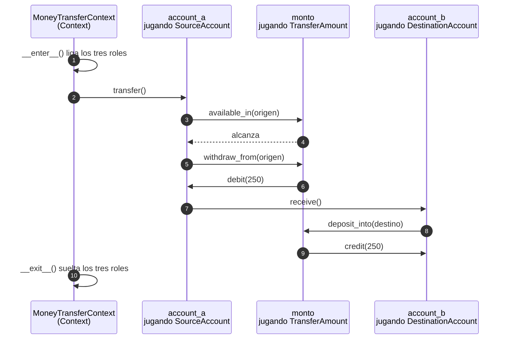
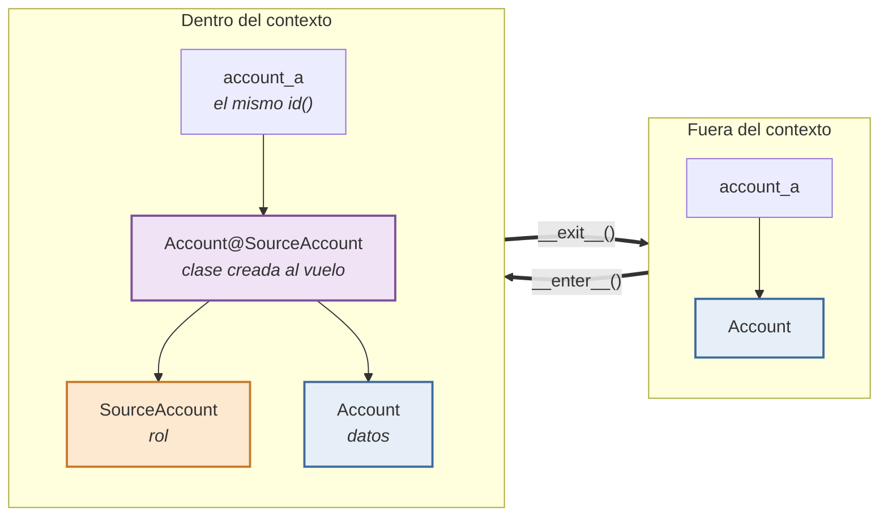
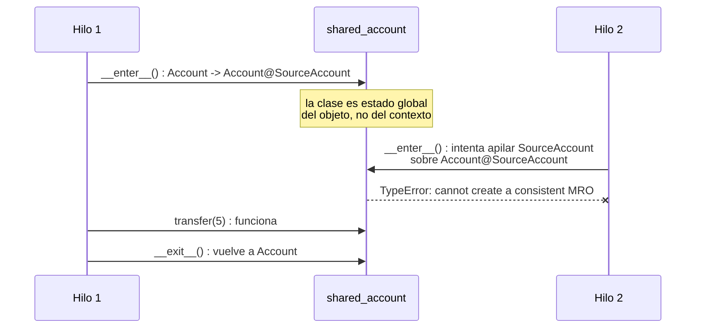

En [la primera parte](/posts/dci-data-context-interaction-reenskaug/) conté de dónde salió DCI: Trygve Reenskaug, el autor de MVC, pasó su jubilación buscando una forma de que el código muestre lo que el sistema *hace* y no sólo lo que el sistema *es*. La propuesta se llama *Data, Context, Interaction* y se resume en tres elementos. **Data**: los objetos de dominio quedan pequeños y apenas inteligentes — la `Account` sabe su saldo y sabe sumarlo y restarlo, nada más. **Context**: el caso de uso deja de ser un método suelto y pasa a ser un objeto de primera clase, que existe mientras el caso de uso ocurre. **Interaction**: los roles —`SourceAccount`, `DestinationAccount`— son comportamiento que se le pega a un objeto de datos *mientras dura el contexto*, y el algoritmo que ejecutan entre todos está escrito en un solo lugar, de principio a fin[^dci_letras].

¿Cómo podemos escribir nuestro software en Python usando esa idea? Para que DCI funcione hace falta algo bastante violento: **inyectarle comportamiento a un objeto en tiempo de ejecución, por la duración de un contexto, sin tocar su clase y sin que el objeto pierda su identidad**. Java no hace eso. C# no hace eso. Python sí. Así que vamos a hacerlo y evaluar las limitaciones del modelo de objetos de Python para este caso.

> **Antes de copiar y pegar.** Todo el código de este post vive en un repositorio aparte: **[CesarBallardini/dci-in-python](https://github.com/CesarBallardini/dci-in-python)**. El mecanismo completo es biblioteca estándar —`contextvars` y `functools`, nada más—, así que no hay ninguna dependencia que instalar para que DCI funcione. Para correr el repositorio sí hacen falta [uv](https://docs.astral.sh/uv/) y Python 3.14:
>
> ```console
> $ git clone https://github.com/CesarBallardini/dci-in-python
> $ cd dci-in-python
> $ make install
> $ make demo
> ```
>
> `make demo` imprime todas las salidas que van apareciendo en este post. Y `make test` corre la suite.
>
> `make` sin argumentos lista el resto: linter, los dos type checkers y los escaneos de seguridad. Todo eso —qué hace cada herramienta, cómo se actualizan las dependencias, cómo se arma la rueda— está en [`TOOLING.md`](https://github.com/CesarBallardini/dci-in-python/blob/main/TOOLING.md).

### La transferencia, tres veces

El ejemplo canónico de DCI es la transferencia bancaria — es el que usan Reenskaug y Coplien en el paper, donde el algoritmo se escribe entre dos roles, *Source Account* y *Destination Account*[^dci]. En el capítulo de arquitectura, en cambio, dicen que «un modelo mental posible tiene **tres** roles»: *Source Account*, *Destination Account* y *Transfer Amount*[^asa].

#### Versión 1: la cuenta que sabe demasiado

```python
class Account:
    def __init__(self, holder, balance):
        self.holder, self.balance = holder, balance

    def transfer_to(self, destination, amount):
        if self.balance < amount:
            raise InsufficientFunds(self.holder)
        self.balance -= amount
        destination.balance += amount
```

Se lee bárbaro y es lo que escribiríamos casi todos. El problema aparece con el tiempo. La `Account` origen ahora sabe qué es una transferencia. En la próxima iteración va a saber de comisiones; en la siguiente, de límites diarios; después, de horarios de acreditación, de cuentas embargadas, de CBU contra CVU, de si el destino es de otro banco. Le cargamos el caso de uso a una entidad que cambia por otros motivos y a otro ritmo. Y ninguna de esas reglas es sobre lo que una cuenta *es*.

#### Versión 2: la cuenta anémica y el servicio

```python
class Account:
    def __init__(self, holder, balance):
        self.holder, self.balance = holder, balance


class TransferService:
    def transfer(self, source, destination, amount):
        if source.balance < amount:
            raise InsufficientFunds(source.holder)
        source.balance -= amount
        destination.balance += amount
```

Ésta es la que se ve en muchos de los sistemas de línea de negocio, y es la reacción sana al problema anterior. La cuenta volvió a ser una entidad pequeña. Pero mirá lo que pasó: `Account` ya no hace *nada*. Es un registro. Y `TransferService` manipula los atributos de otro objeto desde afuera —le resta el saldo con `source.balance -= amount`—, que es exactamente lo que el encapsulamiento venía a impedir. Escribimos una función y le pusimos una clase alrededor para que no se notara.

Fijate además que en ninguna de las dos versiones existen «origen» y «destino» como *cosas*. Son nombres de parámetros. Se evaporan cuando la función retorna.

#### Versión 3: DCI

Empecemos por la **Data**, que es lo único que se parece a lo anterior. Son dos objetos, y los dos son igual de simples. Primero la plata:

```python
@functools.total_ordering
class Money:
    """Data: un monto y una etiqueta que dice de qué plata estamos hablando."""

    def __init__(self, amount, currency="ARS"):
        self.amount, self.currency = amount, currency

    def _same_kind(self, other):
        if self.currency != other.currency:
            raise CurrencyMismatch(f"{self.currency} vs {other.currency}")
        return other

    def __add__(self, other):
        return Money(self.amount + self._same_kind(other).amount, self.currency)

    def __sub__(self, other):
        return Money(self.amount - self._same_kind(other).amount, self.currency)

    def __eq__(self, other):
        if not isinstance(other, Money):
            return NotImplemented
        return (self.amount, self.currency) == (other.amount, other.currency)

    def __lt__(self, other):
        return self.amount < self._same_kind(other).amount

    def __hash__(self):
        return hash((self.amount, self.currency))

    def __repr__(self):
        return f"Money({self.amount}, {self.currency!r})"
```

`amount` va en unidades mínimas —centavos—, así evitamos el uso de `float` en montos de dinero. Y la etiqueta no es decorativa: pesos y dólares no se suman en ningún contexto, lo cual es una regla de negocio sobre montos de dinero en diferentes monedas. `Money` es un *value object*, y dos montos iguales tienen que ser iguales.

Después la cuenta, que sigue siendo igual de simple:

```python
class Account:
    """Data: lo que la cuenta ES. No sabe que existen las transferencias."""

    def __init__(self, holder, balance):
        self.holder, self.balance = holder, balance

    def debit(self, amount):
        self.balance = self.balance - amount

    def credit(self, amount):
        self.balance = self.balance + amount

    def __repr__(self):
        return f"Account({self.holder!r}, {self.balance.amount})"
```

`debit` y `credit` no son reglas de negocio: son lo que una cuenta sabe hacer consigo misma, como un entero sabe sumarse. No hay ninguna validación de saldo ahí, porque el piso del saldo no es un dato de la cuenta: en una caja de ahorro el límite es cero, en una cuenta corriente con acuerdo de descubierto es el negativo del acuerdo, y hay débitos —una comisión, un contracargo, un embargo— que entran igual y dejan el saldo en rojo. Cuánto se puede sacar lo decide el caso de uso, no la cuenta.

> **Ojo con una tentación.** Si escribís `Money` como `@dataclass(frozen=True)` —que es lo que uno haría, y lo correcto para un value object— el ejemplo entero deja de funcionar. Más detalles, más abajo.

Después vienen los **roles**, que son la **Interaction**:

```python
class SourceAccount:
    def transfer(self):
        if not context().amount.available_in(self):
            raise InsufficientFunds(self.holder)
        context().amount.withdraw_from(self)
        context().destination.receive()


class DestinationAccount:
    def receive(self):
        context().amount.deposit_into(self)


class TransferAmount:
    def available_in(self, account):
        return account.balance >= self

    def withdraw_from(self, account):
        account.debit(self)

    def deposit_into(self, account):
        account.credit(self)
```

Leelo despacio, porque acá está toda la idea y también todo lo raro. Ninguno de los tres **hereda de nada** y ninguno **se instancia nunca**. `SourceAccount` usa `self.balance` y `self.debit()` sin haberlos definido en ninguna parte. Son clases escritas para vivir prestadas adentro de otro objeto. Y fijate qué es exactamente lo que saben y lo que no: **no saben de qué clase es el objeto que los va a jugar, pero sí qué protocolo entiende** — `balance`, `debit()`. Por eso pueden usarlo. Ese contrato implícito es todo lo que el rol exige, y es la misma condición que Reenskaug le pedía a Simula en 1970 y no conseguía: componentes que se hablan por un protocolo estándar y son opacos por dentro. Llaman a `context().destination` para hablar con su par: el rol no conoce al otro objeto, conoce al *otro rol*, y lo alcanza a través del contexto. `context()` es una función de la maquinaria, y la vemos en la sección siguiente.

Mirá además lo que le pasó a la firma de `transfer`: se quedó **sin parámetros**. El monto ya no es un argumento que se pasea de función en función; es un participante más, y el origen lo alcanza igual que alcanza al destino, preguntándole al contexto. Eso es lo que quiere decir que el monto «juega un rol»: no es un dato que se mueve entre objetos, es alguien con un papel. `TransferAmount` sabe restarse de una cuenta y sumarse a otra, y ninguna de las dos cuentas sabe cómo se hace eso.

Y fijate dónde terminó la regla del saldo: en `TransferAmount.available_in()`. No está en `Account` —que no tiene por qué saber si puede quedar en rojo— ni suelta en el guion. La pregunta «¿alcanza?» es sobre el monto y la cuenta juntos, en este caso de uso, y ahora tiene un lugar donde vivir.

Y ahora mirá `withdraw_from`, que hace algo que debería estar mal: le pasa `self` a `account.debit()`, un método que espera un `Money`. En tiempo de ejecución es correcto, y por el motivo que sostiene todo lo demás — dentro del contexto `self` **es** el monto, con su `id()` y su `isinstance` intactos, y de paso es un `TransferAmount`. Lo que ningún type checker puede ver es eso: para él, `self` es un `TransferAmount` y ahí hay un error. En el repositorio se paga con un `cast` explícito, escrito una sola vez y con nombre[^cast]. De todas las limitaciones que vienen más abajo, ésta es la única sin arreglo posible, y acá asoma por primera vez.

Y finalmente el **Context**, el caso de uso hecho cosa:

```python
class MoneyTransferContext(Context):
    roles = {
        "source": SourceAccount,
        "destination": DestinationAccount,
        "amount": TransferAmount,
    }

    def __init__(self, source, destination, amount):
        self.source, self.destination, self.amount = source, destination, amount

    def execute(self):
        with self:
            self.source.transfer()
```

Ahí está el caso de uso completo, en un solo lugar, en un renglón: *el origen transfiere*. Ni siquiera hace falta decir qué, porque el monto ya está en escena. Eso es lo que DCI viene a comprar. El `with self:` es el momento durante el cual los tres participantes juegan sus papeles.



#### Un paréntesis: la objeción de Feathers

Mirá el segundo renglón del diagrama: `transfer()` se lo pedimos al **origen**. Ahí aparece la crítica más citada que recibió DCI, la de Michael Feathers, que en [la primera parte](/posts/dci-data-context-interaction-reenskaug/) dejé sin contestar. Dice que elegir la cuenta origen es arbitrario, porque para el usuario la transferencia no la hace ninguna de las dos cuentas. Zabroski propuso un objeto aparte, un `TransferSlip`, para que esa lógica viva ahí[^infoq_feathers]. La objeción es incómoda, porque DCI se vende diciendo que el código se parece a cómo la gente cuenta lo que hace.

Con el código adelante ya se puede contestar, y la respuesta tiene dos partes.

**La primera: Feathers tiene razón, y el tercer rol lo deja ver.** Que el origen empiece el guion es una decisión de quien diseña, no una verdad sobre las cuentas. Se nota en dónde terminó la regla del saldo: `available_in()` no está en `Account`, está en `TransferAmount`, porque la pregunta «¿alcanza?» no es sobre la cuenta sola sino sobre el monto y la cuenta juntos, y sólo en este caso de uso. Ninguna de las dos cuentas es dueña de esa regla. En la versión de dos roles del paper esa decisión no se ve y parece inevitable; con el monto como tercer rol queda claro que alguien la tomó.

**La segunda: el `TransferSlip` que pide Zabroski ya está escrito, y se llama `MoneyTransferContext`.** Es el objeto que existe mientras dura la transferencia, conoce a los tres participantes y tiene el guion. Es exactamente el papelito (*slip*) que pedía Zabroski. La objeción no encontró un agujero en DCI: encontró el Context, sin reconocerlo.

Lo que sí queda en pie es que el guion tiene que empezar en algún lado, y ese `self.source.transfer()` es una elección. Podría ser el monto el que se mueve. La diferencia con el código anterior es que ahora la elección es **un renglón, en un solo archivo**. En la versión con `TransferService` esa decisión estaba igual de tomada, pero repartida entre la firma del método y el cuerpo, y no había dónde señalarla.

### La maquinaria

Falta lo que hace que eso funcione. Todo el mecanismo es la clase `Context`, y en Python entra en veinticinco líneas de código, sin instalar nada:

```python
import contextvars
import functools

_current_context = contextvars.ContextVar("dci_context")


def context():
    return _current_context.get()


@functools.lru_cache(maxsize=None)
def _class_with_role(cls, role):
    return type(f"{cls.__name__}@{role.__name__}", (role, cls), {})


class Context:
    roles: dict = {}

    def __enter__(self):
        self._token = _current_context.set(self)
        self._original_classes = {}
        for attribute, role in self.roles.items():
            obj = getattr(self, attribute)
            self._original_classes[attribute] = obj.__class__
            obj.__class__ = _class_with_role(obj.__class__, role)
        return self

    def __exit__(self, *exc_info):
        for attribute, cls in self._original_classes.items():
            getattr(self, attribute).__class__ = cls
        _current_context.reset(self._token)
        return False
```

El truco central es una sola línea: `obj.__class__ = ...`. Python te deja reasignar la clase de una instancia viva. Entonces al entrar al contexto fabricamos al vuelo una subclase que mezcla el rol con la clase original —`Account@SourceAccount`— y le cambiamos la clase al objeto; al salir, se la devolvemos.



El `lru_cache` es para no fabricar una clase nueva en cada transferencia. El `ContextVar` —y no una variable global— es para que la búsqueda del contexto actual funcione bien con hilos y con `async`.

#### De qué está hecho, exactamente

Vale la pena parar un segundo y mirar qué facilidades son necesarias de Python para hacer funcionar este código.

| Recurso | Para qué lo necesita el estilo |
| --- | --- |
| `obj.__class__ = ...` sobre una instancia viva | el objeto *se convierte* en el rol y conserva su `id()` |
| `type(nombre, bases, ns)` | fabricar la mezcla del rol con la clase de datos al ligar |
| `contextvars.ContextVar` | que un rol alcance a sus pares sin guardar referencias, con hilos y con `async` |
| el protocolo de context manager | que el caso de uso tenga cierta duración, y que el rol se libere aunque se lance una excepción en el cuerpo |
| `types.MethodType` + `object.__setattr__` | la segunda estrategia de ligado, la que no toca la clase |
| metaclase, y `__name__` / `__qualname__` escribibles | que los mensajes de error nombren una clase que existe |
| `typing.Protocol` estructural | que un rol exija un protocolo y no una clase base |
| `if TYPE_CHECKING:` | escribir ese protocolo para el type checker sin que exista en runtime |
| `typing.Self`, `ClassVar`, el `/` posicional | que el propio mecanismo pase los type checkers sin una sola supresión |
| `functools.cache`, `weakref.finalize`, `threading.RLock` | fabricar la clase una sola vez; que el lock de cada participante desaparezca junto con el objeto |

Anda:

```
==============================================================
1. The transfer works
==============================================================
Account('Alice', 750) Account('Bob', 250)
```

La secuencia temporal es:

```
==============================================================
2. Roles are temporary
==============================================================
before the context, does .transfer exist? False
inside:   type(a).__name__ = Account@SourceAccount
inside:   isinstance(a, Account) = True
inside:   does .transfer exist? True
inside:   the amount plays a role too -> Money@TransferAmount
outside:  type(a).__name__ = Account
outside:  does .transfer exist? False
outside:  type(amount).__name__ = Money
```

Por fuera de un contexto, si intentamos un `transfer`, se lanza la excepción `AttributeError`. Dentro del contexto, sigue siendo instancia de `Account`.

Fijate también el `Money@TransferAmount`: al monto le pasa exactamente lo mismo que a la cuenta. Entra a escena, le aparece un método que antes no tenía, y cuando el contexto termina vuelve a ser un monto y nada más.

La misma cuenta que fue origen puede ser destino en la transferencia siguiente, sin agregarle una línea:

```
==============================================================
3. The same object plays the opposite role in another context
==============================================================
Account('Alice', 850) Account('Bob', 150)
```

Éste es el detalle que a mí me parece el más lindo de toda la propuesta: los roles son **contextuales**. Un objeto no *tiene* un rol, un objeto *juega* un rol, y sólo mientras dura la obra. Cuando el contexto termina, la cuenta vuelve a ser una cuenta. Es mucho más parecido a cómo funciona el mundo real que la herencia, donde los métodos que un objeto puede usar se los da su clase, y no cambian nunca.

La identidad se conserva — no estamos devolviendo otro objeto:

```
==============================================================
4. Identity is preserved (this is not a wrapper)
==============================================================
same id inside?  True
same id outside? True
```

Hasta acá, DCI en Python es un éxito: cincuenta líneas, biblioteca estándar, y el caso de uso se lee de corrido en el contexto.

### Algunos escenarios donde el modelo de objetos de Python falla

**Primero: no funciona con `__slots__`.** Basta que la clase de dominio use `__slots__` —o sea, cualquier clase optimizada para memoria, y varias cosas que generan librerías— para que la reasignación de `__class__` sea ilegal:

```
==============================================================
5. Where class binding fails: __slots__
==============================================================
TypeError: __class__ assignment: 'SlottedAccount@SourceAccount' object layout differs from 'SlottedAccount'
```

Python sólo permite reasignar `__class__` entre clases con el mismo *layout* de objeto, y la clase sintetizada no lo comparte. La explicación cómoda sería «los slots le sacan el `__dict__` al objeto», pero es falsa y conviene no repetirla: basta un `__slots__ = ()` —que no saca nada— para que la reasignación deje de ser legal, y sigue siendo ilegal en una subclase que recuperó su `__dict__`. Lo que importa no es si el objeto tiene diccionario sino de qué clase hereda su layout, y el `__slots__` de un ancestro cualquiera ya lo decide. Tampoco se arregla poniéndole `__slots__ = ()` al rol para que no aporte nada: probado, falla igual. No hay forma de rodearlo[^layout].

**Segundo: el mismo resultado por otro camino.** Hasta acá `__slots__` suena a optimización exótica. Pero se llega al mismo lugar por un camino mucho más transitado: la forma más idiomática que hay de escribir un value object.

```python
@dataclass(frozen=True)
class Money:
    amount: int
    currency: str = 'ARS'
```

Eso es lo que cualquiera escribiría para `Money` en 2026. Y es incapaz de jugar un rol:

```
==============================================================
5b. The same failure, reached by the idiomatic value object
==============================================================
FrozenInstanceError: cannot assign to field '__class__'
the field it refuses to assign is __class__
```

La causa se ve enseguida, y **no es la misma que la de `__slots__`**: acá el layout no tiene nada que ver. Un dataclass frozen reemplaza `__setattr__` por uno que rechaza *todo*, y `__class__` es un atributo como cualquier otro. El mensaje lo dice con todas las letras: nombra el campo que no deja asignar.

Entonces, para jugar un rol, el objeto tiene que tener `__dict__` **y** tiene que dejarse reasignar `__class__`. Eso deja afuera `__slots__`, deja afuera `frozen=True`, y deja afuera `@attrs.define` por partida doble, porque trae `slots=True` de fábrica[^instancia].

**Tercero: dos contextos vivos sobre el mismo objeto se pisan.**

```
==============================================================
6. Where class binding fails: two live contexts over one object
==============================================================
with c1 open: type(shared).__name__ = Account@SourceAccount
c2.__enter__() -> TypeError: Cannot create a consistent method resolution order (MRO) for bases SourceAccount, Account@SourceAccount
after closing c1: Account
```

También pasa con hilos. Dos requests concurrentes que toquen la misma cuenta:

```
==============================================================
6b. The same case, served by two threads
==============================================================
failure: ('fast', 'TypeError', 'Cannot create a consistent method resolution order (MRO) for bases SourceAccount, Account@SourceAccount')
final balances: Account('Erin', 999995) Account('Frank', 5) Account('Grace', 0)
```



La transferencia del hilo lento se completa y la del rápido muere con un error de MRO que no tiene nada que ver con transferir plata. Y ése es el caso **bueno**: la excepción salta al ligar, antes de tocar un saldo, y en la escena del problema.

El caso malo aparece cuando los dos contextos le dan al objeto roles **distintos** — la misma cuenta es origen de una transferencia y destino de otra, que en un banco pasa todo el tiempo. Ahí el segundo ligado no falla: apila, y la clase queda `Account@SourceAccount@DestinationAccount`. Cuando el primer contexto sale, le devuelve al objeto la clase que él había guardado, y el segundo, que sigue vivo, se queda sin sus métodos sin que nadie avise. Y cuando ese segundo sale, restaura lo que él había guardado: la cuenta queda siendo `Account@SourceAccount` **fuera de todo contexto y de manera permanente**. Un error silencioso en el código que mueve la plata.

La causa de fondo es sencilla: **el `__class__` de un objeto es estado global de ese objeto**, y DCI lo usa como si fuera estado local del contexto. El `ContextVar` resuelve la mitad del problema —cuál es *mi* contexto— y no toca la otra mitad —qué clase tiene el objeto compartido—.

El arreglo es poco ingenioso: si dos contextos no pueden compartir el `__class__` de un objeto, que no lo tengan al mismo tiempo. Un lock por participante —por participante y no por rol, así que cubre las dos formas de pisarse—, tomado al entrar y soltado al salir. Las dos transferencias pasan, la segunda espera[^serializado].

Lo que el lock **no** hace es permitir que dos contextos jueguen el mismo objeto a la vez. Los pone en fila. En una cuenta con contención el throughput es un caso de uso por vez, que es exactamente lo que te da el row lock de la base y ni mejor ni peor. Y multiproceso, dicho sea de paso, nunca estuvo en discusión: procesos distintos tienen objetos distintos. El problema nunca fueron «los hilos», fue el mismo objeto en memoria dentro de dos contextos vivos.

**Cuarto: el debugger te miente.** `type(a).__name__` devuelve `Account@SourceAccount`, una clase que no existe en ningún archivo, que no vas a poder buscar con grep, que tu IDE no autocompleta y sobre la cual el type checker no tiene nada que decir. `mypy` no sabe que `self.balance` existe dentro de `SourceAccount`; para él ese código está simplemente mal. Y cuando falle en producción, el stack trace va a nombrar una clase que no podés abrir.

Ésta también se puede mejorar, aunque menos que la anterior. A la clase sintetizada se le puede poner el `__name__` de la clase de datos, y entonces los mensajes de error vuelven a decir `'Account' object has no attribute ...` en vez de `'Account@SourceAccount'`. Ojo con el detalle: lo que hace el trabajo es **renombrar** la clase, no una metaclase. Una metaclase que devuelva otro `__name__` arregla lo que ves al pedirlo y no toca los mensajes de error, porque CPython los arma con `tp_name`, que es de nivel C. Igual, esto es maquillaje: seguís teniendo un objeto cuyo tipo dice `Account` y que tiene un método `transfer` que `Account` no define. Se cambia una confusión por otra, un poco más barata[^disfraz].

El type checker no tiene arreglo. Lo más lejos que se llega son dos cosas, las dos escritas a mano: el `cast` que ya vimos en `withdraw_from`, y un bloque `if TYPE_CHECKING:` en cada rol declarando qué le exige a su actor — `balance`, `debit()`. Con eso los checkers pasan. Pero lo que quedó escrito ahí es el mismo contrato que el mecanismo ya cumple en tiempo de ejecución, copiado a mano porque el checker no puede verlo.

### Cuatro maneras de prestar un rol

Los dos arreglos de arriba —el lock y el renombre— no son parches sueltos sobre la misma clase. Cada uno es un `Context` distinto, y en el repositorio están los cuatro, uno al lado del otro: `banking/dci/` es un paquete con el ciclo de vida en `base.py` y un módulo por binder. Comparten absolutamente todo —el contexto reificado, el `ContextVar`, el ciclo de vida entero— y se diferencian en **un solo método**, el que liga: `_bind`. En el código de arriba ese ligado estaba suelto adentro del `__enter__`; en el repositorio es un método propio, y justamente para esto.

- **`Context`** — reasigna la clase. Es el de todo el post y contra el que se miden los otros.
- **`TransparentContext`** — lo mismo, con la clase sintetizada **renombrada** a la de datos, así los mensajes de error dejan de nombrar una clase que no existe.
- **`SerializedContext`** — lo mismo, con los **participantes bloqueados** mientras dura el caso de uso. Es el del lock.
- **`InstanceContext`** — no toca la clase: le **escribe los métodos del rol al `__dict__` de la instancia**, como métodos ligados, y se los saca al salir.

`InstanceContext` merece un párrafo aparte, porque es el que más cambia. Al no tocar `__class__`, todo lo que dependía del layout deja de importar: el dataclass congelado juega su rol, y `type(obj)` no deja de ser `Account` ni un instante, así que el debugger deja de mentir. Eso es la segunda falla entera y la mitad de la cuarta — el type checker sigue sin ver nada, y con ningún binder lo va a ver. Y arregla además la entidad del ORM declarativo, que no está en esa lista y es la que decide si esto se puede usar en un sistema que ya existe: va en la sección que sigue.

Y sin embargo no es el binder por defecto. Le quedan dos problemas.

El primero es que un rol pierde la posibilidad de aportar un método especial. Los dunders se resuelven en el tipo, nunca en la instancia, así que un `__lt__` metido en el diccionario del objeto no lo va a mirar nadie. `InstanceContext` sabe eso y directamente no lo liga, que es lo honesto: mejor no prestar un método que prestarlo sabiendo que no va a correr. Un rol que quisiera hacer a su actor comparable, iterable o invocable puede hacerlo con `Context` —donde el rol termina en una clase de verdad— y con `InstanceContext` no puede de ninguna manera.

El segundo problema de `InstanceContext` es el `pickle`, y enseña algo sobre dónde conviene fallar.

`Context` se niega en el acto: la clase del objeto es `Account@SourceAccount`, no existe en ningún módulo, y `dumps` falla ahí mismo. `InstanceContext` **no se niega**. Un método ligado se serializa como «llamá a `getattr` sobre este objeto con este nombre», así que `dumps` funciona y devuelve bytes — bytes que después nadie puede cargar, porque al reconstruir la cuenta no hay ningún `transfer` que `getattr` encuentre.

La diferencia está en **dónde** explota. Con `Context`, en el proceso que cometió el error. Con `InstanceContext`, en el que más tarde lea esa caché o esa cola, y con un traceback que nombra a `getattr` y a una `Account` común, sin decir una palabra de roles ni de contextos. Ninguno de los dos binders sobrevive un viaje de ida y vuelta, pero fallar en el acto y fallar en otro proceso no son la misma clase de problema[^deepcopy].

Queda el caso de los dos contextos vivos sobre el mismo objeto, y ahí `InstanceContext` no está peor que `Context`: está mejor. Los dos rechazan el segundo ligado, pero cada uno a su manera. `Context` falla porque no puede construir la clase mezclada, y el mensaje habla de MRO y de bases, no de roles ni de contextos. `InstanceContext` revisa, antes de escribir cada método, si el objeto ya tiene un atributo con ese nombre; si lo tiene, levanta un `RuntimeError` que describe la situación:

```
RuntimeError: Account already has 'transfer': instance binding will not
overwrite it. Another context is playing this role, or the object defines
that name itself.
```

Los dos fallan en el momento del ligado, entonces, y ninguno de los dos permite que dos contextos jueguen el mismo objeto a la vez. Eso sólo lo consigue `SerializedContext`, poniéndolos en fila.

Y una aclaración sobre el chequeo de `InstanceContext`: **es un chequeo, no un lock**. Revisa si el nombre está libre y después escribe, en dos pasos separados. Si dos hilos llegan justo entre uno y otro, los dos ven el nombre libre y los dos escriben. La ventana es corta pero existe, y cerrarla es para lo que sirve el lock.

El chequeo sirve además para otra cosa: protege al objeto de dominio que **tiene un atributo propio** llamado igual que un método del rol. Sin él, el `__exit__` se lo borraría para siempre, porque al salir el binder no sabría distinguir lo que prestó de lo que ya estaba.

Puestos en una tabla, por lo que **hacen**:

| | `Context` | `Transparent` | `Serialized` | `Instance` |
| --- | :---: | :---: | :---: | :---: |
| `type(obj).__name__` dice | `Account@SourceAccount` | `Account` | `Account@SourceAccount` | `Account` |
| los mensajes de error nombran | `Account@SourceAccount` | `Account` | `Account@SourceAccount` | `Account` |
| `pickle` con el rol puesto | ❌ | ❌ | ❌ | ⚠️ **falla tarde** |
| dos contextos vivos | ❌ MRO | ❌ MRO | ✅ **hacen fila** | ❌ se niega |
| un rol que aporta un dunder | ✅ | ✅ | ✅ | ❌ imposible |

Cada celda está afirmada por un test: la tabla es un archivo `.feature` en el repositorio, con una fila de ejemplo por casillero, así que si una versión futura de Python cambia una respuesta se pone en rojo exactamente ésa[^tabla].

Y mirala un rato antes de seguir, porque el resumen de la sección está ahí: **cada binder arregla algo que a los otros se les escapa, y lo paga con algo**. Ninguna columna gana todas las filas.

### La pregunta que decide si esto se puede usar

Todas las cuentas que vimos hasta acá las fabricamos nosotros, en la línea de arriba, con `Account('Alice', Money(1000))`. En un sistema de verdad eso no pasa nunca. La cuenta **sale de algún lado**: de una consulta, de un modelo, de un payload que alguien validó. Y la clase de esa cuenta no la elegiste vos sola: la eligió, en buena parte, la librería con la que hablás con la base.

Así que la pregunta que importa no es si DCI anda con una clase que escribí para el ejemplo. Es si anda con la que ya tenés. La respuesta hay que medirla, y la medí: `tests/integration/test_orm_roles.py`, con SQLite de verdad, escribiendo la fila, cerrando la sesión, y recién ahí —con el objeto cargado de disco— dándole un papel.

Y una aclaración antes de la salida, porque de lo contrario la tabla parece una casualidad: **son los mismos tres roles, sin tocarles una línea, sobre cinco clases que no comparten ningún ancestro**. Se puede porque el rol nunca pidió una clase base: pide un `Protocol` estructural —`balance`, `debit()`, `credit()`— y cualquier cosa que los tenga sirve. Es lo que decía cuando miramos `SourceAccount`: el rol no sabe de qué clase es su actor, pero sí qué protocolo entiende. Cada fila es además una fila de ejemplo en un archivo `.feature`, igual que la tabla de los binders.

Sale esto:

```
==============================================================
8. Five ways to write the domain object, five outcomes
==============================================================
  WORKS  SQLAlchemy imperative (from the DB)    -> 750 / 250
  BREAKS SQLAlchemy declarative                 -> TypeError: __class__ assignment: 'DeclarativeAccount@SourceAccount' o
  WORKS  pydantic v2 BaseModel                  -> 750 / 250
  BREAKS attrs @define (slots by default)       -> TypeError: __class__ assignment: 'AttrsAccount@SourceAccount' object
  BREAKS @dataclass(frozen=True)                -> FrozenInstanceError: cannot assign to field '__class__'
```

Ordenado, y con el ligado en la instancia al lado, queda así:

| Cómo escribís tu objeto de dominio | ligando en la clase | ligando en la instancia |
| --- | --- | :---: |
| **SQLAlchemy, mapeo imperativo** (`map_imperatively`) | ✅ anda completo | ✅ |
| pydantic v2 `BaseModel` | ✅ anda | ✅ |
| **SQLAlchemy, declarativo** (`class Account(Base)`) | ❌ `object layout differs` | ✅ **rescatado** |
| `@dataclass(frozen=True)` | ❌ `cannot assign to field '__class__'` | ✅ **rescatado** |
| attrs `@define` (`slots=True` por defecto) | ❌ la misma barrera | ❌ la misma barrera |

**El mapeo declarativo no anda**, y es el que usa todo el mundo. `DeclarativeBase` aporta un `__slots__ = ()` —que no saca nada, pero decide el layout, como vimos— y mezclarle un rol encima da una clase que CPython se niega a reasignar. Los slots vienen de la clase base de la que heredás, y con ellos se fue la posibilidad de que esa entidad actúe.

**El mapeo imperativo anda entero.** Ahí la tabla se describe por separado y la clase de dominio no se entera de que existe una base de datos: el test mapea el `Account` de verdad, el mismo del principio del post, sin agregarle una línea. El objeto se carga de disco, juega su papel, se lo modifica **a través del rol**, devuelve el rol al salir del contexto, y el cambio llega a la base. La vuelta completa.

Y fijate lo que eso significa, porque no es un detalle de SQLAlchemy. La limitación más grave que le encontramos a DCI no salió del lenguaje: salió de dejar que el framework de persistencia se meta adentro de la clase de dominio. Si tu `Account` hereda de `Base`, no puede actuar. Si tu `Account` es una clase común y el mapeo vive afuera, puede.

Que es, palabra por palabra, lo que DCI te venía pidiendo desde el principio. La Data tiene que ser *barely smart data*, decía Coplien, y uno lo lee como una preferencia estética sobre cómo modelar. Resulta que era la condición técnica para que el mecanismo funcione. Y es la misma regla a la que llegan DDD y Clean Architecture por su cuenta, con otros argumentos que no tienen nada que ver con reasignar `__class__`: que el dominio no sepa de la infraestructura.

### Un paréntesis: la librería que hay, y por qué no anda

No es que nadie lo haya intentado. Para Python existe [`roles`](https://pypi.org/project/roles/), de Arjan Molenaar, que hace exactamente esto y con bastante más cuidado que mis treinta líneas: tiene metaclase propia, revocación explícita, un decorador `@in_context` y hasta integración con Django[^rolespy]. El ejemplo canónico de su documentación es, cómo no, la transferencia bancaria.

El problema es la fecha. La última versión publicada es la 1.0.0 y salió el **28 de diciembre de 2020**; en PyPI declara `>=3.7,<4.0` y sus clasificadores no pasan de 3.8. Y cuando uno corre hoy el ejemplo de su propia documentación, pasa esto:

| Python | Resultado |
| --- | --- |
| 3.9 | ✅ anda |
| 3.11 | ✅ anda |
| 3.12 | ✅ anda |
| 3.13 | ❌ **falla** |
| 3.14 | ❌ **falla** |

El error es `TypeError: Can not apply role when overriding methods: __firstlineno__, __static_attributes__`. La causa es sencilla: la librería se niega a aplicar un rol si el rol y la clase de datos comparten nombres de atributos, para no pisarte un método sin querer. Y Python 3.13 agregó dos atributos nuevos, `__static_attributes__` y `__firstlineno__`, que el compilador pone **en todas las clases**[^cp313]. Con lo cual, desde 3.13, *toda* clase colisiona con *toda* otra clase, y la librería no aplica ningún rol nunca.

Es un bug de tres líneas. Y no es que el repositorio esté abandonado —el último commit es de agosto de 2024, y ahí dice «Python >= 3.8»—: es que su CI prueba 3.10, 3.11 y 3.12, nunca llegó a 3.13, y desde 2020 no hay una versión publicada. Lo que eso dice no es que la idea sea mala: dice que hace años que nadie instala esa librería desde PyPI en un Python nuevo. Y para terminar, [la lista oficial de ejemplos del proyecto DCI](https://fulloo.info/Examples/) tiene trygve, Squeak, Haxe, C#, C++, Ruby, Scala y Java — **y no tiene Python**[^fulloo]. El código de este post es propio; no hay un ejemplo oficial que traducir.

#### Lo que Molenaar ya había resuelto y yo no

Pero quedarse en «no funciona» sería cómodo y bastante injusto. Bajé el código y lo leí al lado del mío, una lectura fructífera[^comparacion].

Lo primero es tranquilizador: **el truco central es el mismo**. Su línea es `subj.__class__ = rolecls`. La mía es `obj.__class__ = _class_with_role(...)`. Parece que encontramos el mismo camino en Python.

Lo segundo es una diferencia de fondo que yo no había visto. Él fabrica la clase mezclada con las bases **al revés que yo**: `(clase_de_datos, rol)` donde yo pongo `(rol, clase_de_datos)`. O sea que en su implementación, si el rol y la clase de datos tienen un método con el mismo nombre, **gana la clase de datos** y el método del rol queda inalcanzable; en la mía gana el rol y el que queda tapado es el del dominio. Y ahí se entiende para qué existe el chequeo de colisiones que después le explotó: no es paranoia, es la única defensa contra que el orden de las bases decida en silencio cuál de los dos métodos corre. **Yo no tengo ese chequeo.**

Lo tercero es lo que me hizo cerrar el editor un rato. Acordate del error de MRO de más arriba, el de dos contextos vivos sobre el mismo objeto. Molenaar no lo tiene. Cuando le asigna un segundo rol a un objeto que ya está jugando uno, no apila el rol nuevo sobre la clase ya sintetizada —que es lo que hago yo y es lo que no tiene MRO consistente—: **reconstruye desde las bases originales**, `cls.__bases__ + (rol,)`. El resultado se llama `Account+MoneySource+MoneySink` y funciona:

```
tras rol 1: Account+MoneySource
tras rol 2: Account+MoneySource+MoneySink
MRO: ['Account+MoneySource+MoneySink', 'Account', 'MoneySource', 'MoneySink', 'object']
los dos roles conviven -> balance 995
revoke sink   -> Account+MoneySource
revoke source -> Account
```

Un objeto jugando dos papeles a la vez, y revocables en cualquier orden. Es una idea mejor que la mía.

Ahora, antes de que parezca que la solución estaba ahí todo el tiempo: **tampoco eso arregla la concurrencia.** No hay contador de referencias. Si dos contextos le asignan el *mismo* rol al mismo objeto, el segundo `assign` no hace nada —es idempotente— y el primer `revoke` se lo saca al otro:

```
ctx1 assign -> Account+MoneySource
ctx2 assign -> Account+MoneySource   (idempotente, no hay contador)
ctx1 revoke -> Account
ctx2 se rompe -> AttributeError: 'Account' object has no attribute 'transfer'
```

Y ahí la comparación se da vuelta. Ésta es la corrupción silenciosa que mis dos binders evitan negándose: el que liga en la clase con el error de MRO, el que liga en la instancia con un `RuntimeError`. Feos los dos, pero en el acto. Ninguno de los tres deja que dos contextos jueguen el mismo objeto a la vez, y la única salida sigue siendo la de arriba: que no lo tengan al mismo tiempo.

Y una confirmación: **a él `__slots__` tampoco le funciona.** Y no es que no lo haya intentado. Su código copia el `__slots__` de la clase de datos a la clase sintetizada, que es lo primero que uno probaría. Falla igual, con el mismo `object layout differs`.

Su librería trae **tres** estrategias de ligado —mutar `__class__`, clonar el objeto compartiendo el `__dict__`, y envolver con un `__getattr__`— con nombres y todo.

Si te quedaste con ganas, donde sí hay algo vivo es en TypeScript y en Ruby: hay una serie de tutoriales de DCI para TypeScript y, más interesante, un plugin de ESLint que verifica reglas DCI sobre tu código — probablemente la única herramienta de tooling DCI que existe. Del lado de Ruby está *Clean Ruby*, de Jim Gay, con un par de gemas que implementan contextos y roles[^otros].

### Cinco maneras de escribir la misma transferencia

Llegado este punto conviene mirarlas todas juntas. En el repositorio la misma transferencia está escrita **cinco veces**, y las cinco corren y están bajo test — no son cinco fragmentos de blog.

**Tres ya las viste**, así que las nombro y sigo. La **cuenta gorda** del principio (`FatAccount`, en `banking/alternatives/fat_account.py`), donde el caso de uso se comió a la entidad. La **cuenta anémica con su servicio** (`AnemicAccount` + `TransferService`, en `anemic_service.py`), donde los roles simplemente no existen: «origen» y «destino» son nombres de parámetros que se evaporan cuando la función retorna. Y **DCI**, lo que venimos construyendo, que es la única de las cinco donde el objeto *es* el rol, con su `id()` y su `isinstance` intactos.

Faltan dos, y son las que importan, porque son las que alguien podría preferir de verdad.

#### Cuarta: el rol como envoltorio

`banking/alternatives/role_as_wrapper.py` → `SourceWrapper` + `WrappedTransfer`. Uno mira todo lo anterior y dice: bueno, hagamos el rol con un envoltorio.

```python
class SourceWrapper:
    def __init__(self, account, ctx):
        self._account, self._ctx = account, ctx

    def __getattr__(self, n):
        return getattr(self._account, n)

    def transfer(self, amount):
        if self._account.balance < amount:
            raise InsufficientFunds(self._account.holder)
        self._account.debit(amount)
        self._ctx.destination.credit(amount)
```

Anda perfecto, no rompe con `__slots__`, no tiene problemas de concurrencia, el type checker lo entiende y cualquier programador lo lee sin explicación previa. Y sin embargo:

```
==============================================================
7. The alternative without role binding: the role as a wrapper
==============================================================
Account('Charlie', 450) Account('Dave', 50)
w is c -> False | isinstance(w, Account) -> False
```

El envoltorio **no es** la cuenta. Si ese objeto se guarda en algún lado, si se compara por identidad, si se pasa a una función que hace `isinstance`, si va a parar a un `set` o a una clave de diccionario, empiezan los problemas. Es el viejo problema de identidad del patrón Decorator, que los propios Reenskaug y Coplien señalan cuando dicen que la mayoría de los patrones del GoF rompen la identidad de los objetos para conseguir su efecto[^asa_gof].

Y perdimos justo lo que hacía a DCI distinto de «pasarle el objeto a una función». En DCI el objeto *juega* el rol; acá el objeto *está adentro de* otra cosa que juega el rol. Es la diferencia entre un actor y un títere.

#### Quinta: el servicio honesto

`banking/services/money_transfer.py`. La comparación interesante es contra el servicio que escribiría alguien que **entendió** DCI y decidió no usar el mecanismo.

```python
class SourceAccountRole:
    def __init__(self, account, roles):
        self.account, self.roles = account, roles

    # Angosto a propósito, y a propósito no es __getattr__:
    # sólo lo que el rol necesita.
    @property
    def balance(self):
        return self.account.balance

    @property
    def holder(self):
        return self.account.holder

    def debit(self, amount):
        self.account.debit(amount)

    def transfer(self):
        if not self.roles.amount.available_in(self):
            raise InsufficientFunds(self.holder)
        self.roles.amount.withdraw_from(self)
        self.roles.destination.receive()


class TransferRoles:
    def __init__(self, source, destination, amount):
        self.source = SourceAccountRole(source, self)
        self.destination = DestinationAccountRole(destination, self)
        self.amount = TransferAmountRole(amount, self)
```

Poné ese `transfer()` al lado del rol DCI de más arriba y fijate cuánto se parecen: casi carácter por carácter. Y no es casualidad — las propiedades de reenvío están justamente para que el cuerpo del rol pueda seguir diciendo `self.balance` y `self.debit(...)` como si fuera el objeto.

Lo que este servicio conserva es casi todo lo que DCI venía a comprar. El caso de uso sigue siendo una cosa: `TransferRoles` se instancia cuando la transferencia empieza y muere cuando termina. Los roles siguen siendo objetos de primera clase con nombre propio, **el tercero incluido** — `TransferAmountRole` sobrevive, el monto sigue siendo un participante y no un argumento que se pasea. Un rol sigue alcanzando a sus pares a través del objeto de roles y nunca por referencia directa. El guion se sigue leyendo en un lugar. Y la `Account` sigue sin enterarse de nada.

Cede exactamente **una** cosa: el objeto de datos nunca *se convierte* en el rol, así que `isinstance(role, Account)` da `False`. Es la misma pérdida de identidad de la cuarta — pero acá está acotada, y la diferencia es toda la disciplina que la rodea. No hay `__getattr__` haciéndose pasar por la cuenta, sólo los tres miembros que el rol realmente usa; y los objetos-rol son estrictamente internos: se construyen adentro de `transfer()`, no se devuelven, no se guardan, no se comparan y no se usan como clave de nada.

#### Las cinco, una al lado de la otra

| | 1. cuenta gorda | 2. servicio anémico | 3. DCI | 4. envoltorio | 5. servicio honesto |
| --- | :---: | :---: | :---: | :---: | :---: |
| El caso de uso es una cosa *(juicio)* | ❌ | ❌ | ✅ | ✅ | ✅ |
| Los roles tienen nombre *(juicio)* | ❌ | ❌ | ✅ | ⚠️ sólo el origen | ✅ los tres |
| El guion se lee de corrido *(juicio)* | ❌ | ✅ | ✅ | ✅ | ✅ |
| La Data queda simple *(juicio)* | ❌ | ⚠️ simple pero manoseada | ✅ | ✅ | ✅ |
| El objeto **es** el rol | — | — | ✅ | ❌ | ❌ |
| Anda con `__slots__` / frozen / ORM declarativo | ✅ | ✅ | ❌ | ✅ | ✅ |
| Aguanta dos requests concurrentes | ✅ | ✅ | ⚠️ con locks | ✅ | ✅ |
| El type checker lo entiende sin `cast` | ✅ | ✅ | ❌ | ✅ | ✅ |

Hay una sola fila donde DCI gana, y es la fila que a Reenskaug le importaba más que todas las otras juntas.

El `⚠️` de la fila de concurrencia es el lock del que hablábamos más arriba: DCI aguanta dos requests, siempre que los pongas en fila. Las otras cuatro no necesitan que hagas nada.

### Y en tu código, ¿cuál?

Todo lo anterior es medición. Antes del veredicto conviene usarla, porque si llegaste hasta acá probablemente no sea por curiosidad histórica.

La pregunta que decide no es «¿me conviene DCI?». Es **qué son tus objetos de dominio**, porque tal vez no lo elegiste vos: lo eligió el ORM, o el validador de payloads, o quien escribió esa clase en 2019.

| Tus objetos de dominio son | Andá con | Si no da | Por qué |
| --- | --- | --- | --- |
| Python común, sin compartir entre requests | `Context` | — | el objeto *es* el rol, que es todo el punto |
| Python común, compartidos | `SerializedContext` | el servicio | los pone en fila, como un row lock |
| SQLAlchemy, mapeo imperativo | `Context` | como las dos filas de arriba | la clase de dominio queda plana |
| SQLAlchemy, declarativo, uno por request | `InstanceContext` | el servicio | no toca `__class__` |
| SQLAlchemy, declarativo, compartido o cacheado | el servicio | — | el `pickle` te falla en otro proceso |
| `@dataclass(frozen=True)` | `InstanceContext` | el servicio | `object.__setattr__` pasa por arriba del congelamiento |
| `__slots__` o `attrs @define` | el servicio | — | ningún binder puede |

**La primera es que las clases de dominio se quedan planas.** Nada de `__slots__`, nada de `frozen=True`, nada de `attrs`. El `Account` y el `Money` del principio de este post son clases comunes y escritas a mano por exactamente esta razón. Si eso te parece un precio alto, es una señal honesta: es el mismo precio que van a pagar tus compañeros el día que agreguen una entidad sin saber esta regla.

**La segunda es que pasar el mapeo de declarativo a imperativo es una opción de verdad.** Es un cambio en la capa de persistencia y no en el dominio. Esa decisión tiene su costo.

**Y la tercera es que el servicio honesto aparece en tres de las siete filas.**

### El veredicto

**Lo que DCI cuesta en Python es, primero, qué clase de objeto de dominio te deja escribir.** Nada de `__slots__`. Nada de `@dataclass(frozen=True)` —o sea, nada de la forma canónica de escribir un value object—. Nada de `@attrs.define`, que trae `slots=True` de fábrica. Nada de una entidad mapeada con el declarativo de SQLAlchemy, que es como la mapea todo el mundo. Contá las maneras idiomáticas de escribir una entidad o un value object en Python en 2026 y vas a ver que **las que DCI prohíbe son más que las que permite**. Y ninguna de esas prohibiciones la eligió el programador: vienen con el framework. Ése sí es un argumento fuerte, y fijate que no es sobre el lenguaje: es sobre el ecosistema que se construyó encima. En [la primera parte](/posts/dci-data-context-interaction-reenskaug/) puse «no hay ecosistema» como el segundo motivo por el que nadie usa DCI, detrás de «el lenguaje pelea en contra». Después de escribir el código me quedó claro que están al revés: el lenguaje colabora bastante más de lo que yo creía, y el que pelea es lo que el lenguaje tiene encima.

**Y segundo, el type checker no puede ver el mecanismo**, y eso no tiene arreglo ni maquillaje. La clase existe recién en tiempo de ejecución. Podés escribir el contrato a mano y que quede prolijo; no podés hacer que se verifique solo.

El mecanismo nunca fue la parte difícil. Son cincuenta líneas y las escribiste hace veinte minutos. La parte difícil es que ninguna columna de las dos tablas de arriba gana todas las filas, y elegir en cuál perder es una decisión de diseño que el lenguaje no toma por vos. Coplien lo resolvió de otra manera: escribió un lenguaje entero, `trygve`, donde la inyección de roles no es una travesura sino una construcción del lenguaje — y `trygve` tiene cien estrellas en GitHub[^trygve].

Así que la conclusión honesta es más aburrida y más útil que la que fui a buscar: **DCI en Python se puede.** Se puede más de lo que yo pensaba cuando empecé. No se usa por razones que tienen poco que ver con si se puede.

[La primera parte](/posts/dci-data-context-interaction-reenskaug/) terminaba diciendo que de DCI lo que sobrevivió fue el diagnóstico: Clean Architecture pone los casos de uso en el centro y los convierte en objetos con nombre propio, que es exactamente lo que DCI venía pidiendo, con una solución bastante menos ambiciosa.

Resulta que comparten más que el diagnóstico: comparten la frontera, la que apareció sola cuando fuimos a buscar la cuenta a la base de datos. Y ahí está la diferencia que me quedó dando vueltas. Clean Architecture y DDD te **piden** que el dominio no sepa de la infraestructura, y te dan buenos argumentos, y vos podés escucharlos a medias durante años sin que pase nada grave. DCI te lo **exige**: si no le hacés caso, no terminás con un diseño peor — no te anda.

Lo cual encaja bastante bien con la historia que cuenta la parte 1. Reenskaug se pasó sesenta años diciendo que el problema era dónde vive el comportamiento. El mecanismo que se le ocurrió para arreglarlo no te deja hacer trampa: si dejaste que el framework se metiera adentro de tu dominio, no te lo señala con un olor a código ni con una discusión de code review. Te lo señala con un `TypeError`.

Te confieso algo: yo nunca usé DCI en nada real. Y la razón no es que lo haya evaluado y descartado. Es más tonta y más común que eso. Cuando me crucé con la idea, la implementación natural estaba en Ruby, donde meter y sacar un módulo de un objeto vivo es una línea y nadie te mira raro — es parte del lenguaje, no una travesura. Para cuando podría haberme puesto a probarlo en serio, yo ya no estaba escribiendo Ruby: estaba en Python. Y en Python, como acabamos de ver, se puede, pero no tanto. La idea sobrevivió al cambio de lenguaje; las ganas, no.

Eso es, si lo pensás, una versión menor del mismo argumento del post. Las ideas de arquitectura no se adoptan ni se rechazan por sus méritos: se adoptan cuando el lenguaje que tenés adelante las hace baratas, y se olvidan cuando las hace caras. Yo no decidí nada. Cambié de herramienta y la idea se quedó del otro lado.

Lo cual no quiere decir que el ejercicio no haya servido. Escribí estas cincuenta líneas esperando encontrar una técnica y encontré otra cosa: una manera de mirar el código que se me quedó pegada. Cada vez que ahora escribo un método en una entidad de dominio, la pregunta aparece sola — *¿esto es lo que la cosa es, o lo que la cosa hace en este caso de uso?* La respuesta casi nunca cambia el código que termino escribiendo. Cambia lo que entiendo de él.

Todo el código de este post —el mecanismo, los roles, las alternativas sin DCI, y los tests que fijan cada falla— está en [CesarBallardini/dci-in-python](https://github.com/CesarBallardini/dci-in-python), con licencia MIT. Llevátelo, rompelo, contame qué encontraste. La prosa del repositorio está partida en tres, por si querés ir directo a una:

* [`README.md`](https://github.com/CesarBallardini/dci-in-python/blob/main/README.md) — qué es el mecanismo, dónde se rompe, y qué significan esas fallas.
* [`APPROACHES.md`](https://github.com/CesarBallardini/dci-in-python/blob/main/APPROACHES.md) — la misma transferencia escrita de todas las maneras: los cuatro binders y los cinco diseños, con las dos tablas.
* [`TOOLING.md`](https://github.com/CesarBallardini/dci-in-python/blob/main/TOOLING.md) — requisitos, los `make`, qué hace cada herramienta, CI, dependencias, la rueda.

Si llegaste hasta acá sin haber leído [la primera parte](/posts/dci-data-context-interaction-reenskaug/), ahí está la historia: quién fue Reenskaug, por qué el hombre que inventó MVC pasó su jubilación buscando esto, y las trescientas toneladas de acero mal cortado que están en el origen de todo.

---

[^dci]: [Trygve Reenskaug & James O. Coplien, *The DCI Architecture: A New Vision of Object-Oriented Programming*, Artima, 20 de marzo de 2009](https://www.artima.com/articles/the-dci-architecture-a-new-vision-of-object-oriented-programming) — el paper fundacional; acá sostiene que el algoritmo del ejemplo bancario se escribe entre dos roles, *Source Account* y *Destination Account*. Copia de respaldo en [Wayback Machine](http://web.archive.org/web/20260703092833/https://www.artima.com/articles/the-dci-architecture-a-new-vision-of-object-oriented-programming).
[^dci_letras]: [*The DCI Architecture*](https://www.artima.com/articles/the-dci-architecture-a-new-vision-of-object-oriented-programming) — las definiciones de Data, Context e Interaction, que es lo que resume ese párrafo.
[^asa]: [James O. Coplien & Trygve Reenskaug, *The DCI Paradigm: Taking Object Orientation Into the Architecture World* (PDF)](https://fulloo.info/Documents/CoplienReenskaugASA2012.pdf) — capítulo de *Agile Software Architecture*, Elsevier/Morgan Kaufmann, 2014. Acá, textual: «*One possible mental model has three Roles: Source Account, Destination Account, and Transfer Amount*».
[^asa_gof]: [*The DCI Paradigm*](https://fulloo.info/Documents/CoplienReenskaugASA2012.pdf) — la observación de que la mayoría de los patrones del GoF rompen la identidad de los objetos para lograr su efecto.
[^rolespy]: [`roles` en PyPI](https://pypi.org/project/roles/) / [`amolenaar/roles` en GitHub](https://github.com/amolenaar/roles), de Arjan Molenaar, BSD-3-Clause. Versión 1.0.0 del 28 de diciembre de 2020; en PyPI declara `requires_python >=3.7,<4.0` y clasificadores hasta 3.8, mientras que el `pyproject.toml` del repositorio pide `^3.8` y el CI prueba 3.10, 3.11 y 3.12. Último commit: 27 de agosto de 2024 («Update dependencies, Python >= 3.8»), sin release posterior. Documentación en [pyroles.readthedocs.io](https://pyroles.readthedocs.io/). La tabla de versiones de más arriba sale de correr el ejemplo de esa misma documentación en cada intérprete, con `uv run --with roles` (verificado el 4 de agosto de 2026).
[^comparacion]: Todo lo de esta sección sale de leer `roles/role.py` y de correr los ejemplos, no de la documentación. Las salidas de consola están copiadas de correr `uv run --python 3.12 --with roles` el 5 de agosto de 2026 — 3.12 porque en 3.13 y 3.14 la librería no aplica ningún rol y no se puede probar nada. Los tres puntos concretos, para quien quiera verificarlos en el fuente: el orden de las bases está en `RoleType.assign` (`rolebases = (cls, self)` cuando es el primer rol); la reconstrucción que permite varios roles simultáneos es la otra rama de ese mismo `if` (`rolebases = cls.__bases__ + (self,)`); el chequeo de colisiones es `RoleType.overrides`, que compara `class_fields` del rol contra los del sujeto y es el que Python 3.13 rompió. Las tres estrategias de ligado son las funciones `instance`, `clone` y `adapter`, al principio del archivo. Detalle menor pero real: el contexto de la librería usa `threading.local`, que resuelve los hilos y no el `async`; por eso yo usé `contextvars`.
[^serializado]: El binder con locks es `SerializedContext`, en [`banking/dci/serialized.py`](https://github.com/CesarBallardini/dci-in-python/blob/main/src/banking/dci/serialized.py), y las cuatro comprobaciones son `tests/unit/test_serialized_roles.py`: la colisión bajo hilos, la *lost update* de veinte hilos sobre una cuenta, el paralelismo medido con reloj entre transferencias que no comparten participante, y las cincuenta transferencias cruzadas en sentido opuesto que no se traban. Los locks se toman ordenados por `id()`, que es lo que hace imposible el deadlock en vez de improbable, y hay un lock por objeto —no uno global— guardado en un registro con finalizador para que no gotee.
[^disfraz]: `TransparentContext`, en [`banking/dci/transparent.py`](https://github.com/CesarBallardini/dci-in-python/blob/main/src/banking/dci/transparent.py), con `tests/unit/test_transparent_roles.py`. Lo que hace el trabajo es asignarle a la clase sintetizada el `__name__`, `__qualname__` y `__module__` de la clase de datos: `__name__` alimenta el `tp_name` de CPython, que es de donde salen los mensajes de `AttributeError`. Una metaclase que defina `__name__` como property arregla `type(x).__name__` y el `repr` y **no** llega a los mensajes de error — probado. La metaclase sí sirve para la otra mitad: que el disfraz se pueda interrogar. `repr(type(obj))` devuelve `<class 'banking.data.account.Account' playing 'SourceAccount'>`, y `type(obj).__dci_role__` da el rol. Mentira en la presentación, verdad a una pregunta de distancia.
[^tabla]: `tests/acceptance/features/role_binders.feature` en el repositorio, con las cuatro columnas como `Scenario Outline`. Escribirla como escenarios y no como tabla en un README sirvió para algo concreto: hay dos celdas que necesitan una aclaración que una tabla no puede sostener. Una es la de los dos contextos vivos — `SerializedContext` los pone en fila **entre hilos**, que es el caso que era problema; un solo hilo que abra dos contextos sobre el mismo objeto sigue recibiendo el error de MRO, porque el lock es un `RLock` y es reentrante para su propio dueño. Está bien que así sea: un hilo adentro de dos contextos vivos sobre un objeto es un bug, no contención, y no hay nada que esperar. La otra es la del dunder: `InstanceContext` no es que lo ligue y el operador lo ignore, directamente **no lo liga**, porque sabe que un método especial en el diccionario de una instancia nunca va a correr. La tabla completa, con qué test respalda cada celda, está en [`APPROACHES.md`](https://github.com/CesarBallardini/dci-in-python/blob/main/APPROACHES.md).
[^cast]: En [`banking/roles/money_transfer.py`](https://github.com/CesarBallardini/dci-in-python/blob/main/src/banking/roles/money_transfer.py) el `cast` está encapsulado en un método, `as_money()`, y los tres métodos de `TransferAmount` pasan por ahí, así que la mentira se dice una vez y tiene nombre. Del otro lado no hay ningún `cast`: `Account` no exige una clase sino el `Protocol` estructural `AccountLike`, con `debit(self, amount: Money, /)` posicional-only para que una cuenta que llame `m` a su parámetro también lo satisfaga. Detalle que hace de espejo: el código simplificado de este post **pasa el type checker por no tener anotaciones** —mypy no revisa el cuerpo de una función sin anotar—, mientras que el del repositorio, anotado y verificado con pyright y pyrefly sin una sola supresión, tiene que pagarlo explícito.
[^deepcopy]: `tests/unit/test_instance_roles.py::test_neither_binder_survives_pickling_but_they_fail_differently` afirma las dos mitades, y el test de al lado —`::test_deepcopy_survives_either_binder`— afirma que `copy.deepcopy` sí anda con los dos. Vale la pena el matiz: el problema no es que un rol puesto rompa «la serialización» en general, es que `pickle` serializa un método ligado **por referencia**, guardando la instrucción de ir a buscarlo por nombre en un objeto que al recargar ya no lo tiene.
[^infoq_feathers]: [Sadek Drobi, *Data, Context and Interaction: A New Architectural Approach*, InfoQ, 8 de mayo de 2009](https://www.infoq.com/news/2009/05/dci-coplien-reenskau/) — la recopilación contemporánea del debate que siguió al paper de Artima; de ahí sale la objeción de Michael Feathers sobre lo arbitrario de poner la transferencia en la cuenta origen, y la clase `TransferSlip` que propone John Zabroski.
[^instancia]: Con una salvedad, que vemos enseguida: esa regla vale para el mecanismo que venimos usando, el de reasignar `__class__`. Hay otra forma de prestar un rol que no lo toca, y a ésa el `frozen=True` no la molesta. Va en la sección siguiente. Lo que **no** perdona ninguna de las dos es el `__slots__`: sin `__dict__` no hay ni layout que reasignar ni lugar donde escribir.
[^layout]: Verificado en Python 3.14.4 sobre cuatro casos: una clase común (la reasignación anda), una con `__slots__ = ()` (falla), una subclase de esa última —que vuelve a tener `__dict__`— (falla igual), y una con `__slots__` de verdad (falla). Repetido después declarando `__slots__ = ()` también en el rol, por si el problema era que el rol aportaba almacenamiento: los cuatro casos siguen fallando. La regla que CPython aplica no mira el `__dict__` sino la clase de la que se hereda el layout — la *solid base*, en la jerga de `Objects/typeobject.c`.
[^cp313]: [*What's New In Python 3.13*](https://docs.python.org/3/whatsnew/3.13.html) — «Classes have a new `__static_attributes__` attribute» (gh-115775, Irit Katriel) y «The compiler now creates a `__firstlineno__` attribute on classes» (gh-118465, Serhiy Storchaka). Ambos aparecen ahora en `vars()` de toda clase, que es exactamente lo que rompe el chequeo de colisiones de `roles`.
[^fulloo]: [Ejemplos del proyecto DCI](https://fulloo.info/Examples/) — trygve, Squeak/BabyIDE, Haxe, Marvin (C#), C++, Ruby, Scala y Java; sin Python. El sitio del proyecto es [fulloo.info](https://fulloo.info/) y el comunitario, más nuevo, [dci.github.io](https://dci.github.io/).
[^trygve]: [`jcoplien/trygve`](https://github.com/jcoplien/trygve) — el lenguaje DCI de Coplien, GPL-2.0, construido con OpenJDK 17 y Gradle. [Manual de usuario](https://github.com/jcoplien/trygve/blob/master/doc/trygve.md), escrito por Coplien, fechado el 13 de agosto de 2017.
[^otros]: El [tutorial de DCI para TypeScript](https://blog.encodeart.dev/dci-tutorial-for-typescript-part-1) de Andreas Söderlund (con [parte 2](https://blog.encodeart.dev/dci-tutorial-for-typescript-part-2)) y su [`eslint-plugin-dci-lint`](https://github.com/ciscoheat/eslint-plugin-dci-lint). Del lado de Ruby, [*Clean Ruby*](https://www.saturnflyer.com/clean-ruby) de Jim Gay, con las gemas [`surrounded`](https://github.com/saturnflyer/surrounded) y [`casting`](https://github.com/saturnflyer/casting). Ojo con el bitrot: el dominio original del libro, `clean-ruby.com`, ya no resuelve.
